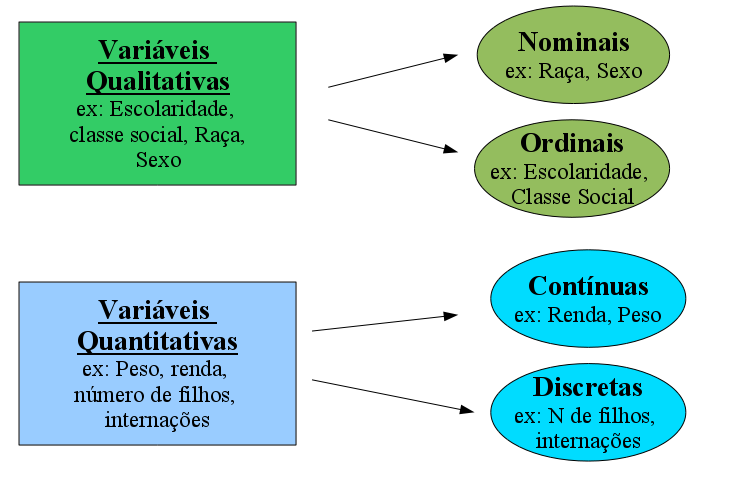
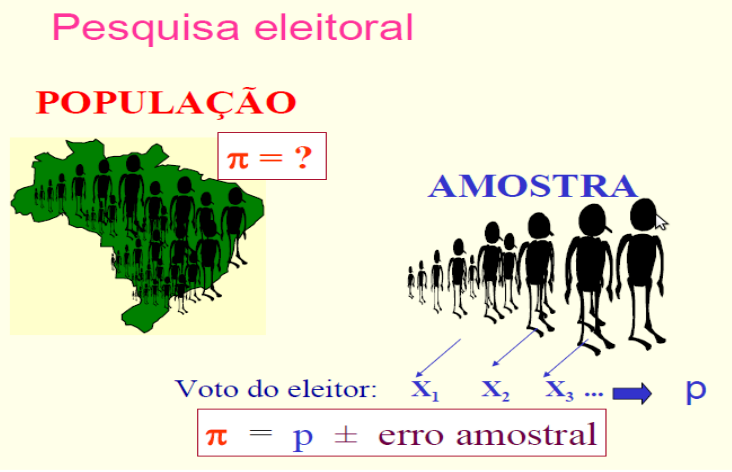
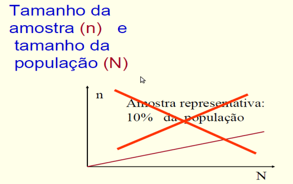
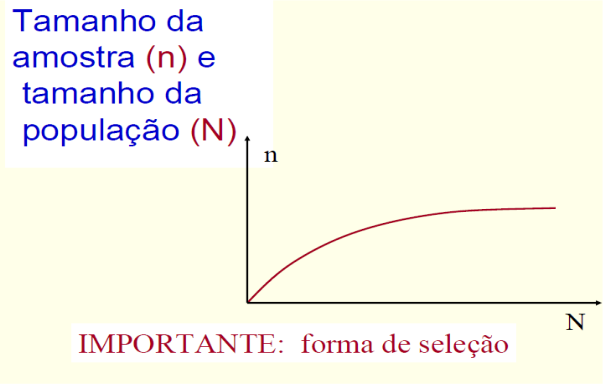
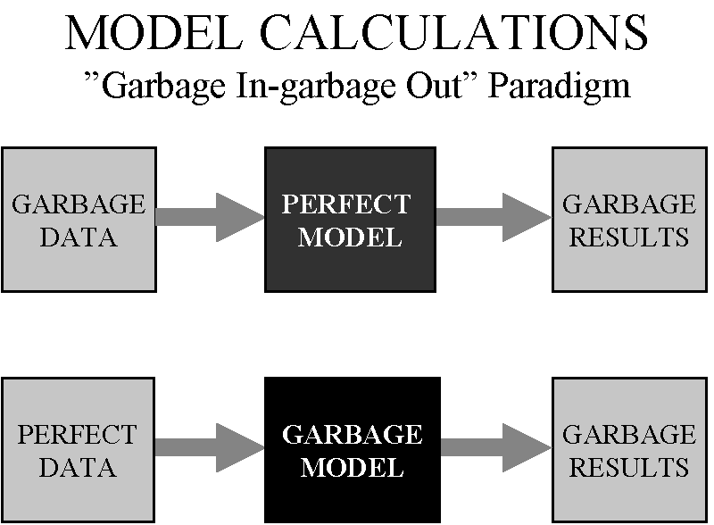
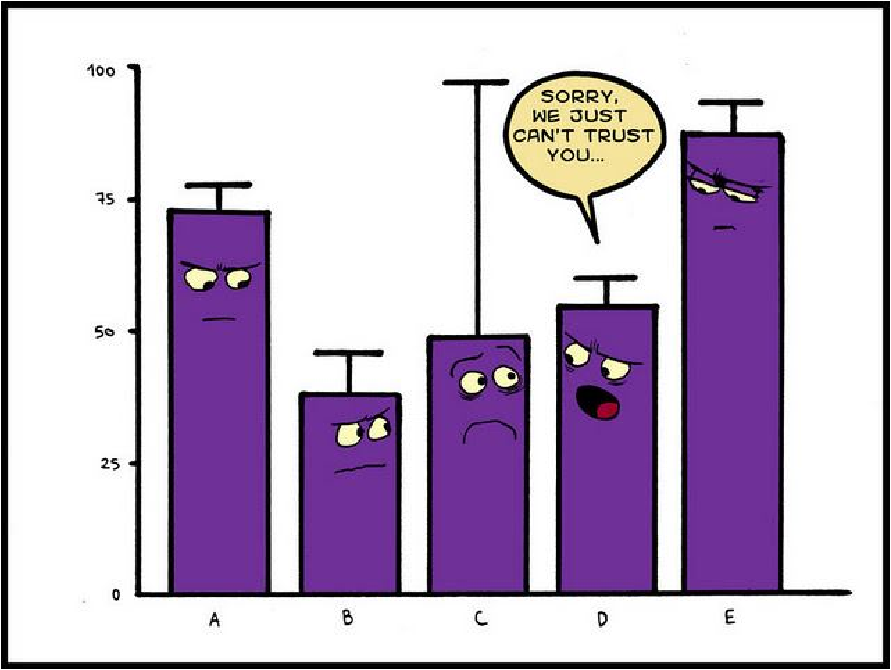
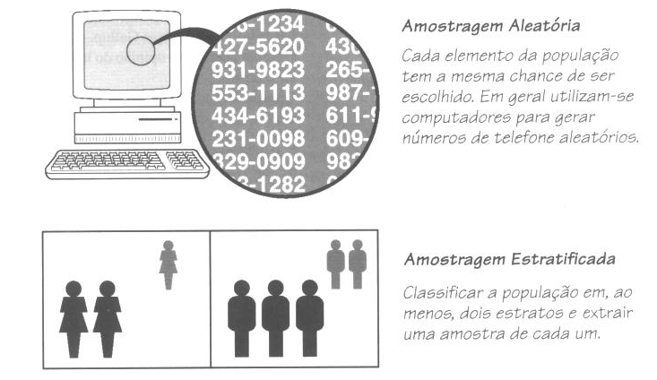
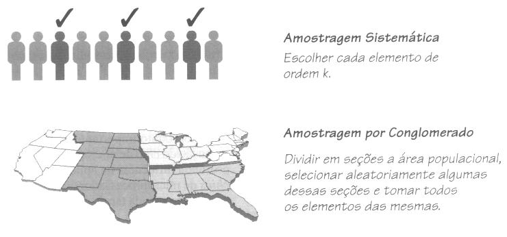
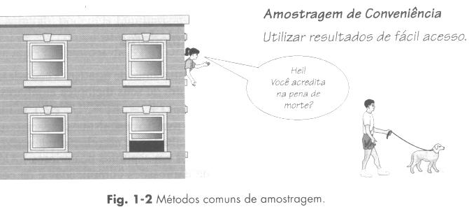
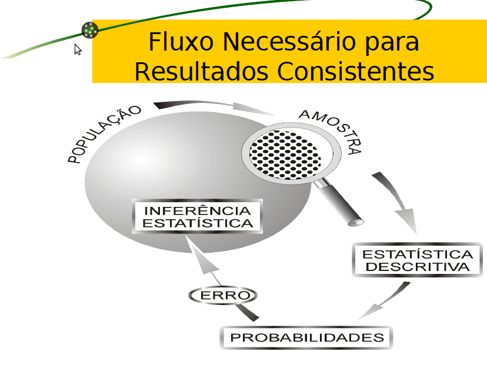

```{r,setup, include=FALSE}
# https://ourcodingclub.github.io/2016/11/24/rmarkdown-1.html
knitr::opts_chunk$set(fig.width = 7, fig.height = 5, fig.align = 'center', dpi = 96, cache=TRUE, echo = F, comment = "", message = F, warning = F)

library(tinytex)
options(tinytex.verbose = TRUE)
```


# Introdução à Estatística

## O que é estatística ?


```{r, out.width='40%', fig.align='center'}

```

O que é isso ?

...é a ciência da arte de torturar os dados ???


## O que é estatística ?

- A Estatística é uma Ciência que tem por objetivo **planejar, coletar, tabular, analisar e interpretar informações** para **tomada de decisões** acertadas mediante **incertezas**.


- **Bioestatística** → Aplicação da estatística na área de saúde.


## Exemplos da importância da Estatística na saúde:

1. Antes de novo medicamento (ou tratamentos) ser colocado no mercado é necessário um ensaio clínico.

    Os dados desse estudo precisam ser processados, descritos e analisados para a determinação da eficácia e segurança.
    

2. A Lei Seca cumpriu seu propósito ?


3. A leptospirose pode estar associada a chuvas e/ou fatores socioeconômicos ?


## Objetivos da estatística 

- O objetivo principal é sempre transformar os dados em informações.

- Tais dados ou observações se distinguem segundo as variáveis estudadas.

# Alguns conceitos

## Alguns conceitos

- **Dados:** qualquer característica passível de observação em uma população ou amostra;

- **População:** conjunto de elementos que possuem características em comum;

- **Amostra:** qualquer subconjunto de uma população;

*"A qualidade das informações depende da qualidade dos dados!!!"*


## Variável

- São atributos ou caracterı́sticas (de animais, coisas, indivı́duos e lugares) que são medidas, observadas ou controladas em uma pesquisa;

- Diferem em muitos aspectos, principalmente no
papel que a elas é dado em uma pesquisa e na forma
como podem ser medidas.

## Variável

```{r, out.width='100%', fig.align='center'}

```


## Variável

- Categorizando uma variável quantitativa


|      **Nível da Pressão Arterial**      |       **Classificação**       |
|:---------------------------------------:|:-----------------------------:|
|    < 120 sistólica e < 80 diastólica    |             Ideal             |
|    < 130 sistólica e < 85 diastólica    |             Normal            |
|  130-139 sistólica ou 86-89 diastólica  |          Normal-Alta          |
|  140-159 sistólica ou 90-99 diastólica  |     Hipertensão Estágio 1     |
| 160-179 sistólica ou 100-109 diastólica |     Hipertensão Estágio 2     |
|   > 110 sistólica ou > 180 diastólica   |     Hipertensão Estágio 3     |
|  Diastólica normal com sistólica > 140  | Hipertensão Sistólica Isolada |

[Fonte: Manuais de Cardiologia](http://www.manuaisdecardiologia.med.br/has/has_Page1061.htm)

# Exercícios 

## Exercícios

**Questão 1:** Classifique as variáveis em qualitativa (nominal ou ordinal) ou variável quantitativa (discreta ou contínua). 

1. Concentração de chumbo em uma amostra de água (mg/dl)
2. Duração de tempo que um paciente de câncer sobrevive depois do diagnóstico
3. Número de abortos prévios que uma mãe grávida teve
4. Resultado de um teste rápido para HIV (positivo ou negativo)
5. A região (estado - UF) de moradia 

## Exercícios

**Questão 1:** Classifique as variáveis em qualitativa (nominal ou ordinal) ou variável quantitativa (discreta ou contínua). (cont.)

6. Sexo do paciente Contato com animal infectado por leishmaniose ou esporotricose (gato ou cachorro)
7. Faixa etária em que está situado o paciente
8. Cor ou raça do paciente
9. Peso (em kg) do paciente
    
## Exercícios

**Questão 2:** Qual a diferença entre as variáveis ordinais e as nominais ?


**Questão 3:** Quais as vantagens e desvantagens de transformar variáveis contínuas em discretas ou ordinais ?

## Exercícios

**Questão 4:** Classifique cada uma das seguintes variáveis em: variável qualitativa nominal, variável qualitativa ordinal, variável quantitativa discreta ou variável quantitativa contínua. 

1. Nível educacional
2. peso (kg)
3. altura (cm)
4. idade (em anos completos)
5. glicemia (mg/dL)
6. colesterol sérico (mg/dL)
7. pressão sistólica (mmHg)
8. motivo do exame

## Exercícios

**Questão 4:** Classifique cada uma das seguintes variáveis em: variável qualitativa nominal, variável qualitativa ordinal, variável quantitativa discreta ou variável quantitativa contínua. (cont.)

9. contato com areia e/ou terra na região peridomiciliar
10. número de lesões em um animal
11. RIFI-IgG (título e classificação: positiva ou negativa)
12. raça/cor de uma pessoa
13. ingestão de carne crua ou mal cozida
14. profissão

# Gabarito

## Gabarito

**Questão 1:**

1. Variável quantitativa contínua
2. Variável quantitativa contínua
3. Variável quantitativa discreta
4. Variável qualitativa (ou categórica) nominal
5. Variável qualitativa (ou categórica) nominal
6. Variável qualitativa (ou categórica) nominal
7. Variável qualitativa (ou categórica) nominal
8. Variável qualitativa (ou categórica) ordinal
9. Variável quantitativa contínua
 
## Gabarito   

**Questão 2:**

- Os dados ordinais representam informações com algum tipo de ordenação, como por exemplo: nível de escolaridade (fundamental, médio e superior). 

- Enquanto os dados nominais são classificados em categorias ou classes não ordenadas, por exemplo: sexo, raça/cor. Tanto os dados ordinais quando os nominais não possuem importância em sua magnitude.


## Gabarito

**Questão 3:**

- A vantagem consiste na facilidade de interpretação dos resultados, como por exemplo: transformar o IMC aferido em uma medida ordinal, classificando em abaixo do peso, normal, sobrepeso e obeso. 

- A desvantagem está na perda de detalhes da informação.


## Gabarito

**Questão 4:**

1. nível educacional variável qualitativa ordinal
2. peso (kg) variável quantitativa contínua
3. altura (cm) variável quantitativa contínua
4. idade (em anos completos) variável quantitativa discreta
5. glicemia (mg/dL) variável quantitativa contínua
6. colesterol sérico (mg/dL) variável quantitativa contínua
7. pressão sistólica (mmHg) variável quantitativa contínua

## Gabarito

**Questão 4:** (cont.)

8. motivo do exame variável qualitativa nominal
9. contato com areia e/ou terra na região peridomiciliar variável qualitativa nominal
10. número de lesões em um animal variável quantitativa discreta
11. RIFI-IgG (título e classificação: positiva ou negativa) variável qualitativa nominal
12. raça/cor de uma pessoa variável qualitativa nominal
13. ingestão de carne crua ou mal cozida variável qualitativa nominal
14. profissão variável qualitativa nominal

# Amostragem

## Amostragem

```{r, out.width='100%', fig.align='center'}

```

## Amostragem

- **Amostra:** subconjunto de unidades representativo da população de pesquisa, que pode ser constituída por indivíduos, animais, cepas, cobaias, regiões entre outros. 

- Previamente à seleção da amostra, é preciso estabelecer o tamanho da amostra requerido para cumprir o objetivo da pesquisa. 

- Define-se, então, o processo de amostragem que se refere à utilização de técnicas de amostragem, visando a representatividade da amostra e a redução dos custos. 
    

## Por que usar amostra ?

- Custo e demora dos censos

- Populações muito grandes

- Impossibilidade física de examinar toda a população

- Comprovado valor científico das informações coletadas por meio de amostras
 
Resumindo as vantagens são: custo menor, menor tempo e objetivos mais amplos.


## Cuidado !!!


- Se os dados amostrais não forem coletados de maneira apropriada, eles podem ser de tal modo inúteis que nenhuma *"manipulação"* estatística poderá salvá-los. 


## Cuidado !!!

- **ERRO AMOSTRAL** é a diferença entre um resultado amostral e o verdadeiro resultado populacional;

- Não podemos evitar a ocorrência do **ERRO AMOSTRAL**, porém podemos limitar seu valor através da escolha de uma amostra de tamanho adequado;

- Obviamente, o **ERRO AMOSTRAL** e o **TAMANHO DA AMOSTRA** seguem sentidos contrários. Quanto maior o tamanho da amostra, menor o erro cometido e vice-versa.


## Cuidado !!!

```{r, out.width='80%', fig.align='center'}

```

## Cuidado !!!

```{r, out.width='80%', fig.align='center'}

```

## Cuidado !!!

- Amostras desnecessariamente grandes acarretam desperdı́cio de tempo e de dinheiro;

- Amostras excessivamente pequenas podem levar a resultados não confiáveis.


## Cuidado !!!

```{r, out.width='100%', fig.align='center'}

```


## Cuidado !!!

```{r, out.width='100%', fig.align='center'}

```


## Cuidado !!!

```{r, out.width='100%', fig.align='center'}

```


## Características desejáveis de uma amostra

- Capacidade de **generalizar** estimativas da amostra para toda a população

- **Menor erro amostral possível**, dado o custo, tempo e restrições operacionais

- Capacidade de **medir a precisão** das estimativas


## Tamanho da amostra

O tamanho da amostra depende:

1. **Margem de erro** que o pesquisador admite em
seus resultados;

2. **Nível de confiança** da estimativa;

3. **Quantidade (média, porcentagem, etc)** da característica de interesse.


## Técnicas de amostragem

- A Estatística baseia-se na análise de dados coletados por intermédio da **amostragem aleatória simples** → toda unidade tem chance igual e independente de ser escolhida

- Na prática, entretanto, em virtude dos custos
do **trabalho de campo**, é difícil a utilização da
amostra aleatória simples.

## Técnicas de amostragem

- **Amostragem Probabilı́stica (aleatória) :** a probabilidade de um elemento da população ser escolhido é conhecida;

- **Amostragem Não Probabilı́stica (não aleatória) :** Não se conhece a probabilidade de um elemento da população ser escolhido para participar da amostra.

## Técnicas de amostragem

- Para obter uma amostra representativa da população, com a precisão requerida e os custos
disponíveis para a pesquisa, são utilizadas **técnicas de amostragem**:

    - Amostragem aleatória simples

    - Amostragem sistemática

    - Amostragem estratificada
    
    - Amostragem por conglomerados

    - Amostragem em múltiplos estágios
    
    - Amostragem por conveniência
    
    

## Técnicas de amostragem

```{r, out.width='100%', fig.align='center'}

```

## Técnicas de amostragem

```{r, out.width='100%', fig.align='center'}

```


## Técnicas de amostragem

```{r, out.width='100%', fig.align='center'}

```

## Técnicas de amostragem

- **Amostragem aleatória:** elementos são retirados ao acaso da população, sendo equivalente a um sorteio lotérico. Todo elemento tem igual probabilidade de ser selecionado. 


- Os elementos podem ser escolhidos por diversos métodos: sorteio, tabelas de números aleatórios e uso de computadores. 

- **Vantagem:** Maior facilidade na análise estatística.

- **Desvantagens:** Maior dificuldade na implementação prática da coleta de dados. Deve-se possuir uma lista dos elementos da população.


## Técnicas de amostragem

- **Amostragem sistemática:** ocorre quando os elementos da população encontram-se ordenados e a retirada é feita periodicamente. 

- **Vantagem:** facilidade na determinação dos elementos que vão compor a amostra. Escolhe-se um ponto inicial e em seguida, seleciona-se cada *k-ésimo* (tal como cada $10^o$) elemento da população. 


## Técnicas de amostragem

- **Amostragem por conglomerados:** começamos dividindo a área da população em seções (ou conglomerados); em seguida selecionamos algumas dessas seções e, finalmente, tomamos todos os elementos (ou uma amostra) das seções escolhidas. 

- **Vantagens:**  Maior facilidade prática e menor custo.

- **Amostragem estratificada:** subdividimos a população em, no mínimo, duas subpopulações que compartilham das mesmas características (ex: sexo) e, em seguida, extraímos uma amostra de cada estrato. 

- **Vantagens:**  Maior facilidade prática. Menor custo dependerá do tipo de inferência.


## Técnicas de amostragem


- **Amostragem de conveniência (não probabilística):** Utilizam-se resultados que já estão disponíveis ou são de
fácil acesso.

- Os estatísticos têm muitas restrições ao uso de amostras por conveniência.

- Em alguns casos, as amostras de conveniência constituem a única maneira de estudar determinado problema.

- **Desvantagens:** Sem poder inferencial, não permite a utilização de técnicas estatísticas.


# Desenhos de Estudo

## Desenhos de Estudo

- A maioria dos estudos quantitativos pertencem claramente a uma dessas duas categorias gerais:

    - Observacionais

    - Experimentais

## Estudos Observacionais

- Visa observar, registrar analisar e verificar a associação fenômenos ou fatos, sem interferir no ambiente analisado;

- Ou seja, o pesquisador não influencia (ou tenta não influenciar) nenhuma variável, mas apenas as mede e procura por relações (correlações) entre elas;

- Estudos Observacionais podem gerar hipóteses para experimentação.  

# Estudos Experimentais

## Estudos Experimentais

- Os experimentos ou ensaios são pesquisas feitas em condições previamente especificadas (planejadas) com a finalidade de obtenção de possı́veis relações
causais (causa e efeito) entre variáveis;

- Por exemplo, se o pesquisador descobrir que sempre que muda a variável **A** então a variável **B** também muda, então ele poderá concluir que **A** "influencia" **B**;

- Por exemplo, aumentar artificialmente a pressão sanguı́nea e registrar o nı́vel de colesterol;

## O que é Estatı́stica Experimental ?

- Segundo Ronald Fisher (1951), a estatı́stica experimental é a parte da estatı́stica aplicada aos dados provenientes de experimentos;

- O principal objetivo nas análises estatı́sticas em estudos experimentais é verificar se existe diferença entre os grupos de estudo (tratamentos). E se essa
diferença é devida a fatores não controlados, que podem ser controlados ou não (aleatórios).

## Exemplo de um estudo experimental

- Um pesquisador deseja testar um novo tipo de tratamento homeopático no tratamento da dermatobiose em um determinado rebanho leiteiro. Ele selecionou cinco animais e
realizou a contagem dos bernes dois perı́odos distintos, para verificar se o tratamento era eficaz. Obeserve os dados:

| Antes | Depois |
|:-----:|:------:|
|   22  |   11   |
|   24  |   22   |
|   40  |   22   |
|   30  |   19   |
|   33  |   15   |

O tratamento de fato é eficaz ?

## Princı́pios Básicos dos Estudos Experimentais

- Repetição;

- Aleatorização ou Causalização;

- Cegamento;

- Controle Local (ex: Blocos, Fatores, etc.)

## Repetição

- Este princı́pio serve para atender com segurança os dados experimentais que serão utilizados os seus valores médios;

- O número ideal de repetições de um experimento depende de vários fatores (variabilidade do meio, número de tratamentos, recursos financeiro, fı́sicos e
humano);

- Quanto maior a variabilidade do meio, maior deverá ser o número de repetições.

## Aleatorização

- É a designação aleatória das unidades experimentais aos tratamentos;

- É a etapa mais importante no experimento (Fisher R.A.);

- Serve para que os tratamentos utilizados não sejam subestimados ou superestimados, ou seja, não ter influência do pesquisador. A alocação feita de maneira similar aos tratamentos e tenderão portanto a se contrabalancearem.

## Cegamento

- A unidade experimental / o pesquisador não tem acesso à identificação de qual nı́vel de tratamento se trata;

- Evita que determinados grupos de tratamentos sejam mais ou menos privilegiados pelo pesquisador.

## Controle Local

- São possı́veis fatores que podem alterar os resultados do experimento;

- **Ex:** Será um local escolhido para o experimento, onde o mesmo venha a ter pouca influência ambiental (heterogeneidade ambiental) e que nos tratamentos haja homogeneidade (a exemplo de locais com mesma caracterı́sticas, tais como o
mesmo solo, mesma temperatura, mesma luminosidade e etc);

# Etapas do Método Estatístico

## Fases do Método Estatístico

1. **Definição do problema:** consiste na formulação correta do problema (ex: formulação das pergunts a serem respondidas)

2. **Planejamento:** determinar o procedimento necessário para resolver o problema

3. **Coleta ou levantamento dos dados:** consiste na obtenção dos dados referentes ao trabalho desejado.

4. **Apuração dos dados ou sumarização:** consiste em resumir os dados, através de uma contagem e agrupamento.

5. **Apresentação dos dados:** pode ser de forma tabular ou gráfica

6. **Análise e interpretação dos dados:** fase mais
importante e mais delicada


## Fases do Método Estatístico

```{r, out.width='100%', fig.align='center'}

```


