[^1]: LIMA, Maria Luiza Carvalho de et al. **Análise diagnóstica dos serviços de reabilitação que assistem vítimas de acidentes e violências em Recife.** Ciênc. saúde coletiva [online]. 2009, vol.14, n.5, pp. 1817-1824.

[^2]: LYRA, Gabriela Franco Dias et al. **A relação entre professores com sofrimento psíquico e crianças escolares com problemas de comportamento.** Ciênc. saúde coletiva [online]. 2009, vol.14, n.2, pp. 435-444. 

[^3]: Medronho, Roberto de Andrade. **Estudos ecológicos.** Epidemiologia. São Paulo: Atheneu (2002): 191-8.

[^4]: Praça, NS et al. **Fatores associados à percepção de risco de infecção pelo HIV por puérperas internadas.** Rev Saúde Pública. 2003, vol.37, n.5, pp. 543-551.

```{r setup, include=FALSE}
# https://ourcodingclub.github.io/2016/11/24/rmarkdown-1.html
knitr::opts_chunk$set(fig.width = 7, fig.height = 5, fig.align = 'center', dpi = 96, cache=TRUE, echo = F, comment = "", message = F, warning = F)

```

# Estatística Descritiva

## Descrição dos Dados 

- Organização e descrição dos dados;
       
- Identificação de valores que represente o elemento típico;
        
- Avaliação e quantificação da variabilidade do conjunto de dados;
        
- Familiarização com os dados; forma da distribuição dos dados; 

- Identificar estruturas interessantes, como a de valores atípicos.
        

## Descrição dos Dados

**Formas de sumarizar os dados:** 

- Tabelas
        
- Gráficos
        
- Medidas-resumo
        

## Apresentação tabular 

- Simples, claras e objetivas. Grandes volumes dividir em várias tabelas numeradas.
    
- Nenhuma casa da tabela deve ficar em branco, apresentando sempre um número ou um símbolo. 
    
- Fechadas no alto e embaixo por linhas horizontais; não fechar as laterais;
    
- **Título:** O que? Quando ? Onde ?
    
- Uniformizar número de casas decimais.
    
- Lembre-se: as tabelas são AUTO-EXPLICATIVAS.
    
[IBGE, Centro de documentação e Disseminação de Informações, Normas de apresentação tabular, 3.ed., Rio de Janeiro: IBGE, 1993.](https://biblioteca.ibge.gov.br/visualizacao/monografias/GEBIS%20-%20RJ/normastabular.pdf)


## Distribuições de frequência

- Relacionam categorias, valores ou classes de valores, juntamente com as contagens (ou frequência).[^1]

```{r, out.width='45%', fig.align='center'}
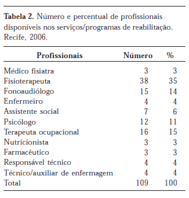
```


## Distribuições de frequência

- Elementos:

    - **Frequência absoluta simples:** é o número de informações verificadas em cada classe ou categoria.

    - **Frequência relativa simples:** é o quociente entre a frequência da classe e a frequência total. 

    - **Frequência acumulada:** é obtida através da soma da frequência daquela classe mais as frequências de todas as classes anteriores. 
    
    
## Apresentação tabular

- Exemplo: variável qualitativa ordinal[^2]

```{r, out.width='60%', size = 'tiny', fig.align='center'}
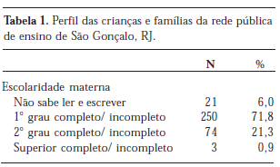
```

## Apresentação Tabular

- Exemplo: variável quantitativa discreta[^3]

```{r, out.width='50%', size = 'tiny', fig.align='center'}
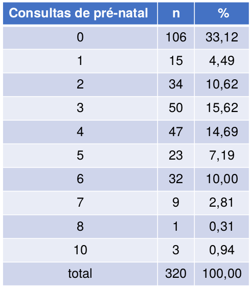
```

## Apresentação Tabular

- Exemplo: variável quantitativa contínua[^3]

```{r, out.width='50%', size = 'tiny', fig.align='center'}
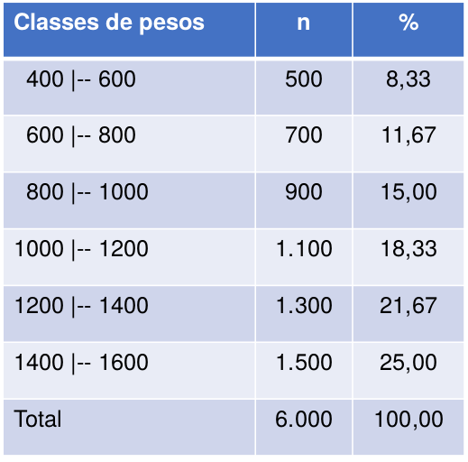
```

## Apresentação Tabular

- Exemplo: Tabelas de contingência[^4]

```{r, out.width='70%', size = 'tiny', fig.align='center'}
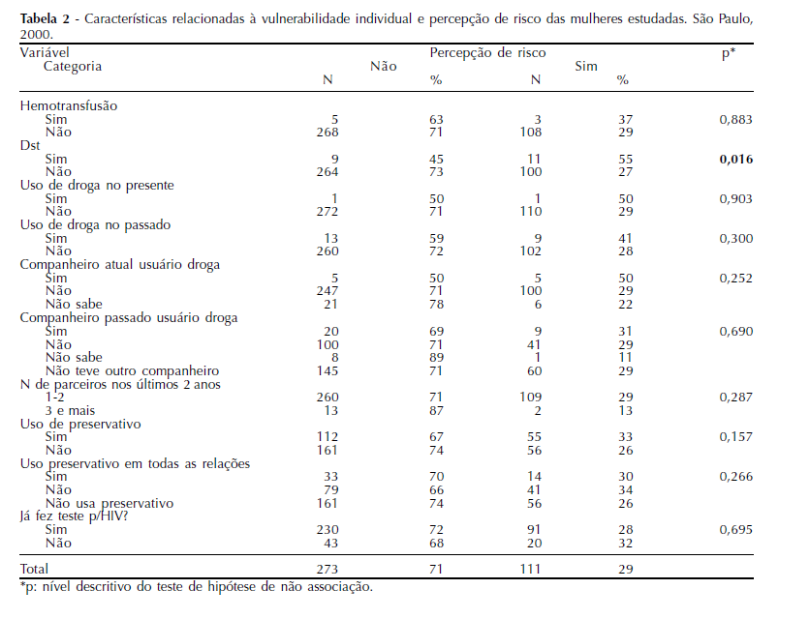
```

## Apresentação Tabular

- Exemplo: Tabelas de contingência[^4]

```{r, out.width='90%', size = 'tiny', fig.align='center'}
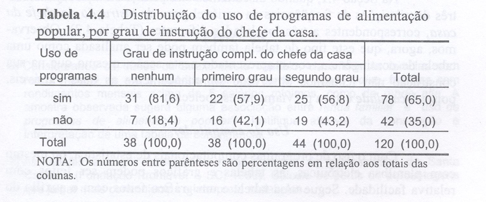
```

## Apresentação em Gráficos (p/ variáveis Nominais e Ordinais)

- **Barras ou colunas:** São muito utilizados para ilustrar a ocorrência de dados ordinais ou nominais, sendo cada barra de tamanho proporcional à frequência absoluta ou relativa de casos dentro daquela classe.

        - As colunas ou barras não devem ser unidas.

- **Setores (Torta ou Pizza):** Outro tipo de representação gráfica de variáveis nominais ou ordinais. Cada "fatia" ou setor representa a ocorrência em uma classe.


## Apresentação em Gráficos (p/ variáveis Nominais e Ordinais)

```{r, out.width='100%', size = 'tiny', fig.align='center'}
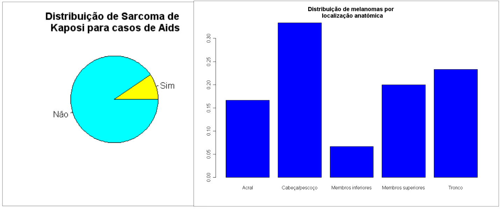
```

## Apresentação em Gráficos (p/ variáveis Nominais e Ordinais)

```{r, out.width='80%', size = 'tiny', fig.align='center'}
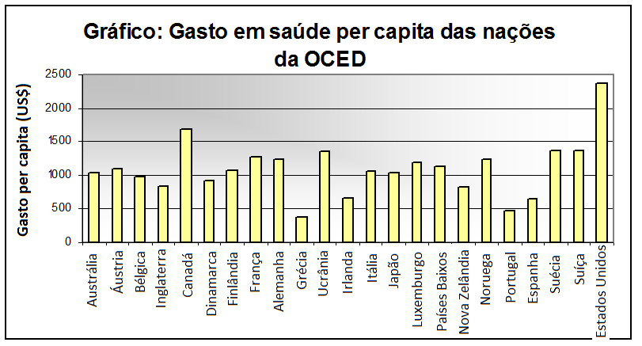
```

## Apresentação em Gráficos (p/ variáveis Nominais e Ordinais)

```{r, out.width='80%', size = 'tiny', fig.align='center'}
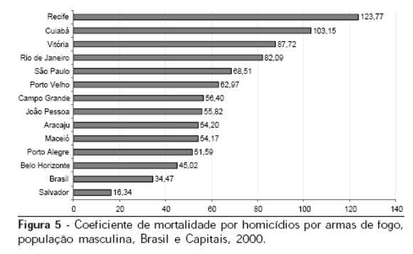
```

## Apresentação em Gráficos (p/ variáveis Nominais e Ordinais)

```{r, out.width='70%', size = 'tiny', fig.align='center'}
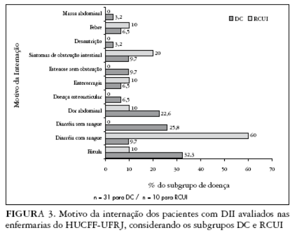
```

## Apresentação em Gráficos (p/ variáveis Nominais e Ordinais)

```{r, out.width='80%', size = 'tiny', fig.align='center'}
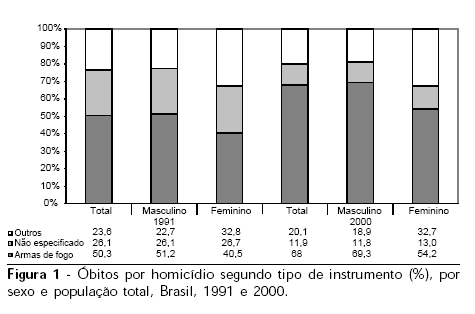
```


## Apresentação em Gráficos (p/ Variáveis Discretas)

- Ordem e magnitude são importantes. 

- Os valores diferem entre si por quantidades fixas. 

- Nenhum valor intermediário é possível. 

- Geralmente são resultados de contagens. 

- Exemplos:

    + Tamanho da família: (1, 2, 3, 4, ...18)

    + Número de internações desde 1980 a 2004

    + Número de óbitos
 
## Apresentação em Gráficos (p/ Variáveis Discretas)

```{r, out.width='80%', size = 'tiny', fig.align='center'}
knitr::include_graphics(c('figuras/tabela2019_7.png', 'figuras/grafico2019_6.png'))
```

## Apresentação em Gráficos (p/ Variáveis Contínuas)

- Os valores possíveis pertencem a um intervalo de números reais, que resultam de mensuração. 

- diferença entre medidas pode ser arbitrariamente pequena e são anotadas até a precisão da medida usada.

- Exemplos:

    + Peso

    + Altura
    
    + Renda

    + Pressão Sanguínea
    
## Apresentação em Gráficos (p/ Variáveis Contínuas)

- Histograma

```{r, out.width='52%', size = 'tiny', fig.align='center'}
knitr::include_graphics(c('figuras/tabela2019_8.png', 'figuras/grafico2019_7.png'))
```

## Apresentação em Gráficos (p/ Variáveis Contínuas)

- Diferentes formas de construir um histograma sem alterar sua forma.

```{r, out.width='80%', size = 'tiny', fig.align='center'}
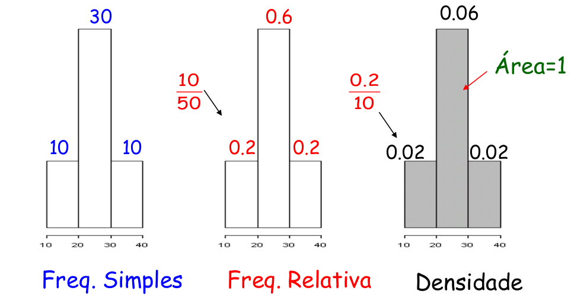
```

## Apresentação em Gráficos (p/ Variáveis Contínuas)

- Polígono de frequências

```{r, out.width='80%', size = 'tiny', fig.align='center'}
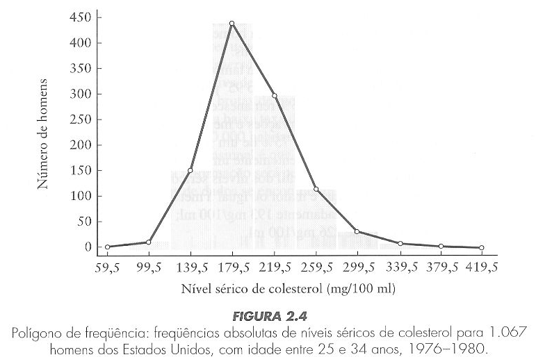
```

## Apresentação em Gráficos (p/ Variáveis Contínuas)

- Polígono de frequências

```{r, out.width='80%', size = 'tiny', fig.align='center'}
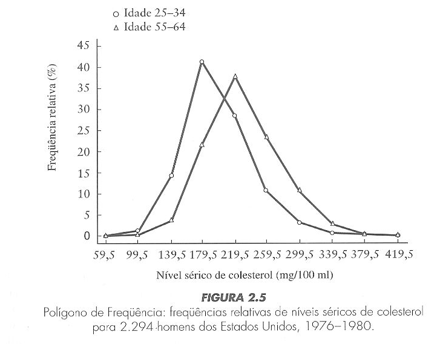
```

## Apresentação em Gráficos (p/ Variáveis Contínuas)

- Gráfico em linha

```{r, out.width='80%', size = 'tiny', fig.align='center'}
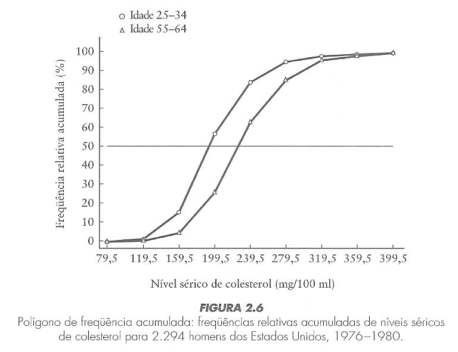

```

## Apresentação em Gráficos (p/ Variáveis Contínuas)

- Gráfico em linha

```{r, out.width='80%', size = 'tiny', fig.align='center'}
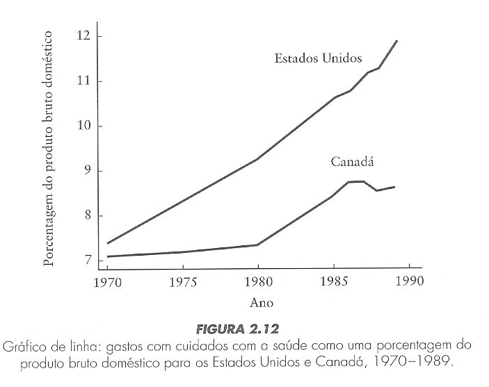

```

## Apresentação em Gráficos (p/ Variáveis Contínuas)

- Diagrama de dispersão

```{r, out.width='80%', size = 'tiny', fig.align='center'}
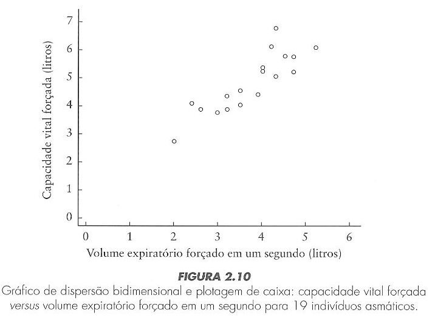
```

## Aspectos Gerais

- Distribuição de Frequências

```{r, out.width='100%', size = 'tiny', fig.align='center'}
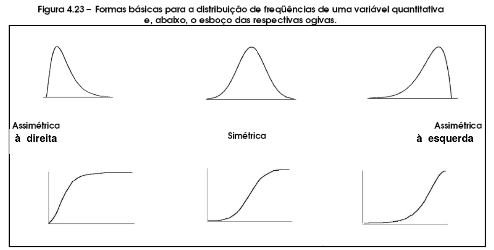
``` 

## Exemplo utilizando o Rcommander

- Abrir o pacote estatístico R

- Escrever o comando: **library(Rcmdr)**

```{r, out.width='60%', size = 'tiny', fig.align='center'}
knitr::include_graphics('figuras/Rcmdr1_2019.png')
``` 

## Exemplo utilizando o Rcommander

- Importar o arquivo "ExemploBDdiarreia.xlsx"

  - Rcommander $\rightarrow$ Dados $\rightarrow$ Importar arquivos de dados $\rightarrow$ do arquivo Excel
  
```{r, out.width='60%', size = 'tiny', fig.align='center'}
knitr::include_graphics('figuras/Rcmdr44_2019.png')
``` 

## Exemplo utilizando o Rcommander

- Plotar gráficos para variáveis qualitativas (categóricas) 

  - Rcommander $\rightarrow$ Gráficos $\rightarrow$ Gráfico de Barra
  
```{r, out.width='70%', size = 'tiny', fig.align='center'}
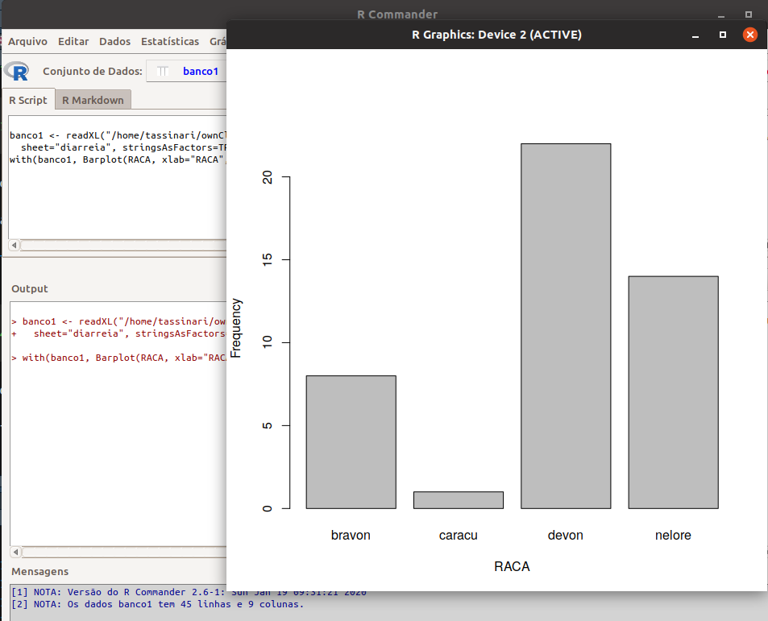
``` 

## Exemplo utilizando o Rcommander

- Plotar gráficos para variáveis qualitativas (categóricas) 

  - Rcommander $\rightarrow$ Gráficos $\rightarrow$ Gráfico de Pizza
  
```{r, out.width='70%', size = 'tiny', fig.align='center'}
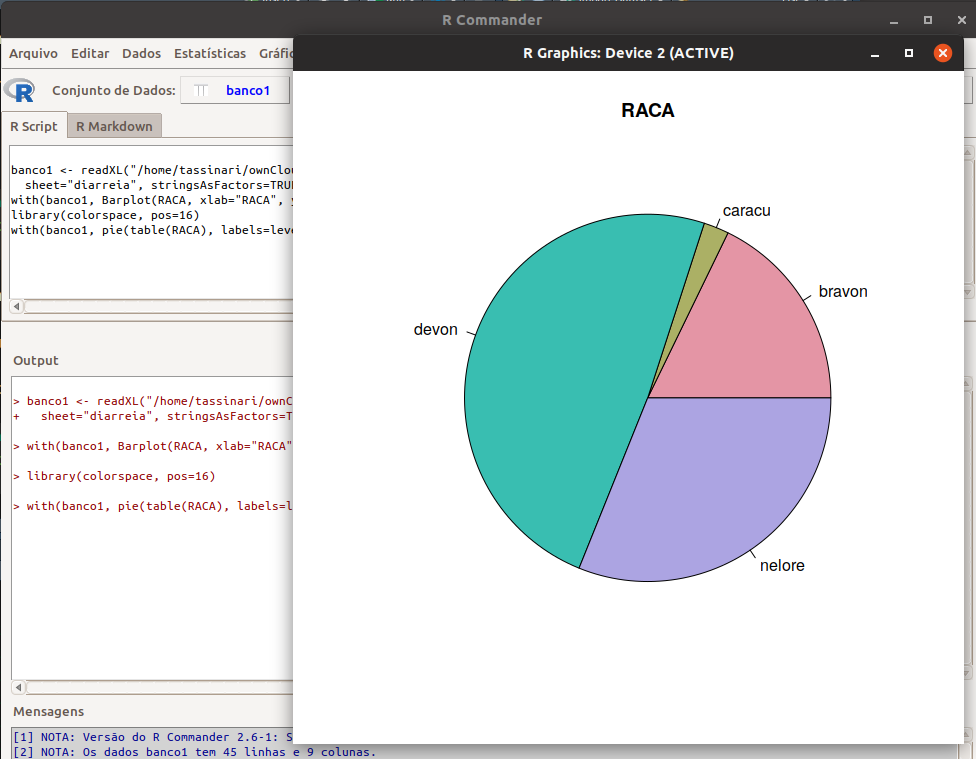
``` 

## Exemplo utilizando o Rcommander

- Plotar gráficos para variáveis quantitativas discretas 

  - Rcommander $\rightarrow$ Gráficos $\rightarrow$ Plot discrete numeric variable
  
```{r, out.width='75%', size = 'tiny', fig.align='center'}
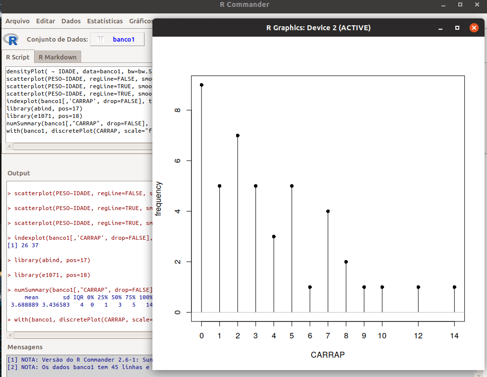
``` 

## Exemplo utilizando o Rcommander

- Plotar gráficos para variáveis quantitativas discretas 

  - Rcommander $\rightarrow$ Gráficos $\rightarrow$ Gráfico de pontos
  
```{r, out.width='75%', size = 'tiny', fig.align='center'}
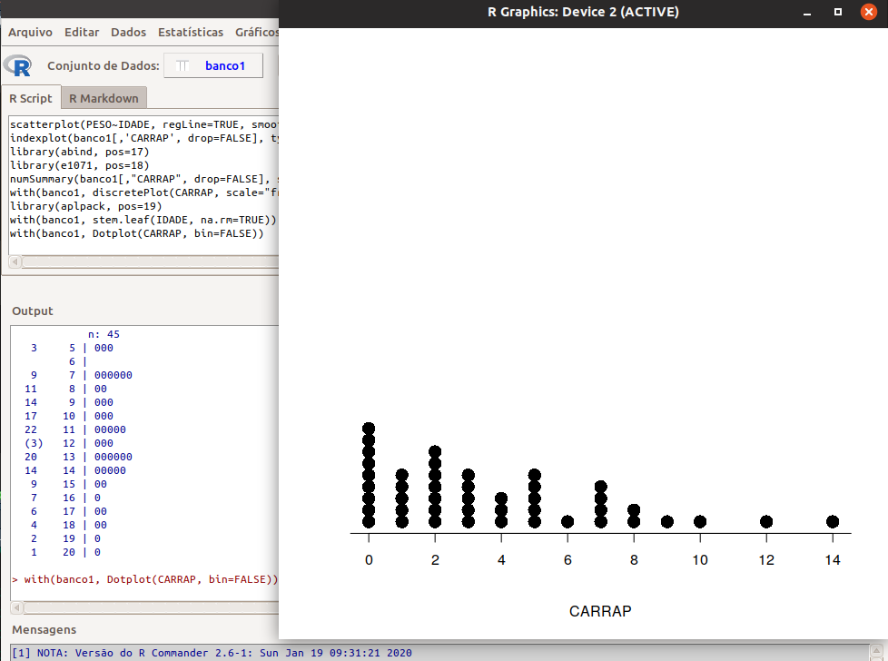
``` 

## Exemplo utilizando o Rcommander

- Plotar gráficos para variáveis contínuas 

  - Rcommander $\rightarrow$ Gráficos $\rightarrow$ Histograma
  
```{r, out.width='70%', size = 'tiny', fig.align='center'}
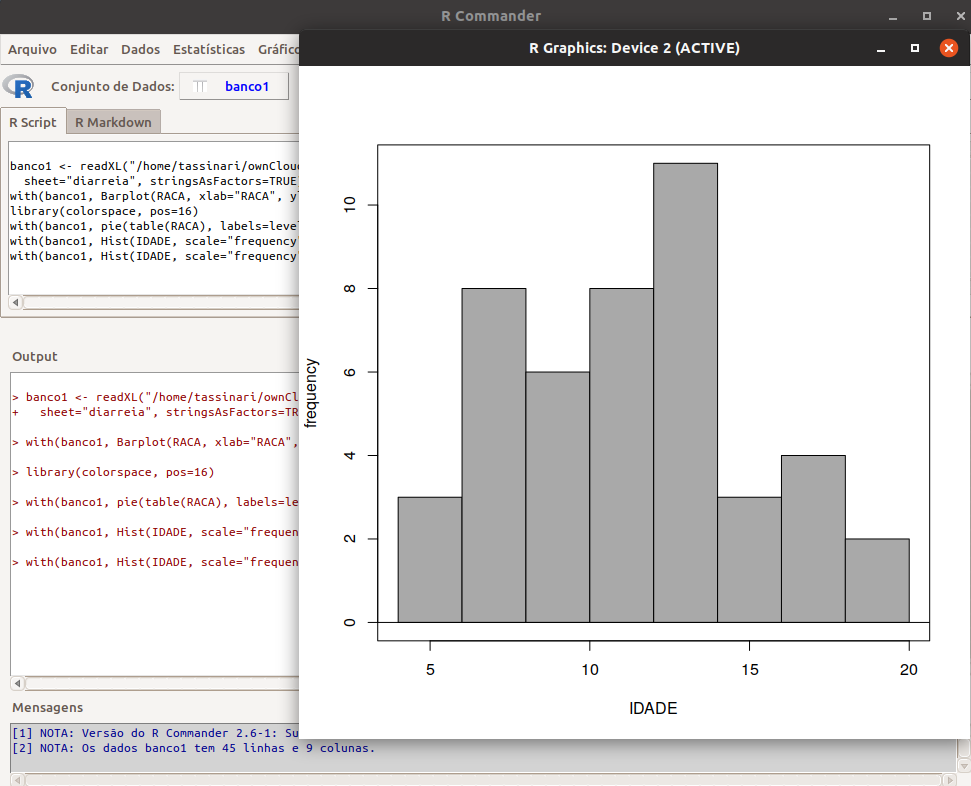
``` 

## Exemplo utilizando o Rcommander

- Plotar gráficos para variáveis contínuas 

  - Rcommander $\rightarrow$ Gráficos $\rightarrow$ Estimativa de densidade
  
```{r, out.width='70%', size = 'tiny', fig.align='center'}
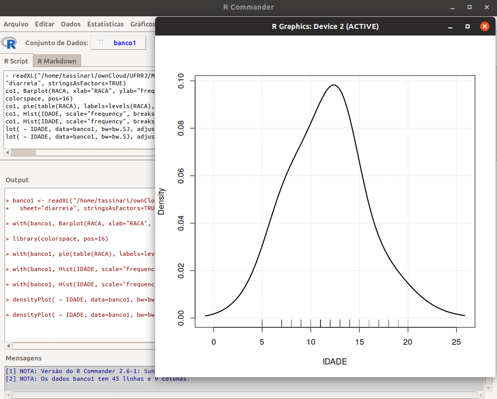
``` 

## Exemplo utilizando o Rcommander

- Plotar gráficos para variáveis contínuas 

  - Rcommander $\rightarrow$ Gráficos $\rightarrow$ Diagrama de dispersão
  
```{r, out.width='70%', size = 'tiny', fig.align='center'}
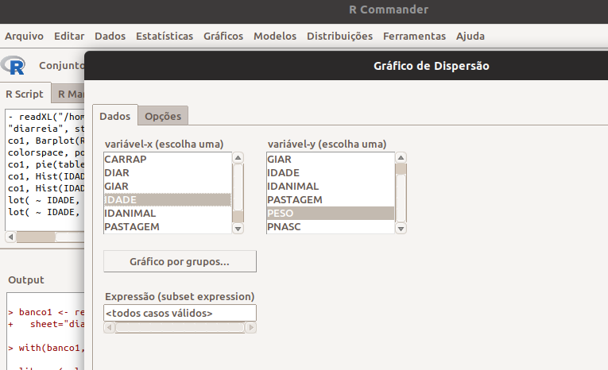
``` 
## Exemplo utilizando o Rcommander

```{r, out.width='70%', size = 'tiny', fig.align='center'}
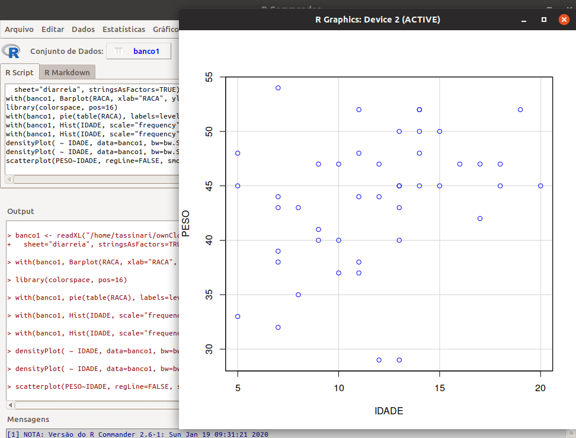
``` 

## Exemplo utilizando o Rcommander

```{r, out.width='70%', size = 'tiny', fig.align='center'}
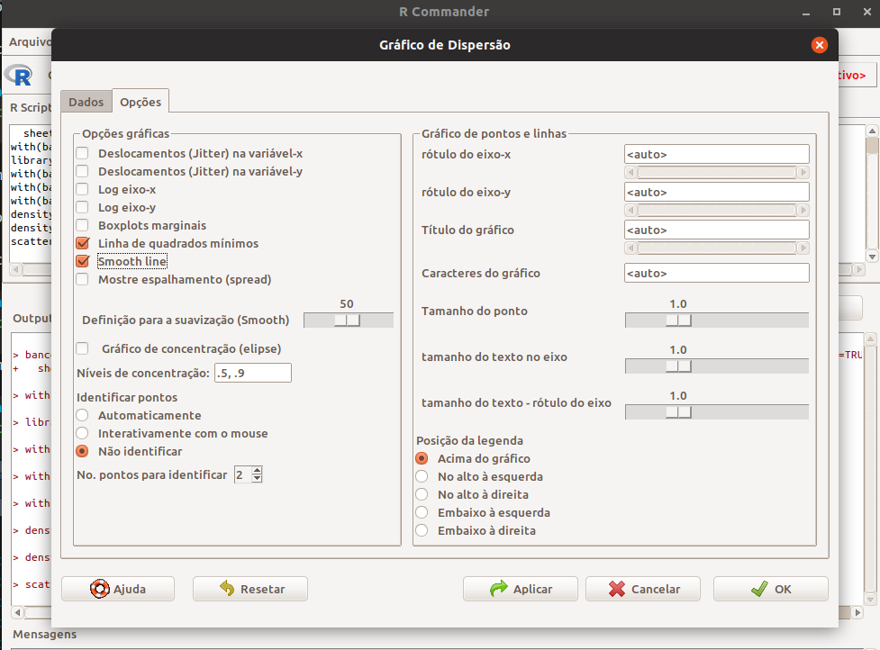
``` 

## Exemplo utilizando o Rcommander

```{r, out.width='70%', size = 'tiny', fig.align='center'}
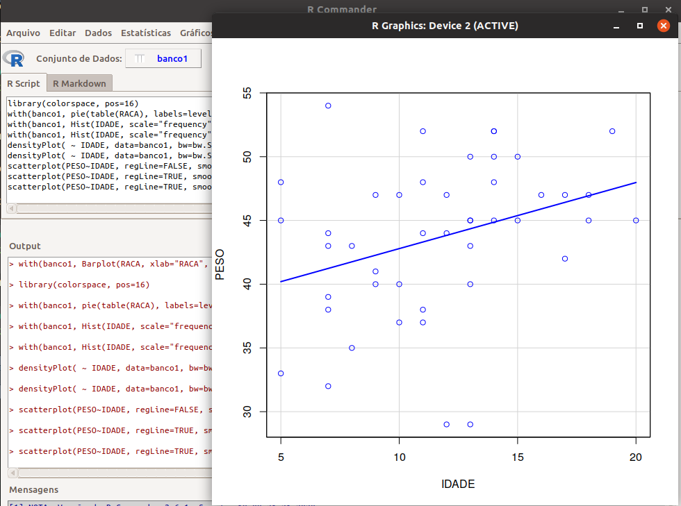
```

## Exemplo utilizando o Rcommander

- Importar o arquivo "prevalenciadoenca.xlsx"

  - Rcommander $\rightarrow$ Dados $\rightarrow$ Importar arquivos de dados $\rightarrow$ do arquivo Excel
  
```{r, out.width='70%', size = 'tiny', fig.align='center'}
knitr::include_graphics('figuras/Rcmdr55_2019.png')
``` 

## Exemplo utilizando o Rcommander

  - Rcommander $\rightarrow$ Gráficos $\rightarrow$ Gráfico de linha
  
```{r, out.width='70%', size = 'tiny', fig.align='center'}
knitr::include_graphics('figuras/Rcmdr56_2019.png')
``` 

## Exemplo utilizando o Rcommander

```{r, out.width='100%', size = 'tiny', fig.align='center'}
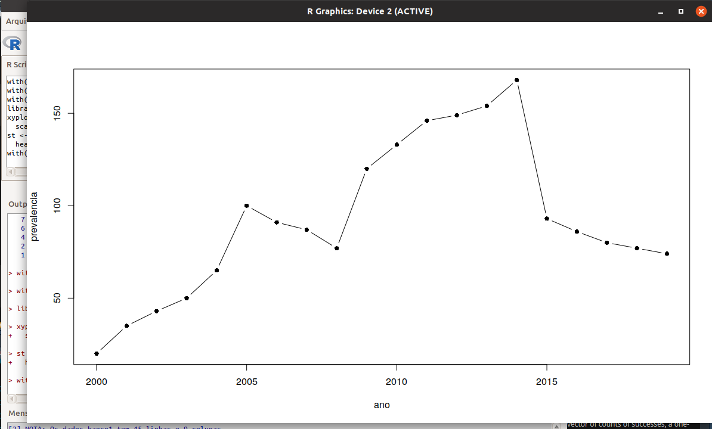
``` 