```{r setup, include=FALSE}
# https://ourcodingclub.github.io/2016/11/24/rmarkdown-1.html
knitr::opts_chunk$set(fig.width = 7, fig.height = 5, fig.align = 'center', dpi = 96, cache=TRUE, echo = F, comment = "", message = F, warning = F)

```

# Estatística Descritiva

## Descrição dos Dados 

- Organização e descrição dos dados;
       
- Identificação de valores que represente o elemento típico;
        
- Avaliação e quantificação da variabilidade do conjunto de dados;
        
- Familiarização com os dados; forma da distribuição dos dados; 

- Identificar estruturas interessantes, como a de valores atípicos.
        

## Descrição dos Dados

**Formas de sumarizar os dados:** 

- Tabelas
        
- Gráficos
        
- Medidas-resumo
        
# Medidas de Tendência Central (Medidas de Centro) 

## Medidas de Tendência Central (Medidas de Centro) 

- Caracterizam o conjunto de dados por valores que representem todos os outros valores da amostra

- É uma forma de resumir o conjunto de dados em um único valor

- Medidas: **média, mediana e moda.**


## Média

- Somam-se todos os n valores da amostra e divide-se pela quantidade total de valores $n$ da amostra.

- O valor da média não necessariamente pertence ao conjunto original de valores.

-  Não é uma medida robusta → influenciada por valores extremos.


- É expressa por: $\bar{X} = \dfrac{\sum_{i=1}^{n}x_i}{n}$


## Média

- **Exemplo:** Pressão sistólica de uma amostra de 5 pacientes

|     Pacientes     | $x_1$ | $x_2$ | $x_3$ | $x_4$ | $x_5$ |
|:-----------------:|-------|-------|-------|-------|-------|
| Pressão Sistólica | 15    | 20    | 14    | 14    | 12    |


$$\bar{X} = \dfrac{\sum_{i=1}^{n}x_i}{n} = \dfrac{x_1 + x_2 + x_3 + x_4 + x_5}{5}$$

$$\bar{X} = \dfrac{15+20+14+14+12}{5} = \dfrac{75}{5} = 15$$


## Média

Exemplo: Influência de valores extremos na média

| Pacientes |  1   |  2   |  3   |  4   |  5   |  6   |  7   |
| :-------: | :--: | :--: | :--: | :--: | :--: | :--: | :--: |
| Dados  |  2   |  2   |  5   |  7   |  6   |  4   |  5   |

$$\bar{X} = \dfrac{2+2+5+7+6+4+5}{7} = \dfrac{32}{7} = 4,4$$

| Pacientes |  1   |  2   |  3   |  4   |  5   |  6   |  7   |
| :-------: | :--: | :--: | :--: | :--: | :--: | :--: | :--: |
| Dados  |  2   |  2   |  5   |  7   |  6   |  4   |  55   |

$$\bar{X} = \dfrac{2+2+5+7+6+4+55}{7} = \dfrac{81}{7} = 11,6$$


## Mediana

- Definição: valor que divide o conjunto de dados em duas partes iguais

- 50% das observações ficam acima da mediana e 50% ficam abaixo

- Medida mais robusta → não sofre influência de valores extremos.

## Mediana

- Colocar os valores em ordem e, em seguida, aplicar um dos dois processos abaixo:

1. Se o número de valores é **ímpar**, a posição da mediana é dada pelo elemento de ordem: $\dfrac{n+1}{2}$

    - $x_1,  x_2, x_3$ → $\dfrac{3+1}{2} = 2$ → $md = x_2$, ou seja, elemento de ordem 2

2. Se o número de valores é **par**, a mediana é dada pela média dos elementos de ordem $\dfrac{n}{2}$ e $\dfrac{n+2}{2}$:

    - $x_1,  x_2, x_3, x_4$ → $md = \dfrac{x_2 + x_3}{2}$
    

## Mediana

- **Exemplo 1:** $(1,2,5,6,7)$

    - Número **ímpar** de elementos → mediana é dada pelo valor que ocupa a terceira posição $\dfrac{5+1}{2}$, que é igual a 5.
    
- **Exemplo 2:** $(1,2,5,6,7,7)$

    - Número par de elementos → mediana será dada por $md = \dfrac{5+6}{2} = 5,5$

## Mediana

- **Exemplo:** Influência de valores extremos na mediana

- $(2,2,4,5,6,7)$

    - Número **ímpar** de elementos → mediana é dada pelo valor que ocupa a quarta posição $\dfrac{7+1}{2}$, que é igual a 5.


- $(2,2,4,5,6,7,55)$
    
    - Número **ímpar** de elementos → mediana é dada pelo valor que ocupa a quarta posição $\dfrac{7+1}{2}$, que é igual a 5.


## Moda

- Definição: valor que ocorre com maior frequência;

- A moda sempre pertence ao conjunto original de valores;

- Uma distribuição pode ser unimodal, bimodal, multimodal ou amodal.

- Exemplos:

    - $(1,1,1,3,5,6,8)$ → Moda = $1$
    
    - $(1,1,2,2,3,4,5)$ → Moda = $1$ e $2$
    
    - $(M,F,M,M,M,F)$ → Moda = $M$
    
    - $(1,2,5,9,11)$ → Amodal


## Mediana versus Média - Qual medida escolher?

- Média

    - Medida mais usada na prática;

    - Facilidade de tratamento estatístico;

    - Muito influenciada por valores extremos.

- Mediana

    - Não é tão influenciada por valores extremos;
    
    - Utiliza no máximo dois valores da amostra (desvantagem).
    
## Forma da Distribuição das Medidas de Tendência Central

- Uma distribuição de dados é simétrica se a metade esquerda do seu histograma é praticamente uma imagem espelhada de sua imagem direita.

- A distribuição de dados é assimétrica quando se estende mais para um lado que para o outro.

```{r, out.width='90%', fig.align='center'}
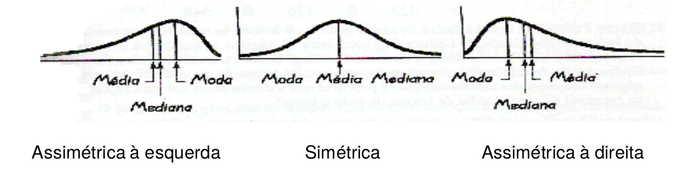
```

# Prática

## Vamos praticar ?

- Qual a média de pesos de recém nascidos na Maternidade N. S. da Luz no dia de ontem ?

    - Bebê 1 = 3,2 Kg

    - Bebê 2 = 2,8 Kg
    
    - Bebê 3 = 2,7 Kg
    
    - Bebê 4 = 3,4 Kg
    
    - Bebê 5 = 3,1 Kg

## Vamos praticar ?

- Qual a média de pesos de recém nascidos na Maternidade N. S. da Luz no dia de ontem ?

$$\bar{X} = \dfrac{3,2 + 2,8 + 2,7 + 3,4 + 3,1}{5} = 3,04 Kg$$

## Vamos praticar ?

- Qual a mediana dos dados abaixo ?

    - Dados 1: $(1,2,4,6,7)$

    - Dados 2: $(1,2,5,6,7,7)$
    
## Vamos praticar ?

- Colocando os valores em ordem, temos:

1. Dados 1 (**ímpar**), a posição da mediana é dada pelo elemento de ordem: $\dfrac{n+1}{2}$

    - $(1,2,4,6,7)$ → $\dfrac{5+1}{2} = 3$ → $md = x_3$, ou seja, elemento de ordem 3
    
    - $md = 4$

2. Se o número de valores é **par**, a mediana é dada pela média dos elementos de ordem $\dfrac{n}{2}$ e $\dfrac{n+2}{2}$:

    - $(1,2,5,6,7,7)$ → $md = \dfrac{x_2 + x_3}{2} = \dfrac{5 + 6}{2}$
    
    - $md = 5,5$
    
## Vamos praticar ?

- Em qual gráfico a moda é maior do que a mediana e a média ?

```{r, out.width='90%', fig.align='center'}
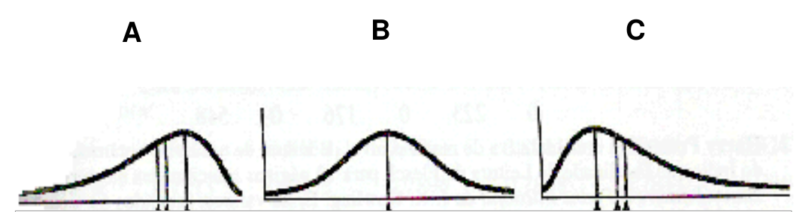

```

## Vamos praticar ?

- Em qual gráfico a moda é maior do que a mediana e a média ?

    - Gráfico **A**
    
```{r, out.width='90%', fig.align='center'}

```

# Medidas Separatrizes

## Medidas Separatrizes

- **Percentil:** O percentil de ordem $k$ (onde $k$ é qualquer valor entre 0 e 100), denotado por $P_k$ , é o valor tal que  $k\%$ dos valores do conjunto de dados são menores ou
iguais a ele. Divide a distribuição em 100 partes iguais em um conjunto ordenado de valores.

- **Quartil:** Divide a distribuição em 4 partes iguais em um conjunto ordenado de valores.

- **Decil:** Divide a distribuição em 10 partes iguais em um conjunto ordenado de valores.

## Medidas Separatrizes

- Percentis: 10, 20, 30, ..., 90 → Decis

- Percentil 25 → Primeiro quartil ($Q_1$)

- Percentil 50 → Segundo quartil ($Q_2$) → Mediana

- Percentil 75 → Terceiro quartil ($Q_3$)

```{r, out.width='100%', fig.align='center'}
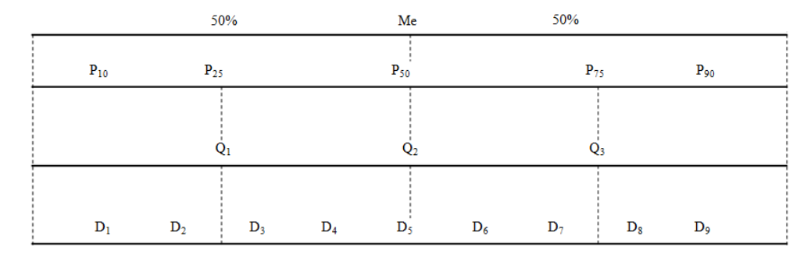
```


## Medidas Separatrizes

```{r, out.width='100%', fig.align='center'}
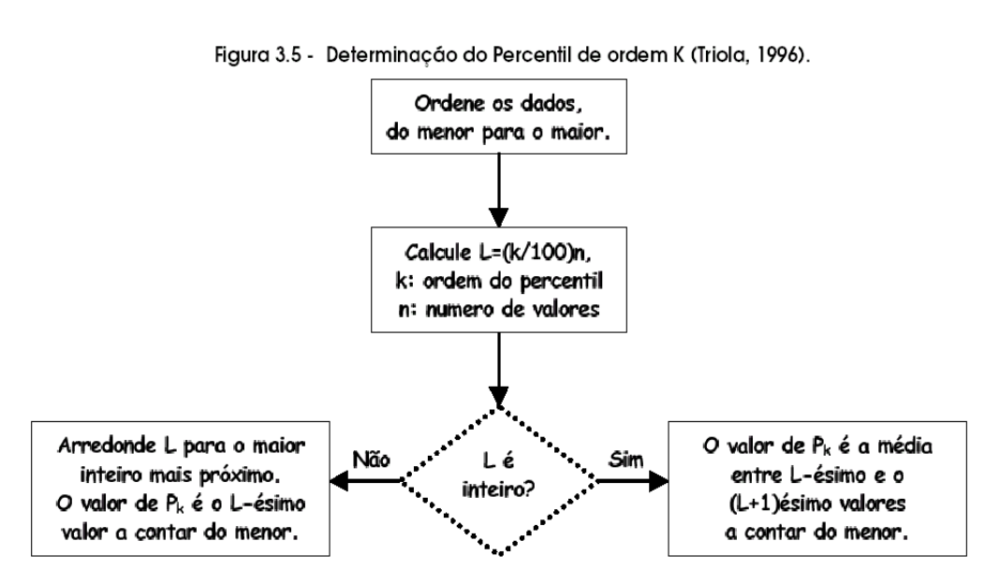
```

## Medidas Separatrizes

- **Exemplo:** A tabela abaixo lista 40 níveis ordenados de nicotinina para fumantes.

```{r, out.width='80%', fig.align='center'}
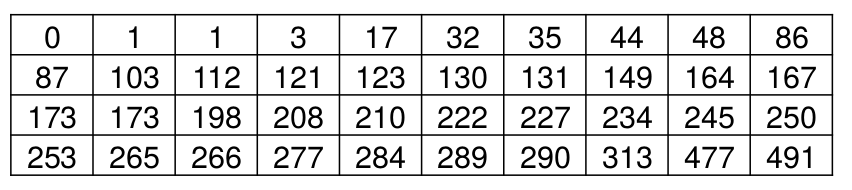
```

- Ache o percentil 30.

$$ L_{30} = \dfrac{30}{100} . 40 = 12$$

- Como o $L$ é inteiro, tiramos a média entre o elemento $L = 12$ e $L + 1 = 13$

- Assim, $P_{30} = \dfrac{103+112}{2} = 107,5$

# Medidas de Dispersão ou Variabilidade

## Medidas de Dispersão 

- A dispersão fornece uma medida da proximidade da série de dados em torno de um valor de tendência central, tomado como comparação.

- Medidas para avaliar a dispersão de um conjunto de dados: **Amplitude Total, Variância, Desvio Padrão e Coeficiente de Variação.**

## Amplitude total

$$AT = x_{máximo} - x_{mínimo}$$

- Maior amplitude total → maior dispersão.

- **Problema:** somente são usados os extremos do conjunto.

- **Elemento auxiliar na análise** → mostra a faixa de variação onde encontramos todos os elementos do conjunto.


## Amplitude Total

- **Exemplo:** Pressão sistólica de uma amostra de 5 pacientes

|     Pacientes     | $x_1$ | $x_2$ | $x_3$ | $x_4$ | $x_5$ |
|:-----------------:|-------|-------|-------|-------|-------|
| Pressão Sistólica | 15    | 20    | 14    | 14    | 12    |

$$AT = 20 - 14 = 8$$

## O Desvio

- Poderíamos então pensar na soma das diferenças entre cada valor do conjunto de dados e a média, mas:

$$(x_1 - \bar{x})+(x_2 - \bar{x})+...+(x_n - \bar{x}) = \sum_{i=1}^{n}(x_i - \bar{x}) = 0$$
- Então essa medida não serve como medida de dispersão. Segundo ela, todos os conjuntos de dados teriam variabilidade nula.

## Variância

- Medida direta da dispersão → conjunto com os dados mais dispersos terá maior variância.

- A variância mede a variabilidade ao redor da média, fornecendo o grau de precisão da média.

- Medida em unidade quadrada (exemplo: anos 2 ) → o que dificulta a sua interpretação.

## Variância e Desvio padrão

- A **Variância** é dada por:

$$S^2 = \dfrac{\sum_{i=1}^{n}(x_i - \bar{x})^2}{n-1}$$

- **Desvio padrão** → é obtido por meio da extração da raiz quadrada da variância. Representa o desvio médio dos valores em relação a média. Dado por:

$$S = \sqrt{\dfrac{\sum_{i=1}^{n}(x_i - \bar{x})^2}{n-1}}$$

- O desvio-padrão possui a mesma unidade de medida que os dados originais.

## Variância e Desvio padrão

- **Exemplo:** média = 15

```{r, out.width='80%', fig.align='center'}
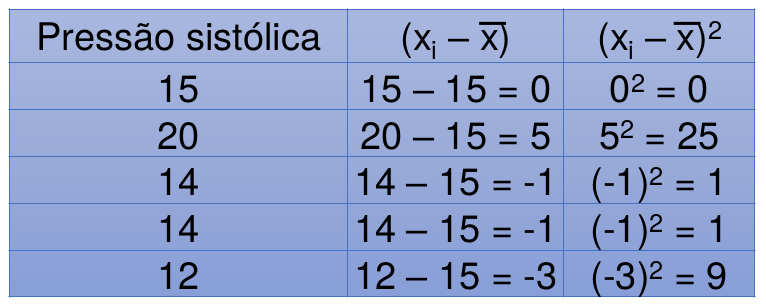
```

$S^2 = \dfrac{36}{4} = 9$  e $S = \sqrt{9}=3$

## Variância e Desvio padrão

**Desvio padrão - Interpretação**

- Uma pergunta que pode surgir é se um desvio padrão é grande ou pequeno → depende da ordem de grandeza da variável.

-  Um desvio padrão de 10 unidades é grande ou pequeno ?

- Se a média é 10.000 → desvio é pequeno (0,1% da média).

- Se a média é 100 → desvio é grande (10% da média).

## Coeficiente de variação

- É uma medida de dispersão relativa ($\%$) que mede a variação do desvio padrão em relação à média aritmética;

- **Vantagem:** permite a comparação entre variáveis ou populações distintas

- Quanto menor é o coeficiente de variação de um conjunto de dados, menor é a sua variabilidade. 
- **Medida adimensional**

- O **Coeficiente de Variação** é dado por:

$$CV(\%) = \dfrac{S}{\bar{x}}.100$$

## Coeficiente de variação

- **Exemplo:**

```{r, out.width='80%', fig.align='center'}

```

$\bar{x} = 15$, $S^2 = \dfrac{36}{4} = 9$  e $S = \sqrt{9}=3$

$$CV(\%) = \dfrac{3}{15}.100 = 20\%$$


## Regra do Desvio-padrão (Distribuições Simétricas)

```{r, out.width='100%', fig.align='center'}
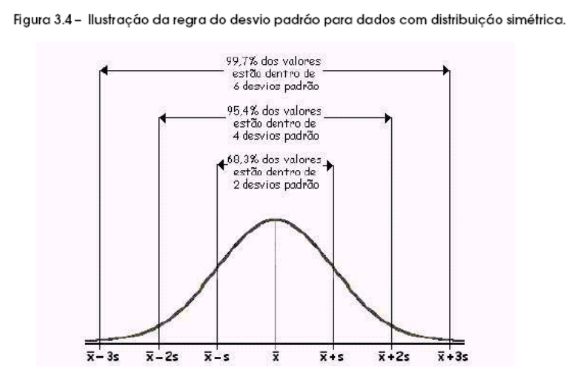
```

# Gráfico – Boxplot

## Gráfico – Boxplot

```{r, out.width='100%', fig.align='center'}
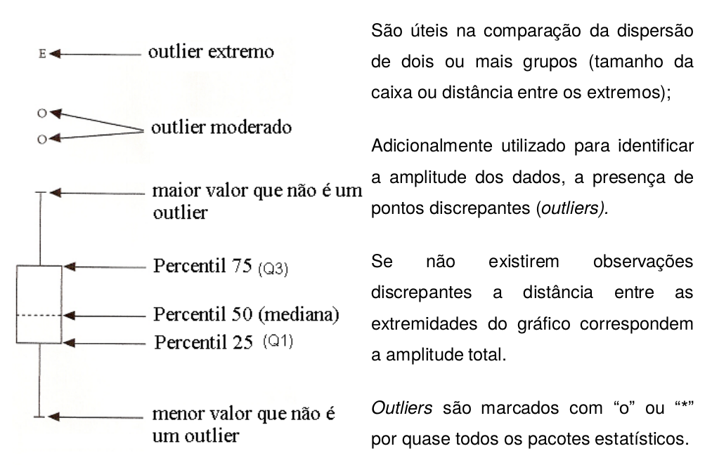
```

## Gráfico – Boxplot

```{r, out.width='100%', fig.align='center'}
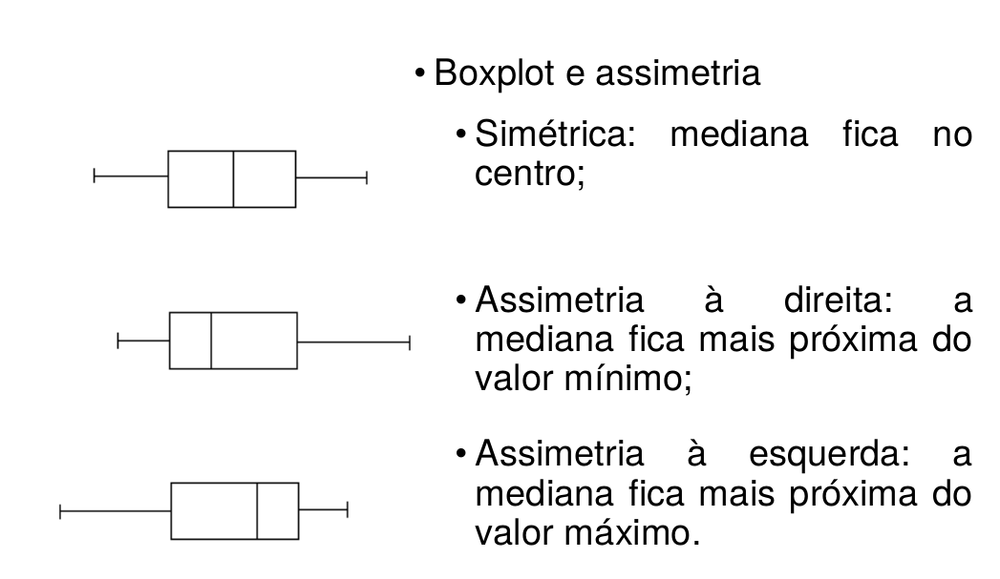
```

## Gráfico – Boxplot

```{r, out.width='100%', fig.align='center'}
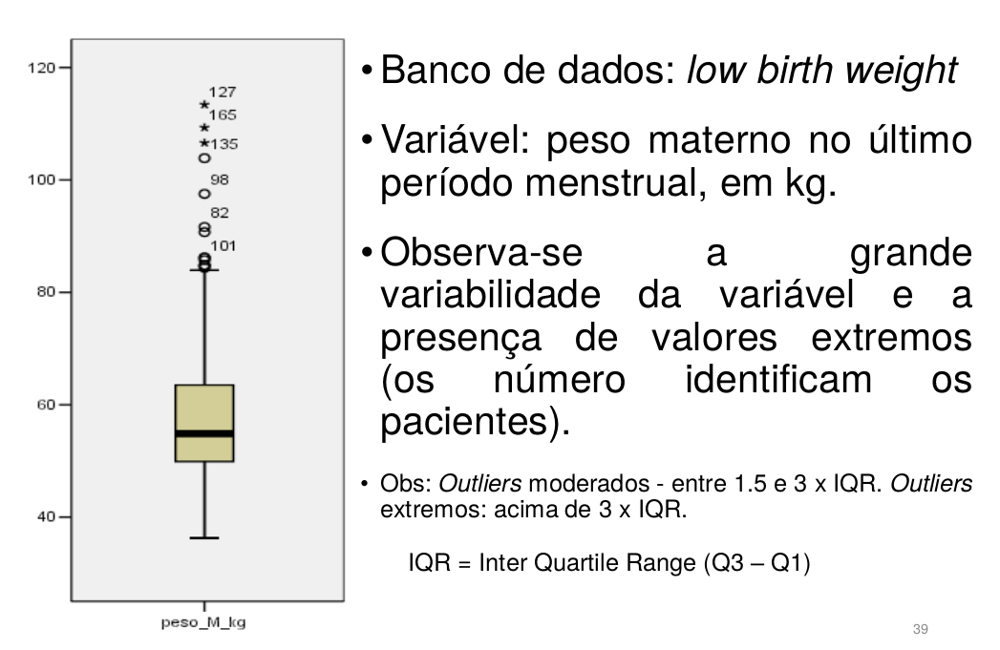
```

## Variância *vs* Coeficiente de Variação 

- **Variância**

    - A variância mede a variabilidade ao redor da média, fornecendo o grau de precisão da média.

    - Medida em unidade quadrada.

- **Coeficiente de Variação**

    - É uma medida de dispersão relativa ($\%$) que mede a variação do desvio padrão em relação à média aritmética.
    
    - Permite a comparação entre variáveis ou populações distintas.

## Exemplo utilizando o Rcommander

- Importar o arquivo "ExemploBDdiarreia.xlsx"

  - Rcommander $\rightarrow$ Dados $\rightarrow$ Importar arquivos de dados $\rightarrow$ do arquivo Excel
  
```{r, out.width='60%', size = 'tiny', fig.align='center'}
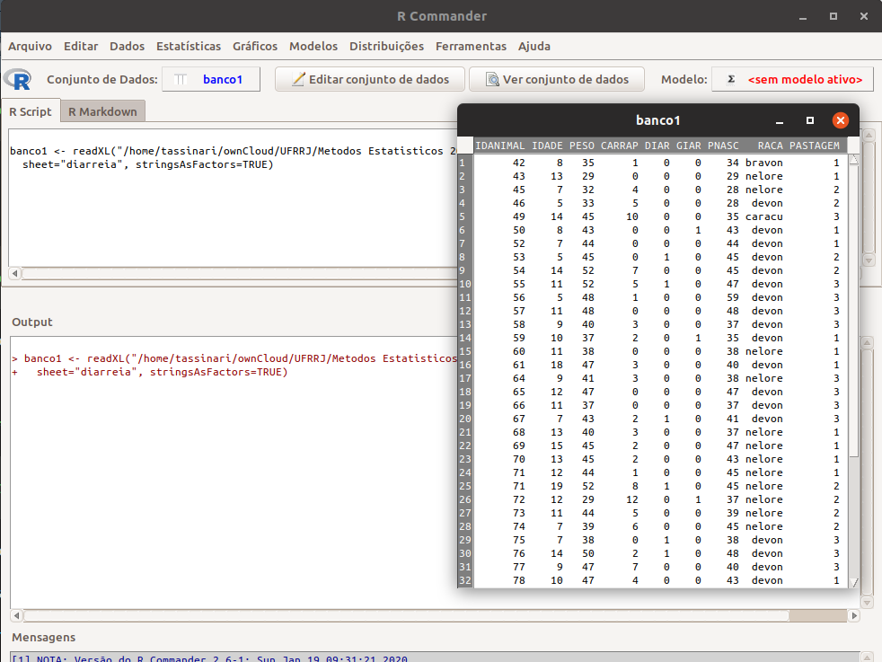
``` 

## Exemplo utilizando o Rcommander

- Sumário (resumo) estatístico de todo o banco

  - Rcommander $\rightarrow$ Resumos $\rightarrow$ Conjunto de dados ativo 
  
```{r, out.width='90%', size = 'tiny', fig.align='center'}
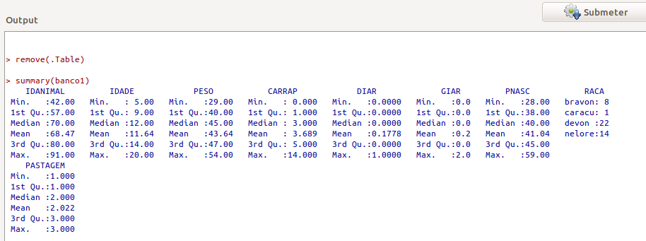
``` 

## Exemplo utilizando o Rcommander

- Sumário (resumo) estatístico de todo o banco

  - Rcommander $\rightarrow$ Resumos $\rightarrow$ Resumos numéricos ... 
  
```{r, out.width='90%', size = 'tiny', fig.align='center'}
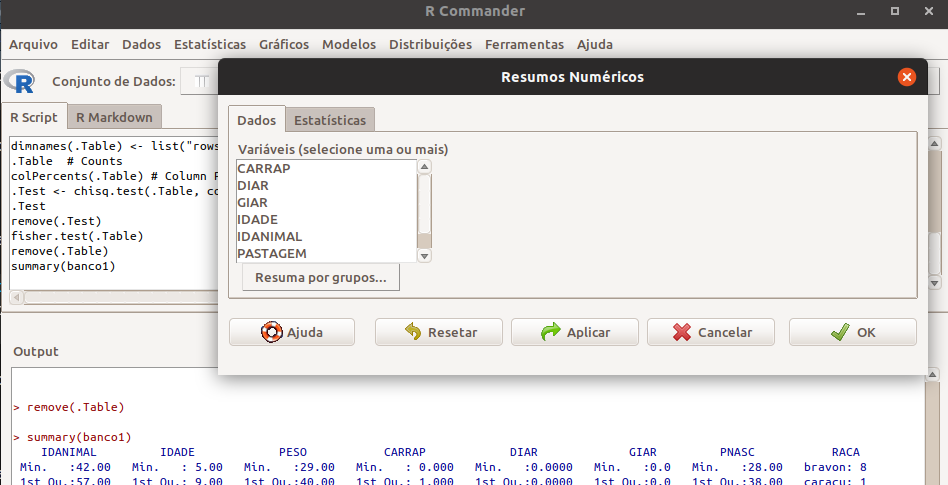
``` 

## Exemplo utilizando o Rcommander

- Sumário (resumo) estatístico personalisado por variável

```{r, out.width='90%', size = 'tiny', fig.align='center'}
knitr::include_graphics(c('figuras/Rcmdr60_2019.png', 'figuras/Rcmdr61_2019.png'))
``` 

## Exemplo utilizando o Rcommander

- Plotar Boxplot  

  - Rcommander $\rightarrow$ Gráficos $\rightarrow$ Boxplot
  
```{r, out.width='70%', size = 'tiny', fig.align='center'}
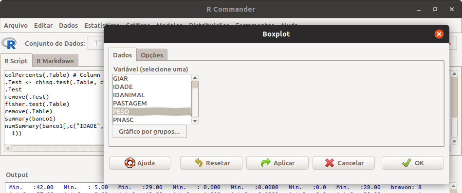
``` 

## Exemplo utilizando o Rcommander

```{r, out.width='90%', size = 'tiny', fig.align='center'}
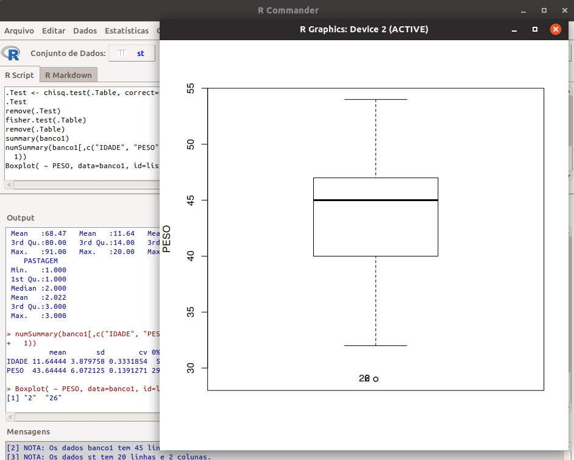
``` 

## Exemplo utilizando o Rcommander

- Plotar Boxplot por grupos de variáveis 

  - Rcommander $\rightarrow$ Gráficos $\rightarrow$ Boxplot
  
```{r, out.width='60%', size = 'tiny', fig.align='center'}
knitr::include_graphics(c('figuras/Rcmdr62_2019.png', 'figuras/Rcmdr64_2019.png'))
``` 

## Exemplo utilizando o Rcommander

```{r, out.width='90%', size = 'tiny', fig.align='center'}
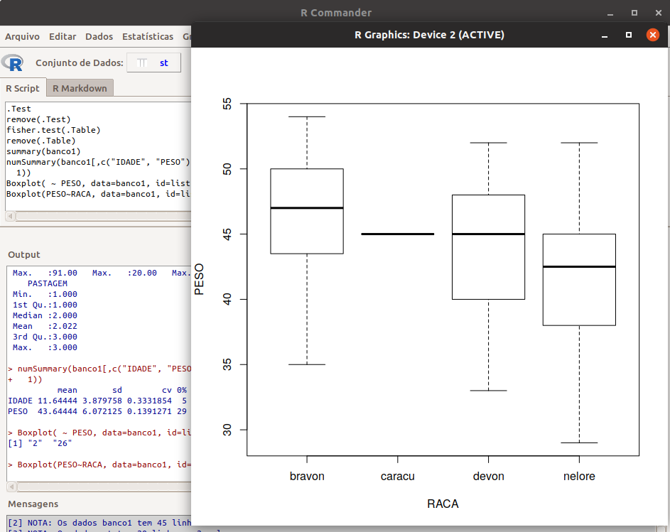
``` 

## Exemplo utilizando o Rcommander

- Distribuição de frequência da variável RACA

  - Rcommander $\rightarrow$ Estatísticas $\rightarrow$ Resumo $\rightarrow$ Distribuições de frequência ...
  
```{r, out.width='70%', size = 'tiny', fig.align='center'}
knitr::include_graphics(c('figuras/Rcmdr66_2019.png', 'figuras/Rcmdr67_2019.png'))
``` 

## Exemplo utilizando o Rcommander

- Média da variável PESO por RACA

  - Rcommander $\rightarrow$ Estatísticas $\rightarrow$ Resumo $\rightarrow$ Tabela de Estatísticas ...
  
```{r, out.width='75%', size = 'tiny', fig.align='center'}
knitr::include_graphics(c('figuras/Rcmdr68_2019.png', 'figuras/Rcmdr69_2019.png'))
``` 