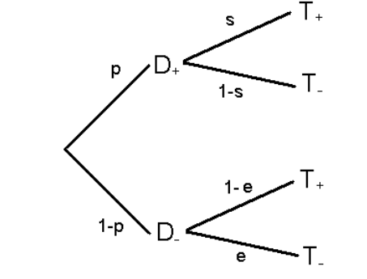
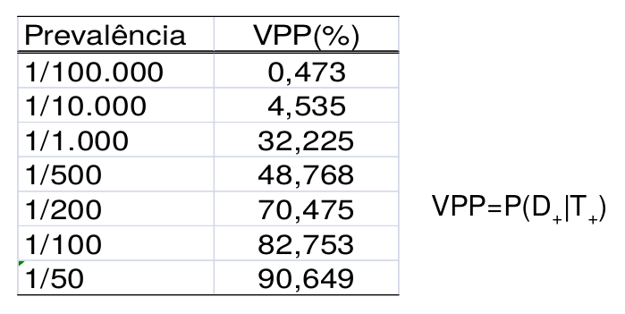
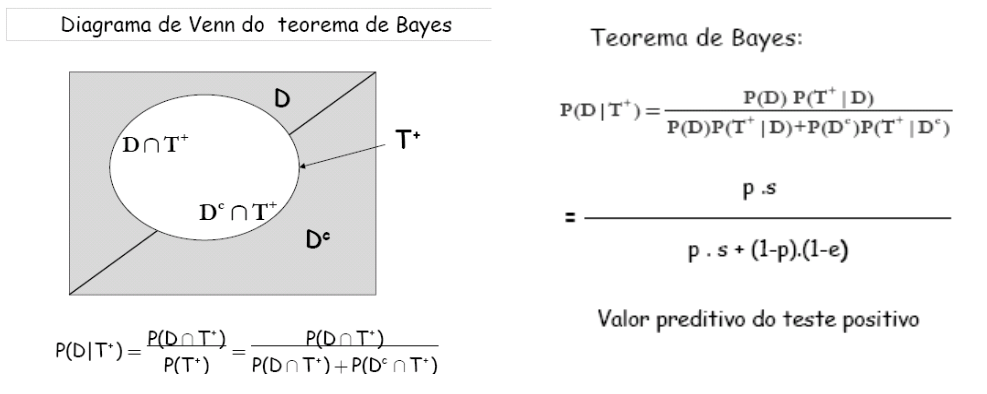
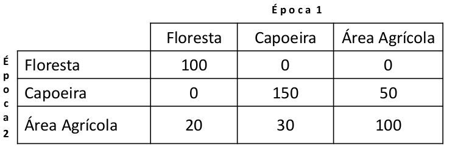

```{r setup, include=FALSE}
# https://ourcodingclub.github.io/2016/11/24/rmarkdown-1.html
knitr::opts_chunk$set(fig.width = 7, fig.height = 5, fig.align = 'center', dpi = 96, cache=TRUE, echo = F, comment = "", message = F, warning = F)

```

# Probabilidade

##  Probabilidade

Teoria matemática utilizada para se estudar incerteza oriunda de fenômenos de caráter aleatório.


## Alguns conceitos

- **Experimento Determinístico:** conhecidas as condições sob as quais o experimento vai ser realizado podemos indicar, a "*priori*", o resultado que será obtido.

    - **Exemplo:** Na operação 2 + 2, sabe-se que o resultado é o número 4.
    
- **Experimento Aleatório:** sabemos os resultados possíveis, mas não podemos dizer qual deles irá ocorrer.

    - **Exemplo:** No lançamento de uma moeda, o resultado poderá ser *cara* ou *coroa*.
    
**Espaço Amostral:** é o conjunto de todos os resultados possíveis de um certo experimento aleatório.

**Evento:** é qualquer subconjunto do espaço amostral.

## Características de um experimento aleatório

- Cada experimento poderá ser repetido indefinidamente sob condições inalteradas;

- Podemos descrever os possíveis resultados;

- Há uma regularidade quando o experimento for repetido um grande número de vezes.

## Como atribuir probabilidades aos eventos ?

1. Através de características teóricas da realização do fenômeno.

- **Exemplo:** Em um dado não viciado temos igual probabilidade para cada uma das faces.

*P(sair o número 6)* = $1/6$ → **eventos equiprováveis**

2. Através da frequência relativa.

- **Exemplo:** Suponha a população de uma cidade no ano de 2001 = 100000 habitantes. No mesmo ano, os casos registrados de uma determinada doença nessa cidade = 20 pacientes.

- Prevalência = P(ter a doença) = freq.relativa = $20/100000$ = $0,0002$

## Definição de probabilidade clássica (frequência relativa)

$$P(A) = \dfrac{k}{n}$$

- Sendo

        - *k*: Número de casos favoráveis ao evento *A* no experimento
        
        - *n*: Número total de casos no experimento
        
## Operações com Eventos

- **Relembrando:** Eventos são subconjuntos do espaço amostral

- É permitida a combinação de eventos (Exemplo: $A \cup B$), pela teoria dos conjuntos.

-  O símbolo $\cup$ ou união, pode ser lido como "ou"

- O símbolo $\cap$ ou interseção, pode ser lido como "e"

- Para a melhor compreensão das operações com eventos recomenda-se utilizar o diagrama de *Venn*.

## Probabilidade (Relembrando conjuntos)

```{r, out.width='100%'}
knitr::include_graphics('figuras/diagramavenn2019.png')
```

## Noções Fundamentais de Probabilidade

- Vamos representar o espaço amostral por $\Omega$ e dois eventos quaisquer deste espaço amostral por *A* e *B*.

- Definição: Uma função de probabilidade $P(.)$ é denominada probabilidade se satisfaz as condições:

    i. $0 \leq P(A) \leq 1$
    
    ii. $P(\Omega) = 1$
    
    iii. $P(A \cap B) = P(A) + P(B)$, se *A* e *B* são eventos disjuntos
    
```{r, out.width='100%'}
knitr::include_graphics('figuras/probabilidade2019.png')
```

## Noções Fundamentais de Probabilidade

```{r, out.width='100%'}
knitr::include_graphics('figuras/probabilidade2019_2.png')
```

## Noções Fundamentais de Probabilidade

vi. $P(\emptyset) = 0$
    
    
Para o evento vazio $\emptyset$, a probabilidade é zero.

## Noções Fundamentais de Probabilidade

- **Exemplo 1:** Supondo a urna abaixo, qual a probabilidade do objeto sorteado ser quadrado ou vermelho ?

```{r, out.width='90%'}
knitr::include_graphics('figuras/probabilidade2019_3.png')

```
## Noções Fundamentais de Probabilidade

- **Exemplo 1:** Supondo a urna abaixo, qual a probabilidade do objeto sorteado ser quadrado ou vermelho ?

```{r, out.width='90%'}
knitr::include_graphics('figuras/probabilidade2019_4.png')
```

## Noções Fundamentais de Probabilidade

- Resumindo:

```{r, out.width='90%'}
knitr::include_graphics('figuras/probabilidade2019_5.png')

```


## Noções Fundamentais de Probabilidade

- **Exemplo 2:** Calcule a probabilidade de sair ímpar no lançamento de um dado

- $A$: Sair ímpar

- $A = {1,3,5}$

$$P(A) = \dfrac{k}{n}=\dfrac{3}{6}=\dfrac{1}{2}$$

## Noções Fundamentais de Probabilidade

- **Exemplo 3:** Retira-se uma carta de um baralho. Determine a probabilidade de ocorrer:

a. Dama $\rightarrow$ $P(Dama) = \dfrac{4}{52}$

b. Carta de copas ou espada  $\rightarrow$ $P(Dama \cup Espada) = \dfrac{26}{52}$

c. Rei ou carta de espada

    i. A: Sair rei

    ii. B: Sair uma carta de espada
    
    
    $$P(A \cap B) = P(A) + P(B) - P(A \cup B) =  \dfrac{4}{52} + \dfrac{13}{52} - \dfrac{1}{52} = \dfrac{16}{52}$$
    
    
## Probabilidade Condicional

- Muitas vezes o fato de um evento ocorrer influencia na probabilidade da ocorrência de um outro evento. Neste caso, definimos:

- Dados dois eventos *A* e *B* , a probabilidade condicional de *B* dado que *A* ocorreu é representada por $P(B|A)$:

$$P(B|A) = \dfrac{P(A \cap B)}{P(A)}$$

- Que pode ser escrito como (pela regra do produto):

$$P(A \cap B) = P(A).P(B|A)$$

## Probabilidade Condicional

- **Exemplo de Probabilidade condicional**

```{r, out.width='90%'}
knitr::include_graphics('figuras/probabilidade2019_6.png')

```

## Probabilidade Condicional

- **Exemplo de Probabilidade condicional**

```{r, out.width='90%'}
knitr::include_graphics('figuras/probabilidade2019_7.png')

```

## Probabilidade Condicional

- **Exemplo de Probabilidade condicional**

```{r, out.width='90%'}
knitr::include_graphics('figuras/probabilidade2019_9.png')

```

## Probabilidade Condicional

- **Exemplo de Probabilidade condicional**

```{r, out.width='90%'}
knitr::include_graphics('figuras/probabilidade2019_9.png')

```

## Probabilidade Condicional

- **Exemplo de Probabilidade condicional**

```{r, out.width='90%'}
knitr::include_graphics('figuras/probabilidade2019_10.png')

```

## Probabilidade Condicional

- **Resumindo**

```{r, out.width='90%'}
knitr::include_graphics('figuras/probabilidade2019_11.png')

```

## Probabilidade Condicional

- **Exemplo 4:** Raio X do tórax para detectar tuberculose

```{r, out.width='90%'}
knitr::include_graphics('figuras/probabilidade2019_12.png')

```

## Independência

- Dois eventos *A* e *B* são independentes se a informação da ocorrência ou não de *A* não altera a probabilidade de ocorrência de *B*. Isto é,

$$P(B|A) = P (B)$$

- ou ainda de forma equivalente (pela regra do produto):

$$P(A \cup B) = P(A) . P(B)$$

## Independência

- **Exemplo de Independência**

```{r, out.width='90%'}
knitr::include_graphics('figuras/probabilidade2019_13.png')

```

## Independência

- **Resumindo**

```{r, out.width='90%'}
knitr::include_graphics('figuras/probabilidade2019_14.png')

```

## Independência

```{r, out.width='90%'}
knitr::include_graphics('figuras/probabilidade2019_15.png')

```

## Probabilidade - Resumo

```{r, out.width='100%'}
knitr::include_graphics('figuras/probabilidade2019_16.png')

```

## Exemplo

- **Exemplo 6:**

```{r, out.width='100%'}
knitr::include_graphics('figuras/probabilidade2019_17.png')

```

## Sensibilidade(s) do Teste

- **Exemplo 6:** Qual é a probabilidade do teste ser positivo sabendo que o paciente está doente, ou seja, $P(T_+|D_+ )$ ?

- Se o paciente está doente: o espaço amostral agora está limitado somente aos pacientes doentes ($D_+$):

```{r, out.width='100%'}
knitr::include_graphics('figuras/probabilidade2019_18.png')

```

- E essa probabilidade pode ser calculada por: $\dfrac{52}{67} = 0,78$

$$P(T_+|D_+ ) = \dfrac{P(T_+ \cap D_+ )}{P(D_+ )} = 0,78$$

- Essa probabilidade é chamada de sensibilidade(s) do teste.

## Sensibilidade(s) do Teste

- **Exemplo 6:** Qual é a probabilidade do teste ser negativo dado
que o paciente não está doente, $P(T_-|D_-)$ ?

$$P(T_-|D_-) = \dfrac{P(T_- \cap D_- )}{P(D_- )} = \dfrac{74/150}{83/150} = 0,89$$


```{r, out.width='90%'}
knitr::include_graphics('figuras/probabilidade2019_19.png')

```

- Vamos encontrar expressões para o **valor preditivo** em função de
*p, s, e*. Para isso vamos representar a através de uma **árvore de
probabilidades**.

## Árvore de Probabilidades


```{r, out.width='70%'}


```

## Árvore de Probabilidades

- Devemos observar que a probabilidade de qualquer combinação de eventos, 
por exemplo "ser portador da doença" $\&$ "teste positivo" é obtido 
multiplicando-se as probabilidades dos ramos que correspondem a esses eventos:

$$P(T_+ \cap D_+) = P(D_+) \times P(T_+ | D_+) = p \times s$$

- Se queremos calcular a probabilidade do evento "teste positivo", basta 
efetuar a soma dos produtos de todos os ramos que levam ao evento "teste positivo":

$$P(T_+) = P(D_+) \times P(T_+|D_+) + P(D_−) \times P(T_+|D_−) = p \times s + ( 1 - p ) \times ( 1 - e )$$

## Valor Preditivo Positivo

- Deste modo podemos escrever:

$$VPP = P(D_+|T_+ ) = \dfrac{P(D_+ \cap T_+ )}{P(T_+ )} = \dfrac{p \times s}{p \times s + (1 - p) \times (1 - e)}$$

- Calculando o Valor Preditivo Positivo no teste tomografia computadorizada na metástase de carcinoma hepático, encontramos:

$$VPP = \dfrac{0,02 \times 0,78}{0,02 \times 0,78 + 0,98 \times 0,11} = 0,126$$

## Valor Preditivo Negativo

- De forma análoga podemos escrever

$$VPN = P(D_-|T_- ) = \dfrac{P(D_- \cap T_- )}{P(T_- )} = \dfrac{(1 - p) \times e}{(1 - p) \times e + p \times (1 - s)}$$

- Calculando o **Valor Preditivo Negativo** no teste tomografia computadorizada na metástase de carcinoma hepático, encontramos:

$$VPN = \dfrac{0,98 \times 0,89}{0,98 \times 0,89 + 0,02 \times 0,22} = 0,995$$

- Observe que **VPP** e **VPN** dependem não só de *s* e *e*, mas também de *p*.

## Exemplo 6

- Conclusão

- A chance de um indivíduo escolhido aleatoriamente numa população ter metástase antes do teste era de *0,02 (2%)*. **(Probabilidade a priori)**

- Depois que a tomografia é realizada e o resultado é positivo probabilidade de metástase passa a ser *0,13 (13%)*. **(Probabilidade a posteriori)**

## Exemplo 7

- Um exemplo relevante da influência da prevalência no **VPP** é o caso de exames para testar a presença do vírus da AIDS. Além de incurável seu tratamento requer um alto custo. Por isso, queremos um teste $VPP = P(D_+|T_+)$ seja alto. A primeira tecnologia a se difundir no
Brasil para a detecção da presença do HIV foi o teste ELISA. O laboratório em seus testes preliminares encontrou sensibilidade de *0,95* e especificidade de *0,998*, para o ELISA. Sabendo-se disso **Valor Preditivo** pode ser escrito como:

$$VPP = P(D_+|T_+ ) = \dfrac{p \times s}{p \times + (1 - p) \times (1 - e)} = \dfrac{p \times 0,95}{p \times 0,95 + (1 - p) \times 0,002}$$

## Exemplo 7

- A tabela abaixo apresenta os valores de **VPP** para a o teste ELISA para alguns valores de **prevalência**:

```{r, out.width='70%'}


```

- **Conclusão:** A prevalência da doença é pequena $\Rightarrow$ **VPP** baixo $\Rightarrow$
poucos pacientes com teste positivo são doentes $\Rightarrow$ muitos pacientes com teste positivo não tem a doença.

## Teorema de Bayes – Teste Diagnóstico

- $D =$ "tem a doença"
- $D^{c} =$ "não tem a doença"
- $T^{+}$ = "resultado do teste é pósitivo"
- Encontrar $P(D|T_+)$

```{r, out.width='100%'}

```

## Exercício 1

1) Sejam *A* e *B* eventos tais que $P(A) = 0,2$; $P(B) = p$; e $P(A \cup B) = 0,6$. Calcular *p* considerando *A* e *B*:

a. mutuamente exclusivos;

b. independentes.


## Exercício 2

- Considere 3 fábricas *A, B e C*, que produzem um determinado produto em lotes de 100, 200 e 300 peças, respectivamente. Um lote de cada fábrica é selecionado e as peças são misturadas. Suponha que a probabilidade de se encontrar peças defeituosas em cada uma das fábricas seja respectivamente de 10%; 5% e 1%. Selecionando-se uma peça ao acaso, calcule as seguintes
probabilidades:

a. ser da fábrica *A*;

b. ser defeituosa, sabendo que a peça provém da fábrica *A*;

c. ser defeituosa; e

d. ser da fábrica *A*, sabendo que a peça é defeituosa.

## Exercício 3

- Duas imagens de duas épocas distintas foram classificadas em 3 classes: floresta (F), capoeira (C) e área agrícola (A). A fim de comparar as mudanças entre as épocas, fez-se a tabulação
cruzada entre as imagens classificadas, obtendo-se a seguinte matriz de confusão (em ha):

```{r, out.width='100%'}

```

## Exercício 3

- Selecionando-se um ponto aleatoriamente, calcule a probabilidade deste ponto:

a. ser floresta na época 1;
b. ser floresta em ambas as épocas;
c. ser capoeira em qualquer época;
d. ser capoeira na época 2, tendo sido área agrícola na época 1; e
e. ser capoeira na época 2, não tendo sido área agrícola na época 1.

## Exercício 4

- Raio X do tórax para detectar tuberculose

```{r, out.width='90%'}

```

- Se a prevalência desta doença é 0,0093, determine:

a. sensibilidade, especificidade, falso positivo, falso negativo,
b. valor preditivo positivo e valor preditivo negativo.
