```{r setup, include=FALSE}
# https://ourcodingclub.github.io/2016/11/24/rmarkdown-1.html
knitr::opts_chunk$set(fig.width = 7, fig.height = 5, fig.align = 'center', dpi = 96, cache=TRUE, echo = F, comment = "", message = F, warning = F)

```

# Probabilidade

##  Probabilidade

- Teoria matemática utilizada para se estudar incerteza oriunda de fenômenos de caráter aleatório.

- Base sobre a qual são construídos importantes métodos de inferência estatística.


## Alguns conceitos

- **Experimento Determinístico:** conhecidas as condições sob as quais o experimento vai ser realizado podemos indicar, a "*priori*", o resultado que será obtido.

    - **Exemplo:** Na operação 2 + 2, sabe-se que o resultado é o número 4.
    
- **Experimento Aleatório:** sabemos os resultados possíveis, mas não podemos dizer qual deles irá ocorrer.

    - **Exemplo:** No lançamento de uma moeda, o resultado poderá ser *cara* ou *coroa*.
    
**Espaço Amostral:** é o conjunto de todos os resultados possíveis de um certo experimento aleatório.

**Evento:** é qualquer subconjunto do espaço amostral.

## Características de um experimento aleatório

- Cada experimento poderá ser repetido indefinidamente sob condições inalteradas;

- Podemos descrever os possíveis resultados;

- Há uma regularidade quando o experimento for repetido um grande número de vezes.

## Exemplo de um experimento aleatório

1. Experimento Aleatório: Jogar um dado homogêneo e observar o resultado

    - Espaço Amostral: $\{1,2,3,4,5,6\}$

    - Evento: {sair o número 6}, {sair um número par}
    
2. Experimento Aleatório: Uma pessoa faz um exame para saber se tem uma determinada doença

    - Espaço Amostral: {tem a doença, não tem a doença}

    - Evento: {tem a doença}

## Como atribuir probabilidades aos eventos ?

1. Através de características teóricas da realização do fenômeno.

- **Exemplo:** Em um dado não viciado temos igual probabilidade para cada uma das faces.

*P(sair o número 6)* = $1/6$ → **eventos equiprováveis**

2. Através da frequência relativa.

- **Exemplo:** Suponha a população de uma cidade no ano de 2001 = $100.000$ habitantes. No mesmo ano, os casos registrados de uma determinada doença nessa cidade = 20 pacientes.

- Prevalência = P(ter a doença) = freq.relativa = $20/100000$ = $0,0002$

## Definição de probabilidade clássica (frequência relativa)

$$P(A) = \dfrac{k}{n}$$

Sendo:

*k*: Número de casos favoráveis ao evento *A* no experimento
        
*n*: Número total de casos no experimento


## Relembrando conjuntos

```{r, out.width='80%', size = 'tiny', fig.align='center'}
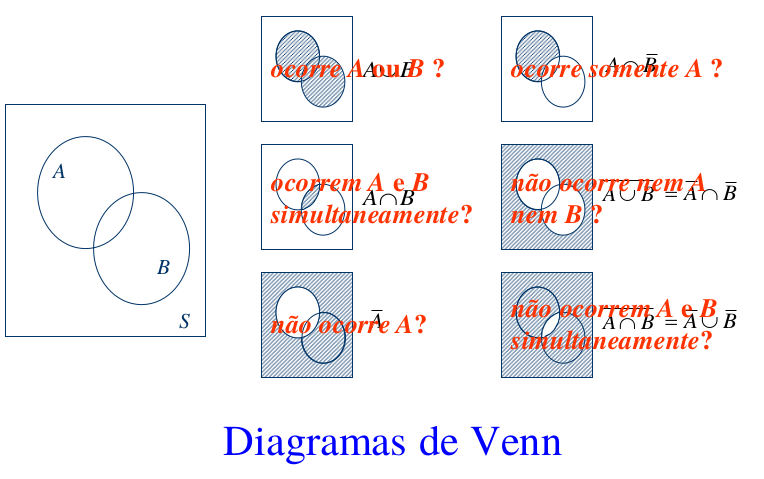
```


## Noções Fundamentais de Probabilidade

- Vamos representar o espaço amostral por $\Omega$ e dois eventos quaisquer deste espaço amostral por *A* e *B*.

- Definição: Uma função de probabilidade $P(.)$ é denominada probabilidade se satisfaz as condições:

    i. $0 \leq P(A) \leq 1$
    
    ii. $P(\Omega) = 1$
    
    iii. $P(A \cap B) = P(A) + P(B)$, se *A* e *B* são eventos disjuntos
    
```{r, out.width='100%'}
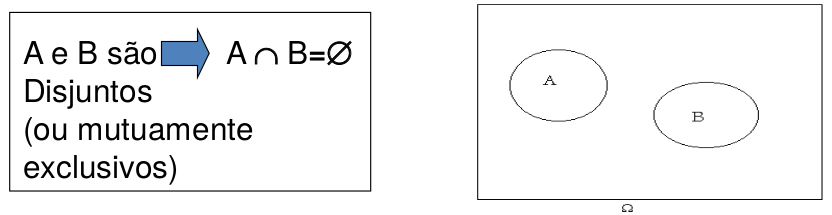
```

## Noções Fundamentais de Probabilidade

```{r, out.width='100%'}
knitr::include_graphics('figuras/probabilidade2019_2.png')
```

## Noções Fundamentais de Probabilidade

vi. $P(\emptyset) = 0$
    
    
Para o evento vazio $\emptyset$, a probabilidade é zero.

## Noções Fundamentais de Probabilidade

- **Exemplo 1:** Supondo a urna abaixo, qual a probabilidade do objeto sorteado ser quadrado ou vermelho ?

```{r, out.width='90%'}
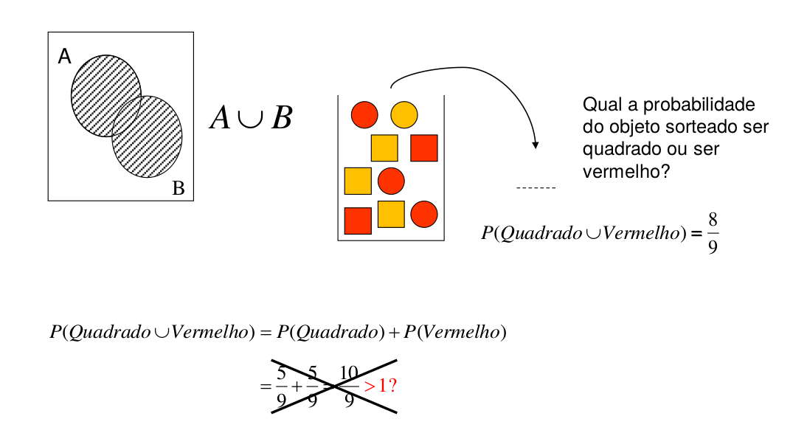

```
## Noções Fundamentais de Probabilidade

- **Exemplo 1:** Supondo a urna abaixo, qual a probabilidade do objeto sorteado ser quadrado ou vermelho ?

```{r, out.width='90%'}
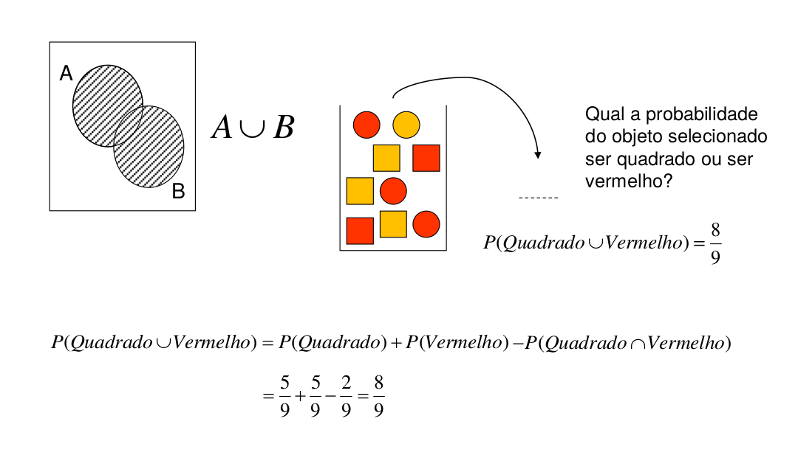
```

## Noções Fundamentais de Probabilidade

- Resumindo:

```{r, out.width='90%'}
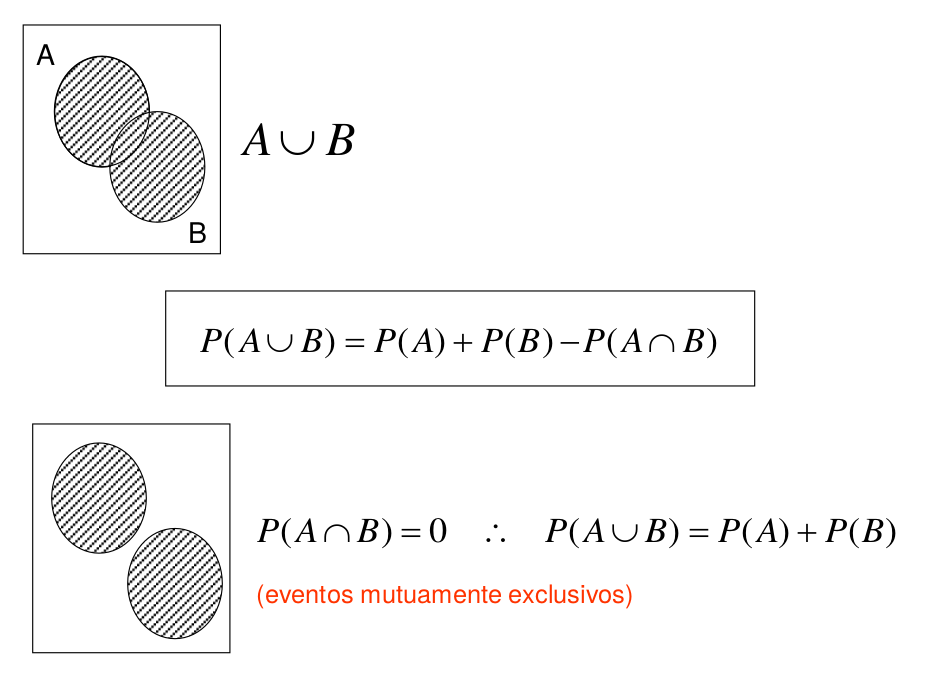

```


## Noções Fundamentais de Probabilidade

- **Exemplo 2:** Calcule a probabilidade de sair ímpar no lançamento de um dado

- $A$: Sair ímpar

- $A = {1,3,5}$

$$P(A) = \dfrac{k}{n}=\dfrac{3}{6}=\dfrac{1}{2}$$

## Noções Fundamentais de Probabilidade

- **Exemplo 3:** Retira-se uma carta de um baralho. Determine a probabilidade de ocorrer:

a. Dama $\rightarrow$ $P(Dama) = \dfrac{4}{52}$

b. Carta de copas ou espada  $\rightarrow$ $P(Dama \cup Espada) = \dfrac{26}{52}$

c. Rei ou carta de espada

    i. A: Sair rei

    ii. B: Sair uma carta de espada
    
    
    $$P(A \cap B) = P(A) + P(B) - P(A \cup B) =  \dfrac{4}{52} + \dfrac{13}{52} - \dfrac{1}{52} = \dfrac{16}{52}$$
    
    
## Probabilidade Condicional

- Muitas vezes o fato de um evento ocorrer influencia na probabilidade da ocorrência de um outro evento. Neste caso, definimos:

- Dados dois eventos *A* e *B* , a probabilidade condicional de *B* dado que *A* ocorreu é representada por $P(B|A)$:

$$P(B|A) = \dfrac{P(A \cap B)}{P(A)}$$

- Que pode ser escrito como (pela regra do produto):

$$P(A \cap B) = P(A).P(B|A)$$

## Probabilidade Condicional

- **Exemplo de Probabilidade condicional**

```{r, out.width='90%'}
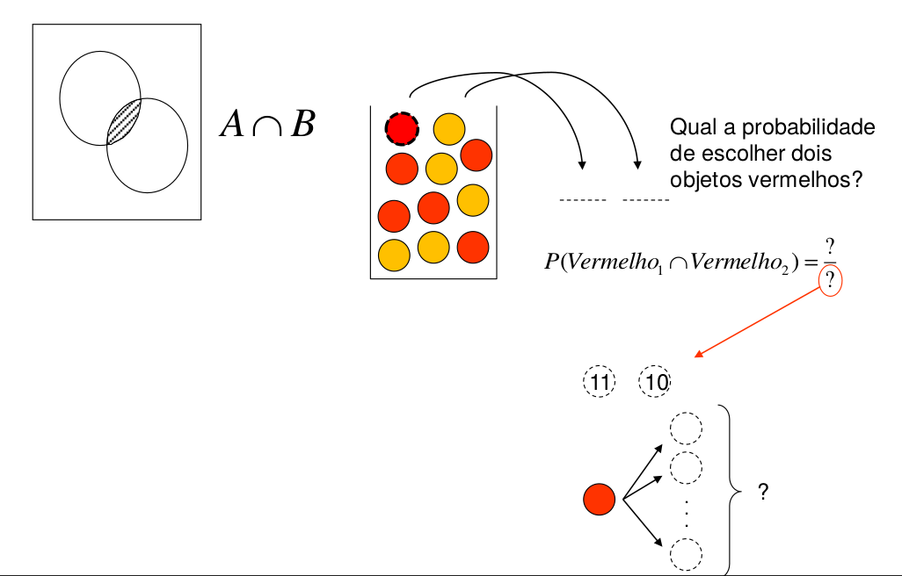

```

## Probabilidade Condicional

- **Exemplo de Probabilidade condicional**

```{r, out.width='90%'}
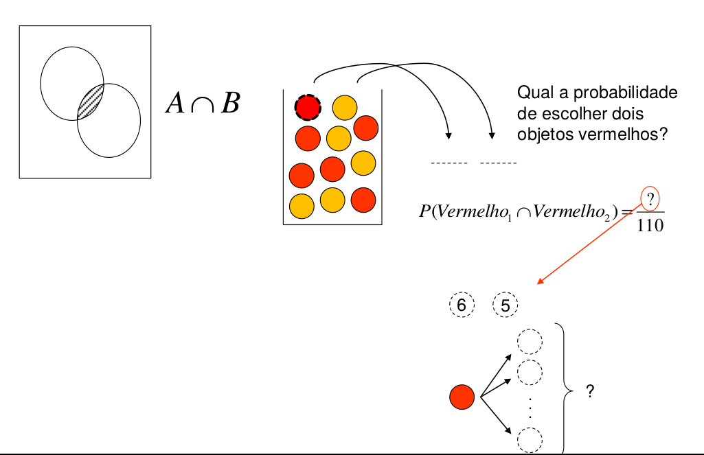

```

## Probabilidade Condicional

- **Exemplo de Probabilidade condicional**

```{r, out.width='90%'}
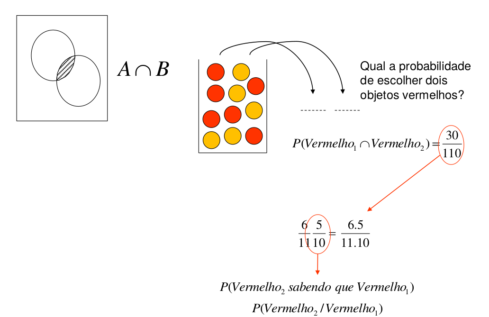

```

## Probabilidade Condicional

- **Exemplo de Probabilidade condicional**

```{r, out.width='90%'}


```

## Probabilidade Condicional

- **Exemplo de Probabilidade condicional**

```{r, out.width='90%'}
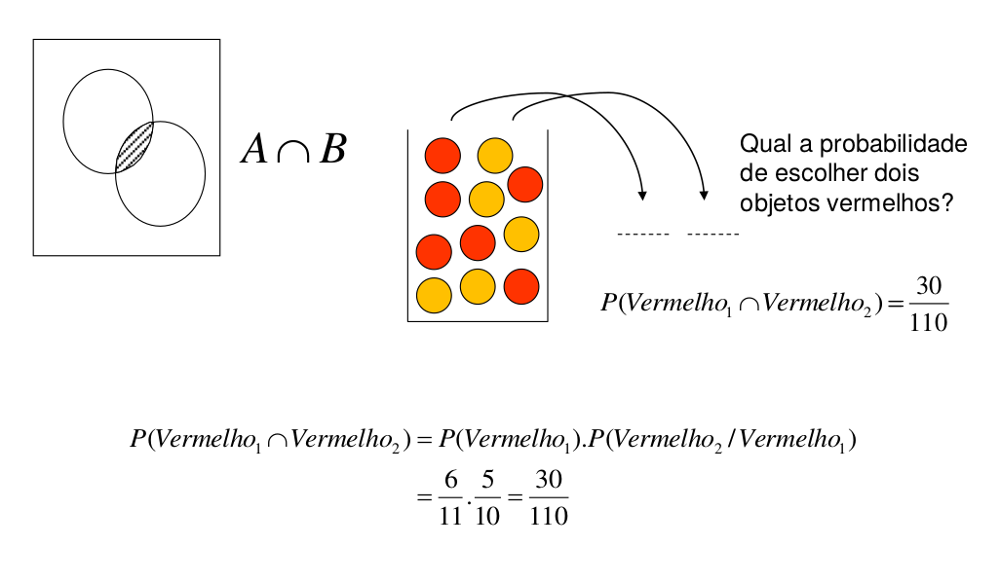

```

## Probabilidade Condicional

- **Resumindo**

```{r, out.width='90%'}
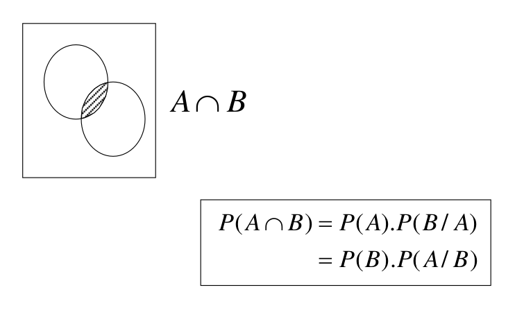

```

## Probabilidade Condicional

- **Exemplo 4:** Raio X do tórax para detectar tuberculose

```{r, out.width='90%'}
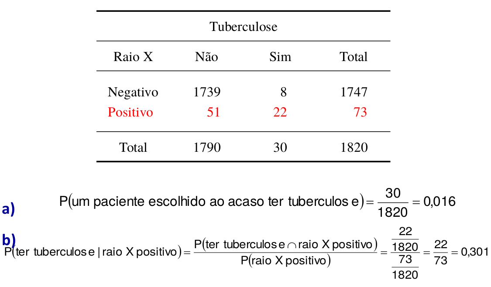

```

## Independência

- Dois eventos *A* e *B* são independentes se a informação da ocorrência ou não de *A* não altera a probabilidade de ocorrência de *B*. Isto é,

$$P(B|A) = P (B)$$

- ou ainda de forma equivalente (pela regra do produto):

$$P(A \cap B) = P(A) . P(B)$$

## Independência

- **Exemplo de Independência**

```{r, out.width='90%'}
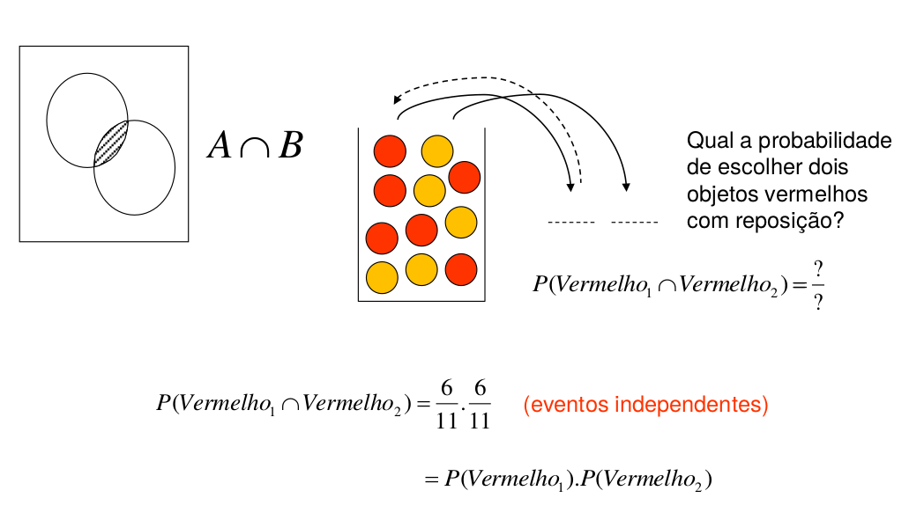

```

## Independência

- **Resumindo**

```{r, out.width='90%'}
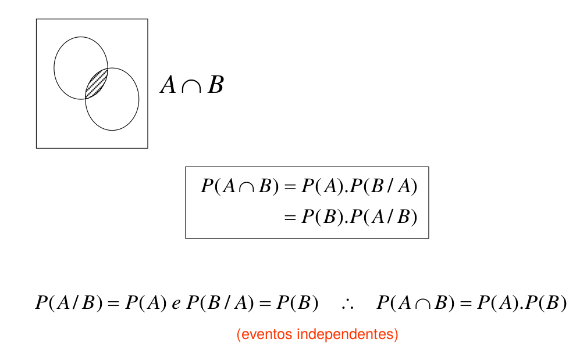

```

## Independência

```{r, out.width='90%'}
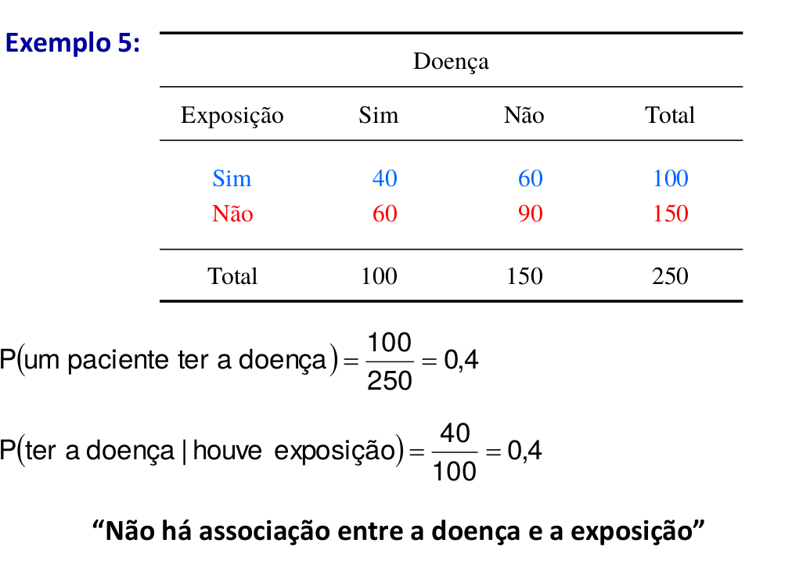

```

## Probabilidade - Resumo

```{r, out.width='100%'}
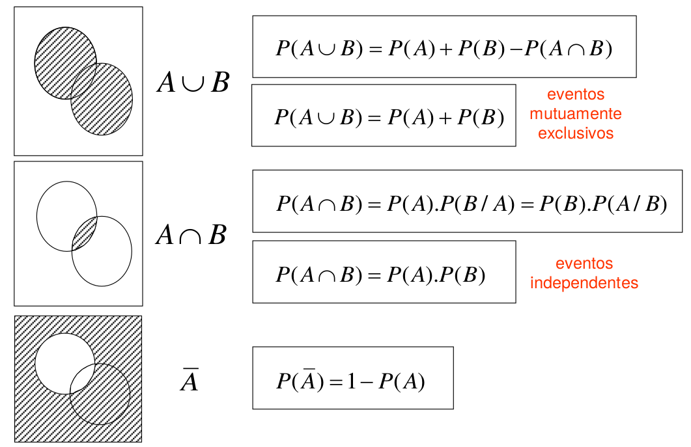

```

## Medidas de qualidade de um teste (Sensibilidade e Especificidade)

-  Exemplo de Lind & Singer (1986): qualidade da tomografia computadorizada para o diagnóstico de metástase de carcinoma de fígado. (Comparado com laparotomia, um teste padrão ouro). Suponha que nessa população a prevalência (*p*) de metástase de carcinoma de fígado é de $2\%$.

## Exemplo de Lind & Singer (1986):

```{r, out.width='100%'}
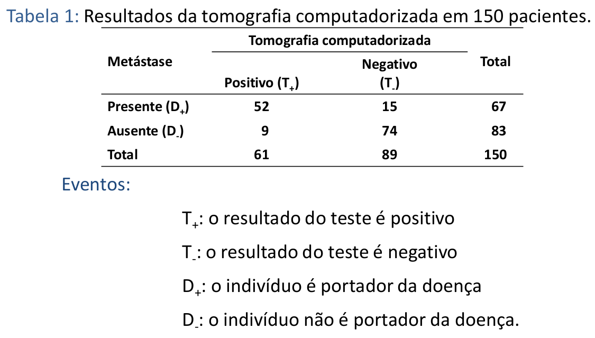

```

## Sensibilidade(s) do Teste

- **Exemplo 6:** Qual é a probabilidade do teste ser positivo sabendo que o paciente está doente, ou seja, $P(T_+|D_+ )$ ?

- Se o paciente está doente: o espaço amostral agora está limitado somente aos pacientes doentes ($D_+$):

```{r, out.width='100%'}
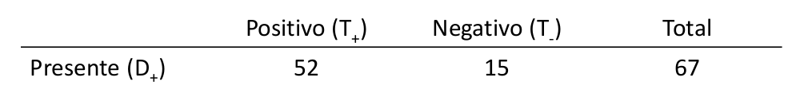

```

- E essa probabilidade pode ser calculada por: $\dfrac{52}{67} = 0,78$

$$P(T_+|D_+ ) = \dfrac{P(T_+ \cap D_+ )}{P(D_+ )} = 0,78$$

- Essa probabilidade é chamada de sensibilidade(s) do teste.

## Especificidade(s) do Teste

- **Exemplo 6:** Qual é a probabilidade do teste ser negativo dado
que o paciente não está doente, $P(T_-|D_-)$ ?

$$P(T_-|D_-) = \dfrac{P(T_- \cap D_- )}{P(D_- )} = \dfrac{74/150}{83/150} = 0,89$$


```{r, out.width='90%'}
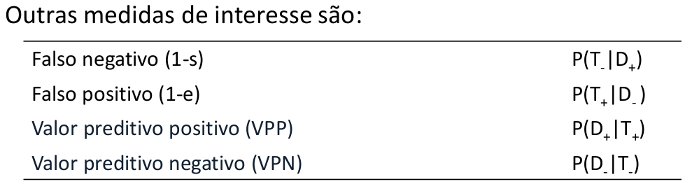

```


## Valores Preditivos

- Valor Preditivo Positivo

$VPP = P(D_+|T_+ ) = \dfrac{P(D_+ \cap T_+ )}{P(T_+ )} = \dfrac{52/150}{61/150} = 0,852$

- Valor Preditivo Negativo

$VPN = P(D_-|T_- ) = \dfrac{P(D_- \cap T_- )}{P(T_- )} = \dfrac{74/150}{89/150} = 0,831$


## Solução do exemplo utilizando o plugin "RcmdrPlugin.EZR" 

- Primeiro abra o Rcommander

```{r, out.width='90%', fig.align='center'}

```

## Solução do exemplo utilizando o plugin "RcmdrPlugin.EZR" 

- Segundo carregue o plugin RcmdrPlugin.EZR

```{r, out.width='90%', fig.align='center'}
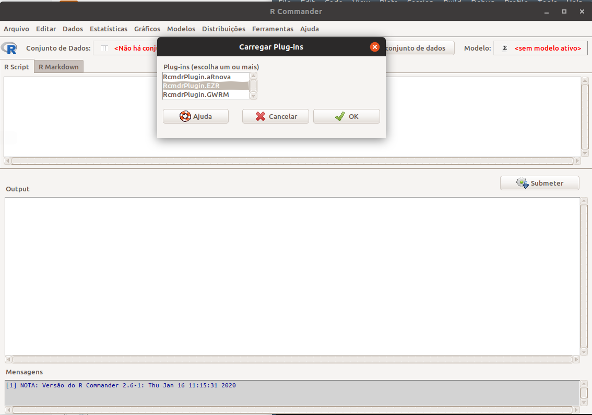
```

## Solução do exemplo utilizando o plugin "RcmdrPlugin.EZR" 

- O Rcommander será reinicializado com o RcmdrPlugin.EZR

```{r, out.width='90%', fig.align='center'}

```

## Solução do exemplo utilizando o plugin "RcmdrPlugin.EZR" 

 - Rcommander $\rightarrow$ Statistical analysis $\rightarrow$ Accuracy of diagnostic test $\rightarrow$ Accuracy of qualitative test
 
```{r, out.width='90%', fig.align='center'}
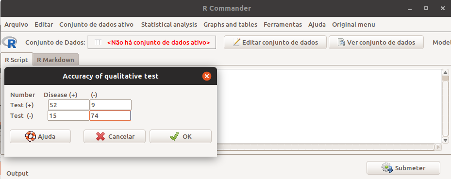

```

## Solução do exemplo utilizando o plugin "RcmdrPlugin.EZR" 

```{r, out.width='100%', fig.align='center'}
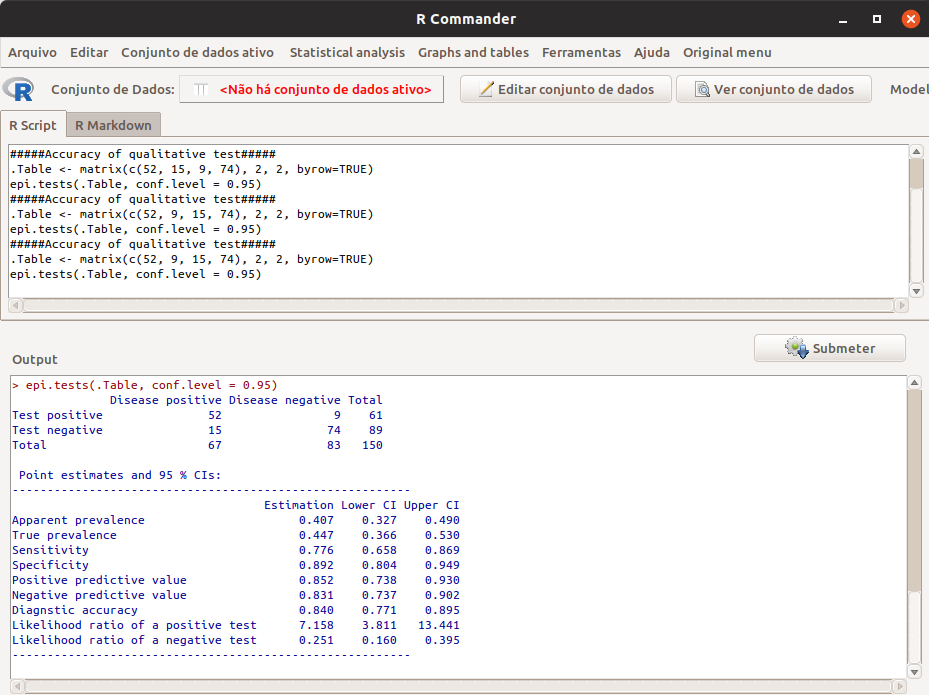

```


## Exercício:

Os dados abaixo se referem ao exame de Raio X do tórax para detectar tuberculose.

```{r, out.width='90%'}
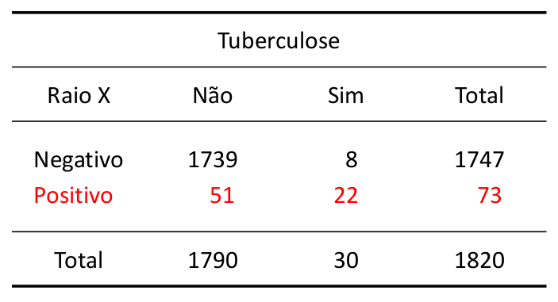
```

Determine a sensibilidade, especificidade, valor preditivo positivo e valor preditivo negativo.

## Solução utilizando o plugin "RcmdrPlugin.EZR" 

```{r, out.width='100%', fig.align='center'}
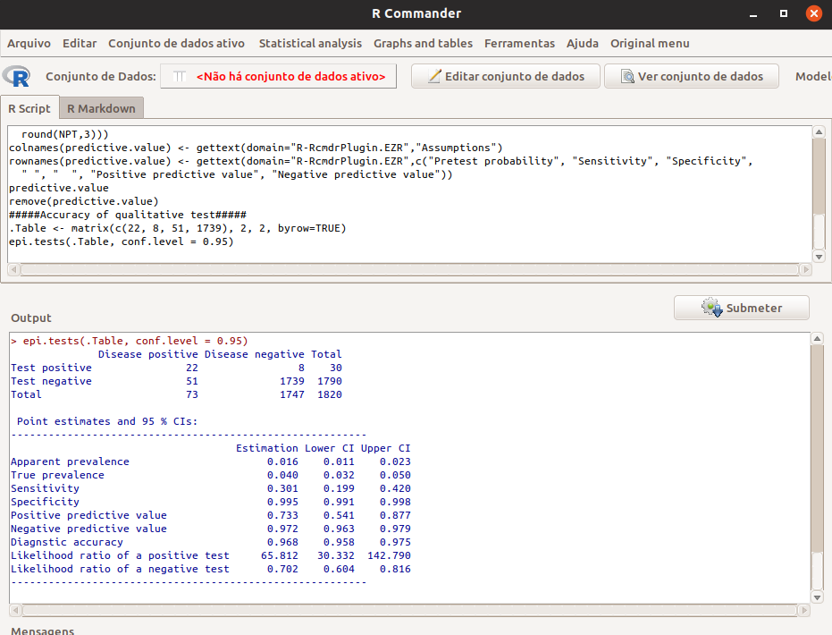
```