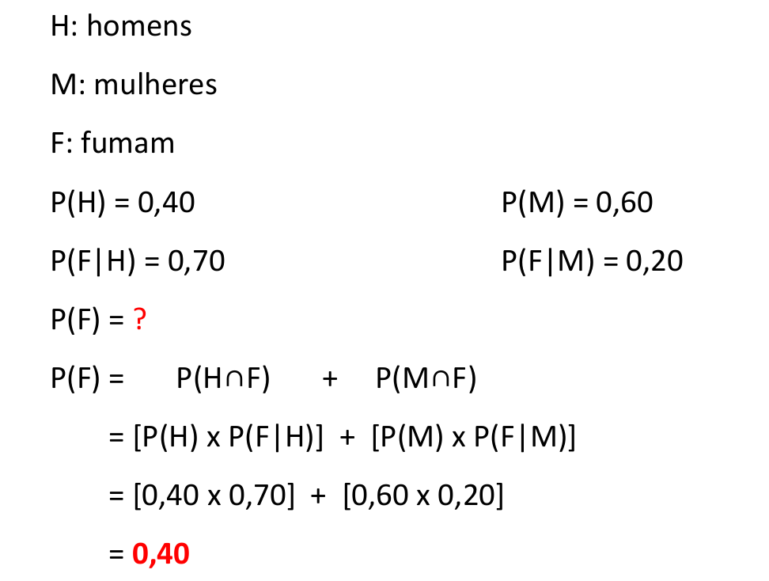
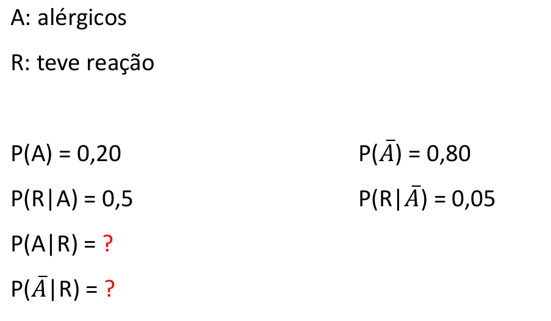
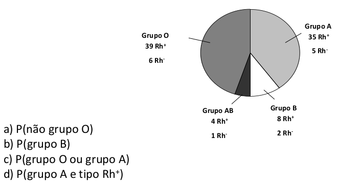
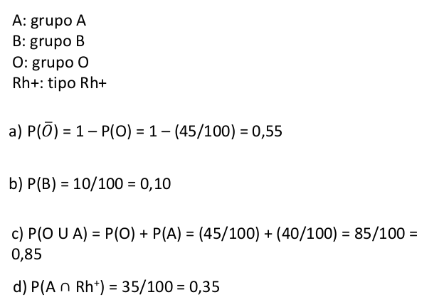
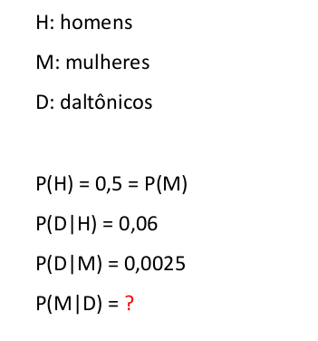
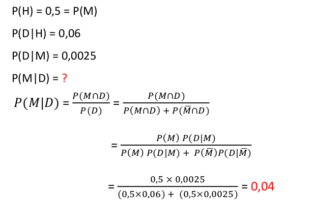
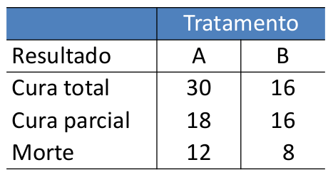
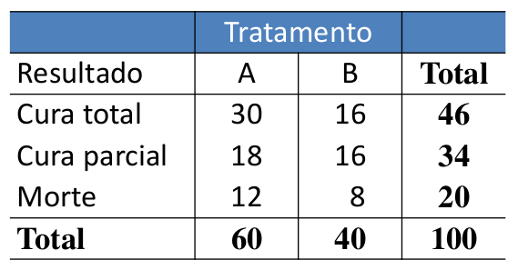

```{r setup, include=FALSE}
# https://ourcodingclub.github.io/2016/11/24/rmarkdown-1.html
knitr::opts_chunk$set(fig.width = 7, fig.height = 5, fig.align = 'center', dpi = 96, cache=TRUE, echo = F, comment = "", message = F, warning = F)

```

## Exercício 1

- Entre os estudantes de uma Faculdade de Enfermagem existiu as seguintes proporções: 40% são homens; 70% dos homens fumam, enquanto que entre as mulheres, só 20% fumam. Escolhido um estudante ao acaso, calcule a probabilidade de que ele seja um fumante.


## Solução do exercício 1

```{r, out.width='90%'}

```

## Exercício 2

- Acredita-se que numa certa população, 20% de seus habitantes sofrem de algum tipo de alergia e são classificados como alérgicos para fins de saúde pública. Sendo alérgico, a probabilidade de ter reação a certo antibiótico é de 0,5. Para os que não são alérgicos essa probabilidade é de
apenas 0,05. Uma pessoa dessa população teve reação ao ingerir o antibiótico, qual a probabilidade de:

a. ser do grupo não alérgico ?

b. ser do grupo alérgico ?

## Solução do exercício 2

```{r, out.width='90%'}

```

## Solução do exercício 2

### Item a.

$$P(A|B) = \dfrac{P(A \cap R)}{P(R)} = \dfrac{P(A \cap R)}{P(A \cap R) + P(\bar{A} \cap R)}$$

$$ = \dfrac{P(A) P(R|A)}{P(A) P(R|A) + P(\bar{A}) P(R|\bar{A})}$$

$$ = \dfrac{0,2 \times 0,5 }{0,2 \times 0,5 + 0,8 \times 0,05} \cong 0,7143$$

## Solução do exercício 2

### Item b.

$$P(\bar{A}|B) = \dfrac{P(\bar{A} \cap R)}{P(R)} = \dfrac{P(\bar{A} \cap R)}{P(A \cap R) + P(\bar{A} \cap R)}$$

$$ = \dfrac{P(\bar{A}) P(R|\bar{A})}{P(A) P(R|A) + P(\bar{A}) P(R|\bar{A})}$$

$$ = \dfrac{0,8 \times 0,5 }{0,2 \times 0,5 + 0,8 \times 0,05} \cong 0,2857$$

## Exercício 3

- Para este exercício recorra à figura a seguir, que descreve os grupos sanguíneos e os tipos de Rh de 100 pessoas. Determine a probabilidade indicada.

```{r, out.width='90%'}

``` 

## Solução do exercício 3

```{r, out.width='100%'}

```

## Exercício 4

- Em uma população, o número de homens é igual ao número de mulheres. Sabe-se que 6% dos homens são daltônicos e 0,25% das mulheres são daltônicas. Se uma pessoa é selecionada ao acaso e verifica-se que é daltônica, determine a probabilidade de que seja do sexo feminino.


## Solução do exercício 4

```{r,  fig.align = 'left', out.width='50%'}

```

## Solução do exercício 4

```{r, out.width='90%'}

```

## Exercício 5

- Em um período de um mês, 100 pacientes sofrendo de determinada doença foram internados em um
hospital. Informações sobre os resultados de dois métodos alternativos de tratamento aplicados aos pacientes estão resumidas no quadro abaixo:

```{r, out.width='90%'}

```

## Exercício 5

a. Sorteando aleatoriamente um dos pacientes, determine a probabilidade do paciente escolhido ter sido:
    1. submetido ao tratamento A;
    2. totalmente curado;
    3. submetido ao tratamento A e ter sido parcialmente curado;
    4. submetido ao tratamento A ou ter sido parcialmente curado.
    
b. Os eventos “morte” e “tratamento A” são independentes ? Justifique a resposta.


## Solução do exercício 5

- **A:** tratamento A

- **B:** tratamento B

- **CT:** cura total

- **CP:** cura parcial

- **X:** Morte

## Solução do exercício 5

### Item a.1

```{r, out.width='60%'}

```

$$P(A) = \dfrac{60}{100} = 0,6$$


## Solução do exercício 5

### Item a.2

```{r, out.width='60%'}

```

$$P(CT) = \dfrac{46}{100} = 0,46$$

## Solução do exercício 5

### Item a.3

```{r, out.width='60%'}

```

$$P(A \cap CP) = \dfrac{18}{100} = 0,18$$

## Solução do exercício 5

### Item a.4

```{r, out.width='60%'}

```

$$P(A \cup CP) = P(A) + P(CP) - P(A \cap CP)$$

$$\dfrac{60}{100} + \dfrac{34}{100} - \dfrac{18}{100} = 0,76$$

## Solução do exercício 5

### Item b


- $P(X) = 20/100 = 0,2$

- $P(A) = 60/100 = 0,6$

$$P(X \cap A) = P(X) \times P(A) ?$$

$$12/100 = 0,2 \times 0,6$$

$$0,12 = 0,12$$

- Sim, os eventos são independentes.