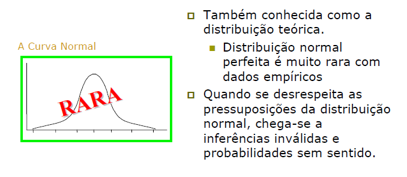
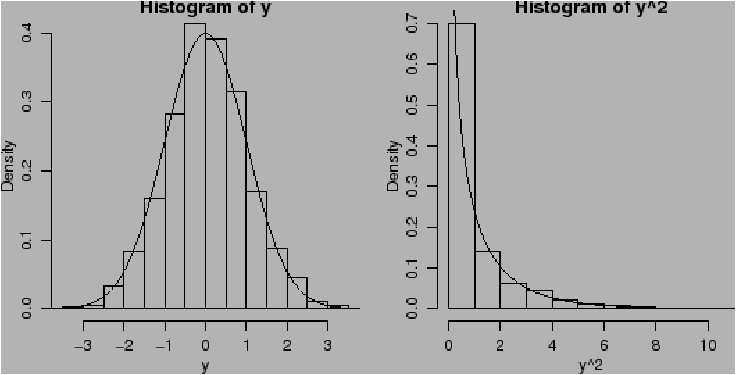

```{r setup, include=FALSE}
# https://ourcodingclub.github.io/2016/11/24/rmarkdown-1.html
knitr::opts_chunk$set(fig.width = 7, fig.height = 5, fig.align = 'center', dpi = 96, cache=TRUE, echo = F, comment = "", message = F, warning = F)

```
# Variáveis Aleatórias

## Varíaveis Aleatórias

- **Variável** - Qualquer característica que pode ser medida ou categorizada.

- Variáveis aleatórias (v.a) são eventos associados com números.

- **Exemplo:** Lançamento de duas moedas

## Variáveis Aleatórias

- Exemplo: $\Omega = \{(K,K), (K,C), (C,K), (C,C)\}$

```{r, out.width='40%', fig.align='center'}
knitr::include_graphics('figuras/dist_prob2019_1.png')
```

- Seja $X$ a quantidade de caras ($C$). Dessa forma $X$ pode ser definido com V.A.

|  $X$   |   0   |   1   |   2   |
| :----: | :---: | :---: | :---: |
| P($X$) | $1/4$ | $2/4$ | $1/4$ |
##  Representação das Variáveis Aleatórias

- As variáveis aleatórias (v.a) geralmente são representadas por letras maiúsculas X, Y ou Z. 


## Exemplos de Variáveis Aleatórias

- Resultado de um teste diagnóstico

- Sexo do paciente

- Idade do paciente

- Cor ou raça do paciente

- Número de filhos de mulheres em idade fértil

- Tempo de tratamento

- Número de infecções auditivas de bebês menores de 6 meses


## Tipos de Variáveis Aleatória

- **Variável aleatória discreta:** Assume somente um número finito ou enumerável de resultados

- **Variável aleatória contínua:** Assume qualquer valor dentro de um intervalo

## Distribuições de Probabilidade

- Uma distribuição de probabilidades é uma representação do conjunto de probabilidades de todos os eventos associados a um espaço amostral (universo) $\Omega$.

- Se $\Omega$ é finito, a distribuição de probabilidades pode ser descrita enumerando-se todos os eventos de $\Omega$ e suas
probabilidades.


## Distribuição de Probabilidades para Variáveis Aleatórias Discretas

- Distribuição de Bernoulli

- Distribuição Binomial

- Distribuição de Poisson

- Outras


## Distribuição de Probabilidades para Variáveis Aleatórias Contínuas

- As variáveis aleatórias contínuas podem assumir **qualquer valor** num intervalo numérico.

- São representadas graficamente por **curvas**, chamadas de **função densidade de probabilidade**.

## Função densidade de probabilidade

- **Curva de densidade ou função densidade de probabilidade:** é um gráfico de uma distribuição de probabilidade contínua.

- A **área** sob esta curva representa a **probabilidade de ocorrência**.

- Nas variáveis contínuas **não** existe a probabilidade de ocorrência de um **valor exato, mas sim de intervalos**.

## Distribuição de Probabilidades para Variáveis Aleatórias Contínuas

- Distribuição Normal ou Gaussiana

- Distribuição T-Student($t$)

- Distribuição F-Snedecor ($F$)

- Distribuição de Qui-Quadrado ($\chi^2$)

- Outras


# Distribuição Normal

## Função densidade de probabilidade Normal (Gaussiana)

- Este modelo probabilístico é essencialmente importante na estatística por três razões principais:

- Inúmeros fenômenos contínuos parecem segui-la ou podem ser aproximados por ela.

- Podemos utilizá-la para aproximar várias distribuições de probabilidades discretas.

- Ela oferece a base para a inferência estatística clássica devido a sua afinidade com o teorema central do limite.


## Distribuição de Probabilidades Contínua: Normal (Gaussiana)


- Sua distribuição de probabilidades é simétrica e é determinada por dois parâmetros, $\mu$ e $\sigma^2$ , respectivamente a média e a variância. A variável aleatória Normal é denotada como:

$$X \sim N(\mu, \sigma^2)$$

$$f(x) = \dfrac{1}{\sigma\sqrt{2\pi}} e ^{- \dfrac{(x - \mu)}{2\sigma^2}}$$

,para $-\infty \leq x \leq +\infty$

## Distribuição Normal

- Representação gráfica:

```{r, out.width='70%', fig.align='center'}
knitr::include_graphics('figuras/normal2019_1.png')
```

- Os parâmetros da normal são a **média** (localização) e o **variância** (formato), que permitem infinitas curvas normais com diferentes formatos (sempre simétricas).

## Transformando para NORMAL PADRÃO - N(0,1)

- Por meio da transformação de dados, precisaremos
apenas de uma tabela.

$$Z = \dfrac{X - \mu}{\sigma} \rightarrow X = Z \sim N(0,1)$$

Enquanto os dados originais para a variável aleatória $X$
possuíam média aritmética $\mu$ e variância $\sigma^2$, a variável aleatória padronizada $Z$ terá sempre média aritmética $\mu = 0$ e variância $\sigma^2 = 1$.

## Tabela da distribuição NORMAL PADRÃO N(0,1)

```{r, out.width='90%', fig.align='center'}
knitr::include_graphics('figuras/normal2019_2.png')

```

## Transformando para NORMAL PADRÃO - N(0,1)

- **Exemplo:** Tempo (*X*) que os trabalhadores de uma
fábrica de automóveis levam para montar uma peça,
dado o treinamento individual. Com média de 75
segundos e desvio padrão de 6 segundos.

```{r, out.width='80%', fig.align='center'}
knitr::include_graphics('figuras/normal2019_3.png')

```

## Transformando para NORMAL PADRÃO - N(0,1)

- Qual a probabilidade de uma pessoa com treinamento individual levar de 75 a 81 segundos para terminar a tarefa ?

```{r, out.width='100%', fig.align='center'}
knitr::include_graphics('figuras/normal2019_4.png')

```

## Transformando para NORMAL PADRÃO - N(0,1)

**IMPORTANTE !!!!**

- As seguintes probabilidades associadas aos intervalos são, em geral, muito utilizadas...
    - $\mu \pm \sigma \rightarrow$ contém cerca de 68% das observações
        
    - $\mu \pm 2\sigma \rightarrow$ contém cerca de 95% das observações
        
    - $\mu \pm 3\sigma \rightarrow$ contém cerca de 99% das observações

## Pergunta

- Como podemos decidir se o nosso conjunto de dados parece seguir ou pelo menos se aproximar da distribuição normal ?

- Nem todas as variáveis aleatórias contínuas são provenientes de uma distribuição normal !!!

## A distribuição dos meus dados é normal ?

```{r, out.width='100%', fig.align='center'}


```

## A distribuição dos meus dados é normal ?

```{r, out.width='100%', fig.align='center'}


```

## Abordagens para verificar se os dados são normais

```{r, out.width='15%', fig.align='center'}


```

1. Descritiva exploratória

2. Gráfica
    * ramo-e-folha
    * boxplot
    * histograma
    * gráfico de probabilidade normal

3. Testes de hipóteses

   * Teste de *Shapiro-Wilk*
   * Teste de *Kolmogorov-Smirnov*
   * Outros.


