```{r setup, include=FALSE}
# https://ourcodingclub.github.io/2016/11/24/rmarkdown-1.html
knitr::opts_chunk$set(fig.width = 7, fig.height = 5, fig.align = 'center', dpi = 96, cache=TRUE, echo = F, comment = "", message = F, warning = F)

```
# Variáveis Aleatórias

## Varíaveis Aleatórias

- **Variável** - Qualquer característica que pode ser medida ou categorizada.

- Variáveis aleatórias (v.a) são eventos associados com números.

- **Exemplo:** Lançamento de duas moedas

## Variáveis Aleatórias

- Exemplo: $\Omega = \{(K,K), (K,C), (C,K), (C,C)\}$

```{r, out.width='90%', fig.align='center'}
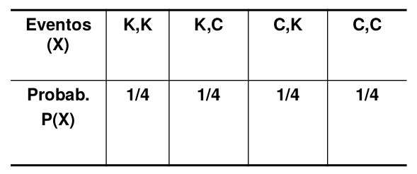
```

##  Representação das Variáveis Aleatórias

- As variáveis aleatórias (v.a) geralmente são representadas por letras maiúsculas X, Y ou Z. 


## Exemplos de Variáveis Aleatórias

- Resultado de um teste diagnóstico

- Sexo do paciente

- Idade do paciente

- Cor ou raça do paciente

- Número de filhos de mulheres em idade fértil

- Tempo de tratamento

- Número de infecções auditivas de bebês menores de 6 meses

## Pergunta

- Quais as diferenças notadas na natureza das variáveis aleatórias anteriormente citadas ?

## Tipos de Variáveis Aleatória

- **Variável aleatória discreta:** Assume somente um número finito ou enumerável de resultados

- **Variável aleatória contínua:** Assume qualquer valor dentro de um intervalo

## Distribuições de Probabilidade

- Uma distribuição de probabilidades é uma representação do conjunto de probabilidades de todos os eventos associados a um espaço amostral (universo) $\Omega$.

- Se $\Omega$ é finito, a distribuição de probabilidades pode ser descrita enumerando-se todos os eventos de $\Omega$ e suas
probabilidades.


## Distribuição de Probabilidades Discretas

- Distribuição de Bernoulli

- Distribuição Binomial

- Distribuição de Poisson

# Distribuição de Bernoulli

## Distribuição de Bernoulli

- Variável de interesse (X) assume só dois valores

- Situações dicotômicas, exemplo: fracasso – sucesso, vida - morte, etc.

- Utilização de variáveis indicadoras (codificadas como $\{0,1\}$)


$$
X= \left\{
    \begin{array}{ll}
        1, & \mbox{se evento ocorre } (E) \\
        0, & \mbox{se evento não ocorre } (\bar{E})
    \end{array}
\right.
$$

$P(X) = p^x (1-p)^{1-x}$, sendo $x = 0$ ou $x = 1$

- Sabendo que $p =$ sucesso e $1-p =$ fracasso.

## Distribuição de Bernoulli

- **Exemplo:** Suponha uma v.a $X$ que represente o status
do fumante; $X=1$ se é fumante e $X=0$ se ele não é
fumante. Assuma que em 1987, a proporção de
fumantes é 29%, como enunciaria as probabilidades ?

$$
X= \left\{
    \begin{array}{ll}
        1, & \mbox{se é fumante } \\
        0, & \mbox{se não é fumante } 
    \end{array}
\right.
$$

$P(X) = 0,29^x (1-0,29)^{1-x}$, sendo $x = 0$ ou $x = 1$ $\Rightarrow$

$P(X) = 0,29^x (0,71)^{1-x}$

## Exemplo:

1. Suponha agora que dois selecionados aleatoriamente indivíduos são selecionados aleatoriamente

2. O evento agora a ser analisado é o número de pessoas fumantes

- **Pergunta:** É possível identificar as probabilidades
através do modelo proposto por Bernoulli ? Por quê ?

## Distribuição Binomial

Um experimento é dito binomial quando:

1. Consiste de *n* ensaios;
2. Cada ensaio tem apenas dois resultados: **sucesso** ou
**fracasso**; e
3. Os ensaios são independentes ente si, com probabilidade
*p* de ocorrer **sucesso**, sendo *p* uma constante entre 0 e 1 ($0 < p < 1$)

# Distribuição Binomial

## Distribuição Binomial

- **Evento:** Lançar duas moedas e CONTAR no de coroas Variável aleatória discreta $\Rightarrow$ $X =$ número de coroas

```{r, out.width='80%', fig.align='center'}
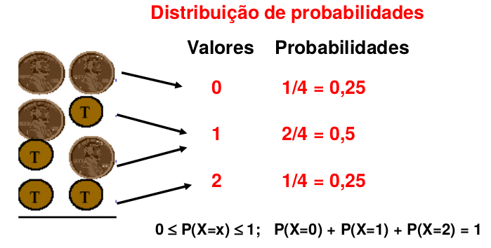
```

## Distribuição Binomial

- **Evento:** Lançar duas moedas e CONTAR no de coroas

```{r, out.width='90%', fig.align='center'}
knitr::include_graphics('figuras/dist_prob2019_3.png')
```

## Distribuição Binomial

- **Exemplo** (Fumantes):

1. Suponha agora que três indivíduos são selecionados aleatoriamente

2. O evento agora a ser analisado é o número de pessoas fumantes

3. A proporção de fumantes é denominada *p*

## Distribuição Binomial

```{r, out.width='100%', fig.align='center'}
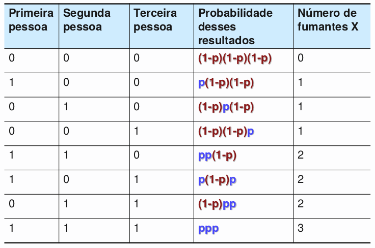
```

## Distribuição Binomial

4. Considere uma proporção de fumantes de 29%

5. Qual a probabilidade de não existir nenhum fumante ?

$P(X=0) = (1-0,29)^3 = (0,71)^3 = 0,358$

6. Qual a probabilidade de existir um fumante ?

$P(X=1)=p(1-p)(1-p)+(1-p)p(1-p)+(1-p)(1-p)p$

$P(X=1)=p(1-p)^2 +p(1-p)^2 +p(1-p)^2 =3p(1-p)^2$

$P(X=1)=3(0,29)(0,71)^2 = 0,439$

7. Qual a probabilidade de existir pelo menos um fumante ?

$P(X>=1)=1-P(X=0)=1-0,358=0,642$

## Distribuição Binomial

- Quais as principais desvantagens da forma de solução desse exemplo ?

    • Exige sucessivas contas
    
    • Difícil de ser empregada quando o número de ensaios tende a aumentar (exemplo: n=10)
    
## Distribuição Binomial

$$P(X = x) = \binom{n}{x} p^x (1-p)^{n-x}$$

Sendo $x = 0,1,2,...$ 

- Onde $\binom{n}{x} = \dfrac{n!}{x!(n-x)!}$ e $p$ representa a proporção de sucessos.

## Distribuição Binomial

- Relembrando: Como calcular n! (Lê-se *n* **fatorial**)

- Se $n = 5 → n ! = 5 ! = 5 . 4 . 3 . 2 . 1$

- Se $n = 10 → n ! = 10 ! = 10 . 9 . 8 . 7 . 6 . 5 . 4 . 3 . 2 . 1$

- Se $n = 1$ ou $n = 0 → n ! = 1$

## Distribuição Binomial

- Voltando ao exemplo dos fumantes: Probabilidade de fumo em 3 indivíduos

$P(X = 0) = \dfrac{3!}{0! (3-0)!} (0,29)^0 (1-0,29)^{3-0} \cong 0,3579$

$P(X = 1) = \dfrac{3!}{1! (3-1)!} (0,29)^1 (1-0,29)^{3-1} \cong 0,4386$

$P(X = 2) = \dfrac{3!}{0! (3-2)!} (0,29)^2 (1-0,29)^{3-2} \cong 0,1791$

$P(X = 3) = \dfrac{3!}{3! (3-3)!} (0,29)^3 (1-0,29)^{3-3} \cong 0,0244$

## Exemplo 1:

- Nove por cento dos homens e $0,25\%$ das mulheres não podem distinguir entre as cores verde e
vermelha. Se são escolhidos aleatoriamente seis homens para um estudo de percepção de sinais de
trânsito, ache a probabilidade de que exatamente dois deles não possam distinguir entre verde e vermelho.

## Solução:

$$P(X = 2) = \dfrac{6!}{2! (6-2)!} (0,09)^2 \times (0,91)^{6-2}$$

$$P(X = 2) = \dfrac{6 \times 5 \times 4! }{2 \times 1 \times 4!} (0,09)^2 \times (0,91)^{4}$$

$$P(X = 2) = 15 \times (0,09)^2 \times (0,91)^{4} = 0,0833$$

## Exemplo 2:

- Em um teste clínico da droga Viagra, verificou-se que $4\%$ das pessoas no grupo placebo
tiveram dores de cabeça. Supondo que a mesma taxa de $4\%$ se aplique aos que tomaram Viagra, ache a probabilidade de que entre oito usuários de Viagra, três apresentem dores de cabeça.

## Solução:

$$P(X = 3) = \dfrac{6!}{3! (8-3)!} (0,04)^3 \times (0,96)^{8-3}$$

$$P(X = 3) = \dfrac{8 \times 7 \times \times 6 5! }{3 \times 2 \times 1 \times 5!} (0,04)^3 \times (0,96)^{5}$$

$$P(X = 3) = 0,00292$$

## Parâmetros Característicos

- Média, variância e desvio-padrão de uma distribuição binomial

$$\mu = np$$

$$\sigma^2 = npq$$

$$\sigma = \sqrt{npq}$$

## No Excel

- Distribuição Binomial

    * DISTRBINOM(x, n, p, cumulativo)

- Onde:

    * x = número de sucessos
    
    * n = tamanho da amostra (tentativas)
    
    * p = probabilidade de sucesso
    
    * cumulativo = Falso se deseja calcular a probabilidade de exatamente x sucessos ou Verdadeiro se deseja calcular a probabilidade de x ou menos sucessos

# Distribuição de Poisson

## Distribuição de Poisson

- É uma distribuição de probabilidade discreta que se aplica a ocorrência de eventos ao longo de intervalos especificados (tempo, distância, volume, etc).

- VA X é uma contagem e desta forma pode assumir um valor inteiro entre 0 e infinito.

$$P(X=x) = \dfrac{\lambda^x \times e^{-\lambda}}{x!}$$

- Sendo:

    - $\lambda$ = número médio de ocorrências do evento;

    - $e = 2,71828$ (base logaritmo natural).
    
## Distribuição de Poisson

- Exemplos:

    - número de registros anuais de câncer;
    
    - número de óbitos diários em um grande hospital;
    
    - número de bactérias por ml de urina;
    
    - número de pacientes que chegam diariamente a centros de saúde.
    
## Requisitos

1. A VA X é o número de ocorrências ao longo de um intervalo.

2. As ocorrências devem ser aleatórias e independentes.

3. A distribuição de Poisson tem como parâmetros:

    - Média → $\lambda$ (taxa média de ocorrências ou número médio de ocorrências em um intervalo)

    - Variância → $sigma^2 = \lambda$
    
## Exemplo 1: 

- Suponha que o número de pacientes que chegam ao pronto socorro de uma pequena cidade
durante a madrugada tenha distribuição de Poisson com média 3. Encontre:

    1. A probabilidade de que nenhum paciente chegue em uma determinada madrugada.

    2. A probabilidade de que um paciente chegue em uma madrugada.
    
    3. A probabilidade de que pelo menos um paciente chegue em determinada madrugada.
    
## Solução 1:

1. Probabilidade de nenhum: $P(X=0) = \dfrac{3^0 \times e^{-3}}{0!} = 0,05$

2. Probabilidade de um: $P(X=1) = \dfrac{3^1 \times e^{-3}}{1!} = 0,149$

3. Probabilidade de pelo menos um (um ou mais): $P ( X \geq 1 ) = 1 - P(nenhum) = 1 - 0,050 = 0,950$

## Exemplo 2:

- A variável aleatória X representa o número de indivíduos envolvidos em um acidente de veículo a motor a cada ano. Nos EUA, a probabilidade de que um indivíduo em particular esteja envolvido é $0,00024$. Suponha que estejamos interessados em determinar a probabilidade de que ninguém de uma população de $10.000$ habitantes esteja envolvido em um acidente de veículo a motor em
determinado ano.

## Solução 2:

$$\lambda = n \times p = 10.000 \times 0,00024 = 2,4$$

$$P(X=0) = \dfrac{2,4^0 \times e^{-2,4}}{0!} = 0,091$$

## Distribuição de Probabilidades para Variáveis Aleatórias Contínuas

- As variáveis aleatórias contínuas podem assumir **qualquer valor** num intervalo numérico.

- **Exemplos:** Normal, $t$, $\chi^2$, $F$

- São representadas graficamente por **curvas**, chamadas de **função densidade de probabilidade**.

## Função densidade de probabilidade

- **Curva de densidade ou função densidade de probabilidade:** é um gráfico de uma distribuição de probabilidade contínua.

- A **área** sob esta curva representa a **probabilidade de ocorrência**.

- Nas variáveis contínuas **não** existe a probabilidade de ocorrência de um **valor exato, mas sim de intervalos**.

## Função densidade de probabilidade

- $f(x) \geq 0$ , para todo $x$.

- Área total sob a curva deve ser igual a $1$.

- A área sob a curva $f(x)$ nos informa a probabilidade de ocorrência de valores da variável $x$.

# Distribuição Normal

## Função densidade de probabilidade Normal (Gaussiana)

- Este modelo probabilístico é essencialmente importante na estatística por três razões principais:

- Inúmeros fenômenos contínuos parecem segui-la ou podem ser aproximados por ela.

- Podemos utilizá-la para aproximar várias distribuições de probabilidades discretas.

- Ela oferece a base para a inferência estatística clássica devido a sua afinidade com o teorema central do limite.


## Distribuição de Probabilidades Contínua: Normal (Gaussiana)


- Sua distribuição de probabilidades é simétrica e é determinada por dois parâmetros, $\mu$ e $\sigma^2$ , respectivamente a média e a variância. A variável aleatória Normal é denotada como:

$$X \sim N(\mu, \sigma^2)$$

$$f(x) = \dfrac{1}{\sigma\sqrt{2\pi}} e ^{- \dfrac{(x - \mu)}{2\sigma^2}}$$

,para $-\infty \leq x \leq +\infty$

## Distribuição Normal

- Representação gráfica:

```{r, out.width='70%', fig.align='center'}
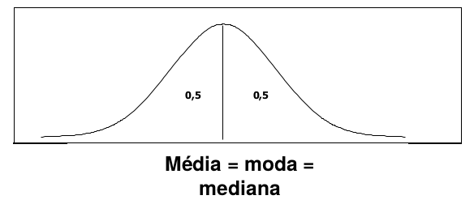
```

- Os parâmetros da normal são a **média** (localização) e o
**variância** (formato), que permitem infinitas curvas
normais com diferentes formatos (sempre simétricas).

## Transformando para NORMAL PADRÃO - N(0,1)

- Por meio da transformação de dados, precisaremos
apenas de uma tabela.

$$Z = \dfrac{X - \mu}{\sigma} \rightarrow X = Z \sim N(0,1)$$

Enquanto os dados originais para a variável aleatória X
possuíam média aritmética $\mu$ e variância $\sigma^2$, a variável aleatória padronizada $Z$ terá sempre média aritmética $\mu = 0$ e variância $\sigma^2 = 1$.

## Tabela da distribuição NORMAL PADRÃO N(0,1)

```{r, out.width='90%', fig.align='center'}
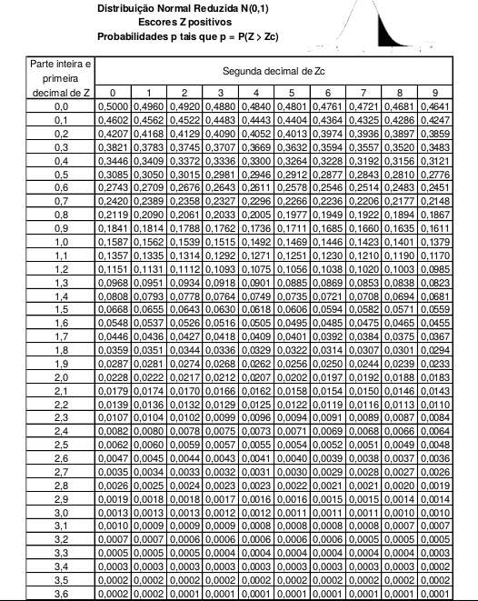

```

## Transformando para NORMAL PADRÃO - N(0,1)

- **Exemplo:** Tempo (*X*) que os trabalhadores de uma
fábrica de automóveis levam para montar uma peça,
dado o treinamento individual. Com média de 75
segundos e desvio padrão de 6 segundos.

```{r, out.width='80%', fig.align='center'}
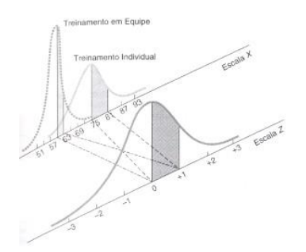

```

## Transformando para NORMAL PADRÃO - N(0,1)

- Qual a probabilidade de uma pessoa com treinamento individual levar de 75 a 81 segundos para terminar a tarefa ?

```{r, out.width='100%', fig.align='center'}
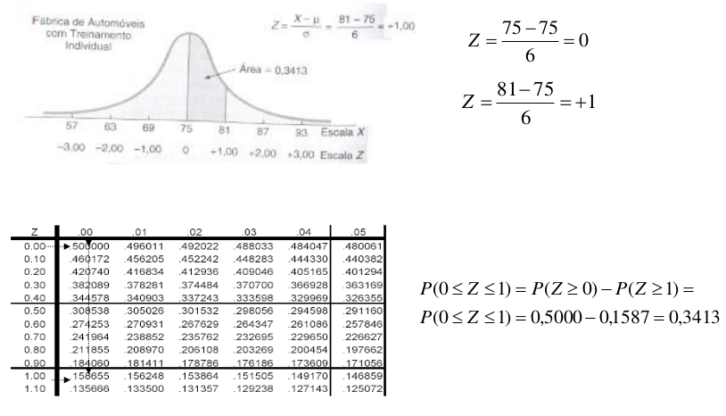

```

## Transformando para NORMAL PADRÃO - N(0,1)

- Qual a probabilidade de uma pessoa com treinamento individual
levar de 62 a 69 segundos para terminar a tarefa ?

```{r, out.width='100%', fig.align='center'}
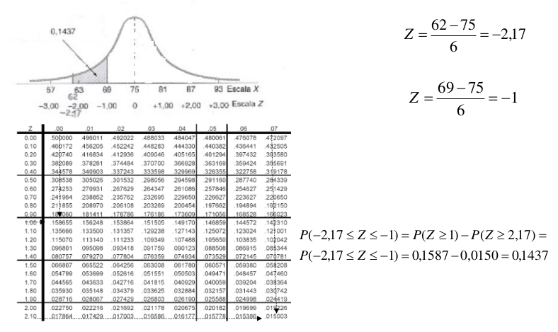

```

## Transformando para NORMAL PADRÃO - N(0,1)

- Qual a probabilidade de uma pessoa com treinamento individual
levar de 62 a 69 segundos para terminar a tarefa ?

- Lembre-se que os dois lados da distribuição são simétricos !

```{r, out.width='100%', fig.align='center'}
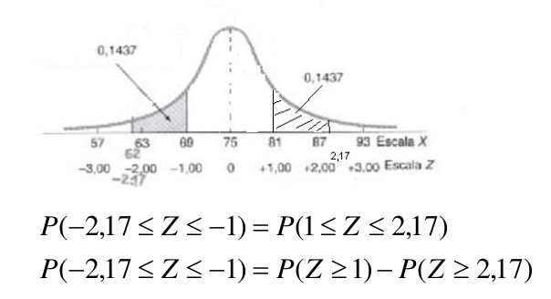

```

## Transformando para NORMAL PADRÃO - N(0,1)

```{r, out.width='100%', fig.align='center'}
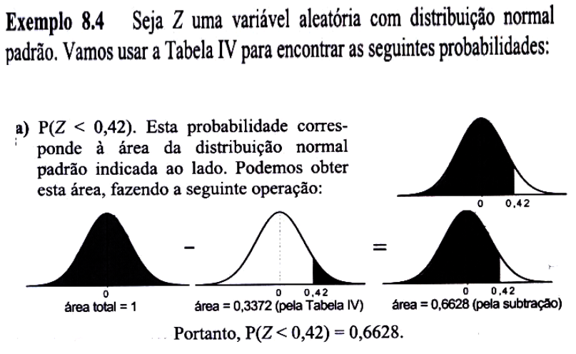

```

## Transformando para NORMAL PADRÃO - N(0,1)

```{r, out.width='100%', fig.align='center'}
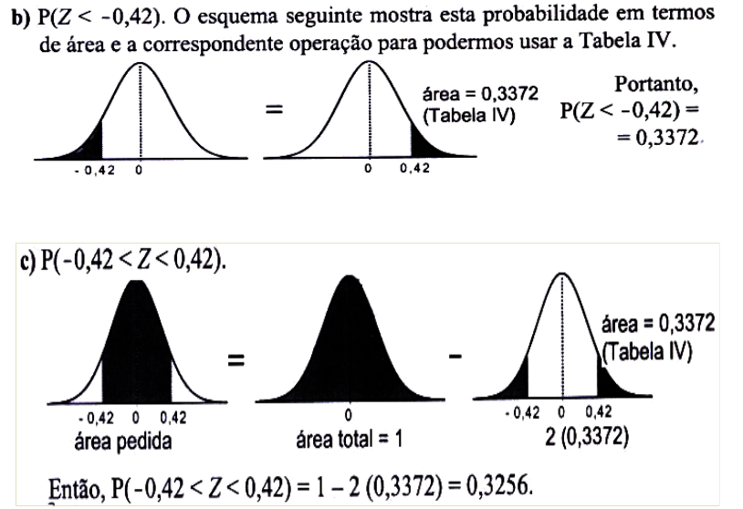

```

## Distribuição Normal

```{r, out.width='25%', fig.align='center'}
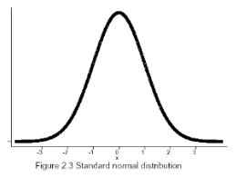

```

- A figura mostra a distribuição de uma variável aleatória
Gaussiana com parâmetros $\mu = 0$ e $\sigma^2 = 1$, conhecida como distribuição normal padrão.

**IMPORTANTE !!!!**

- As seguintes probabilidades associadas aos intervalos são, em geral, muito utilizadas...
    - $\mu \pm \sigma \rightarrow$ contém cerca de 68% das observações
        
    - $\mu \pm 2\sigma \rightarrow$ contém cerca de 95% das observações
        
    - $\mu \pm 3\sigma \rightarrow$ contém cerca de 99% das observações

## No Excel

1. PADRONIZAR($X, \mu, \sigma$)

2. DIST.NORMP($Z$)

3. INV.NORMP($Probabilidade < X$)

## Pergunta

- Como podemos decidir se o nosso conjunto de dados parece seguir ou pelo menos se aproximar da distribuição normal ?

- Nem todas as variáveis aleatórias contínuas são provenientes de uma distribuição normal !!!

**ABORDAGENS:**

1. Descritiva exploratória

2. Gráfica
    * ramo-e-folha
    * boxplot
    * histograma
    * gráfico de probabilidade normal
    
## Exercício 1:

Um conjunto de notas finais de provas em um curso de Introdução à Estatística foi considerado como sendo
normalmente distribuído com média aritmética de 73 e
desvio padrão de 8.

- $X:$Conjunto de notas finais de provas em um curso de
Introdução à Estatística

$$X \sim N(\mu = 73, \sigma^2 = 8^2)$$

## Exercício 1 (cont.):

a. Qual é a probabilidade de se obter no máximo uma nota
91 nesta prova ?

b. Qual a percentagem de alunos tirou entre 65 e 89 ?

c. Qual a percentagem de alunos tirou entre 81 e 89 ?

d. Qual é a nota final do exame se somente 5% dos alunos
que fizeram a prova tiraram nota mais alta ?

e. Se o professor fizesse uma "curva" (dando conceito A
para os 10% melhores da classe independentemente da
nota), você se sairia melhor com uma nota 81 neste exame
ou 70 numa outra prova onde a média aritmética fosse
igual a 62 e o desvio padrão igual a 3 ?


## Solução a:

$P(X \leq 91) = ?$

$Z = \dfrac{91-73}{8} = \dfrac{18}{8} = 2,25$

$P(Z \leq 2,25) = 1 - P(Z < 2,25)$

$P(Z \leq 2,25) = 1 - 0,0122 = 0,9878$

## Solução b:

$P(65 \leq X \leq 89) = ?$

$Z = \dfrac{65-73}{8} = \dfrac{-8}{8} = -1$ $Z = \dfrac{89-73}{8} = \dfrac{16}{8} = +2$

$P(-1 \leq Z \leq +2) = P(Z \geq -1) - P(Z \geq +2)$

$P(-1 \leq Z \leq +2) = \{1-P(Z \geq -1)\} - P(Z \geq +2)$

$P(-1 \leq Z \leq +2) = \{1-0,1587\} - 0,0228$

$P(-1 \leq Z \leq +2) = 0,8413 - 0,0228 \cong 81,9\%$

## Solução c:

$P(81 \leq X \leq 89) = ?$

$Z = \dfrac{81-73}{8} = \dfrac{+8}{8} = +1$ $Z = \dfrac{89-73}{8} = \dfrac{16}{8} = +2$

$P(+1 \leq Z \leq +2) = P(Z \geq +1) - P(Z \geq +2)$

$P(+1 \leq Z \leq +2) = 0,1587 - 0,0228$

$P(+1 \leq Z \leq +2) = 0,1359 \cong 13,6\%$

## Solução d:

$P(X \leq ?) = 0,05$

Olhando na tabela $\Rightarrow Z = 1,64 \rightarrow p=0,05$

$Z = \dfrac{X-\mu}{\sigma}$

$1,64 = \dfrac{X-73}{8} \therefore X - 73 = 1,64 \times 8$

$X = 13,12 + 73 = 86,12$

## Solução e:

$P(X \geq ?) = 0,10 \rightarrow$ *Conceito A*

Olhando na tabela $\Rightarrow Z = 1,28 \rightarrow p = 0,10$ 

$Z = \dfrac{X-\mu}{\sigma}$

Nesse exame: $1,28 = \dfrac{X - 73}{8} \therefore X - 73 = 1,28 \times 8$

$X = 10,24 + 73 = 83,24$

Outro exame: $1,28 = \dfrac{X - 62}{8} \therefore X - 68 = 1,28 \times 3$

$X = 3,84 + 62 = 65,84$

## Solução e (cont.):

- Neste exame:
        
    - $X \geq 83,24 \rightarrow$ *Conceito A*
        
    - Se $X = 81 \rightarrow$ *Conceito B*
        
- Outro exame:

     - $X \geq 65,84 \rightarrow$ *Conceito A*
        
     - Se $X = 70 \rightarrow$ *Conceito A*


Melhor desempenho seria no segundo teste.