```{r setup, include=FALSE}
# https://ourcodingclub.github.io/2016/11/24/rmarkdown-1.html
knitr::opts_chunk$set(fig.width = 7, fig.height = 5, fig.align = 'center', dpi = 96, cache=TRUE, echo = F, comment = "", message = F, warning = F)

```

# Tamanho da Amostra

## Tamanho da Amostra ($n$) - Para Média 

- Qual deve ser o tamanho da amostra para que se tenha um dado um erro máximo de  $|\overline{x} - \mu| \leqslant \varepsilon$ e uma confian\c{c}a de $100(1-\alpha)\%$ ?

$$n =  \begin{bmatrix} \dfrac {z_{(\alpha/2)} \sigma}{\varepsilon} \end{bmatrix}^{2}$$


- Correção para populações finitas ($N \leqslant n$)

$$n' =  \dfrac {n}{1 + \dfrac{n}{N}}$$

## Exemplo 1:

Vamos supor que queremos amostrar alguns ratinhos da raça *Wistar* com 30 dias de idade para realizar um determinado experimento. Conforme já estabelecido pela literatura, sabemos que o peso médio desses ratos é de 65$g$. Determine o $n$, ao nível de $5\%$ de significância, para esse experimento, supondo um erro máximo de $0,02$ ($|\overline{x} - \mu| \leqslant 0,02$) e $\sigma = 1$. Temos então:

$n =  \begin{bmatrix} \dfrac {z_{(\alpha/2)} \sigma}{\varepsilon} \end{bmatrix} ^{2} = \begin{bmatrix} \dfrac {1,96 \cdot 1}{0,02} \end{bmatrix} ^{2} \simeq 9.604 \text{  ratinhos}$


## Exemplo 2:

Mas só dispomos de uma população com 300 ratinhos experimentais.

$n' =  \dfrac {n}{1 + \dfrac{n}{N}} = \dfrac {9604}{1 + \dfrac{9604}{300}} \simeq 291 \text{  ratinhos}$

## Solução no app n4Studies 

```{r, out.width='35%', fig.align='center'}
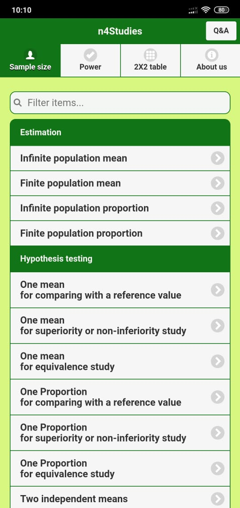
```

## Solução no app n4Studies 

```{r, out.width='35%', fig.align='center'}
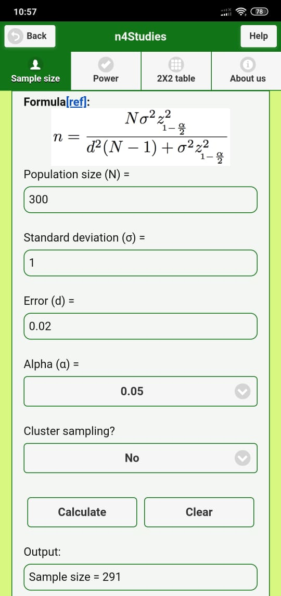
```

## Solução no app n4Studies 

```{r, out.width='85%', fig.align='center'}

```

## Tamanho da Amostra ($n$) - Para Proporção

- Qual deve ser o tamanho da amostra para que se tenha um dado um erro máximo de  $|p - \pi| \leqslant \varepsilon$ e uma  confiançaa de $100(1-\alpha)\%$ ?

$$n =  \dfrac {[z_{(\alpha/2)}]^{2} \pi(1-\pi)}{\varepsilon ^{2}}$$

- Correção para populaçõeses finitas ($N \leqslant n$)

$$n' =  \dfrac {n}{1 + \dfrac{n}{N}}$$

## Exemplo: 

Um epidemiologista veterinário quer investigar a prevalência de febre $aftosa$ em uma fazenda que possui 10 mil cabeças de gado da raça *nelore* na região Centro-Oeste do Brasil. Segundo a literatura, a prevalência de febre *aftosa* nesta região no ano passado foi de $50\%$, determine o $n$, ao nível de $5\%$ de significância para este *survey* supondo um erro máximo de $0,04$ ($|p - \pi| \leqslant 0,04$). Temos então:

$$n =  \dfrac {[z_{(\alpha/2)}]^{2} \pi(1-\pi)}{\varepsilon ^{2}} = \dfrac {(1,96)^{2} 0.5 (1 - 0.5)}{0.04 ^{2}} \simeq 600 \text{  bois}$$

## Solução do exemplo no R: 
\small
```{r, echo = T}
library(epiDisplay)
n.for.survey(p=.5, delta =.04, alpha = 0.05)

```
\small

## Solução do exemplo utilizando o plugin "RcmdrPlugin.EZR" 

```{r, out.width='100%', fig.align='center'}
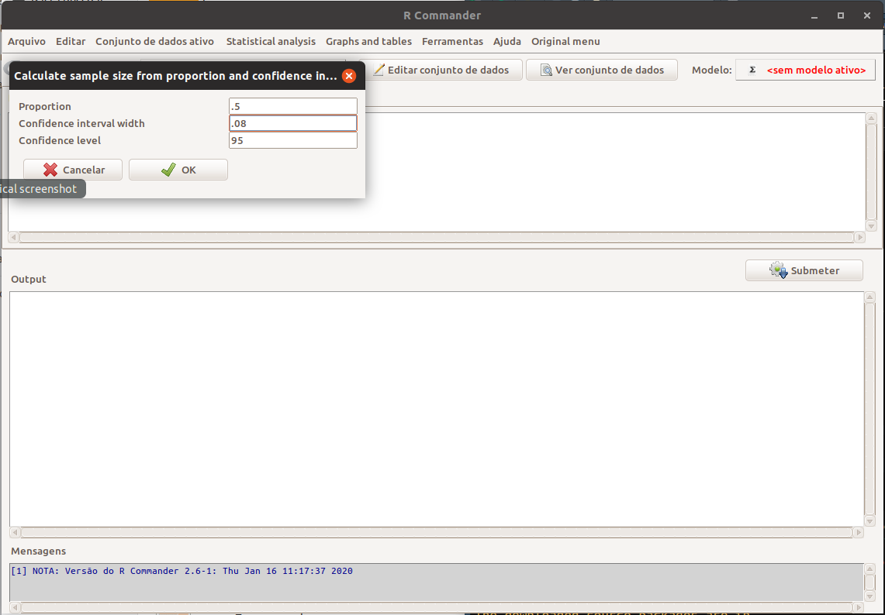
```

## Solução do exemplo utilizando o plugin "RcmdrPlugin.EZR" 

```{r, out.width='100%', fig.align='center'}
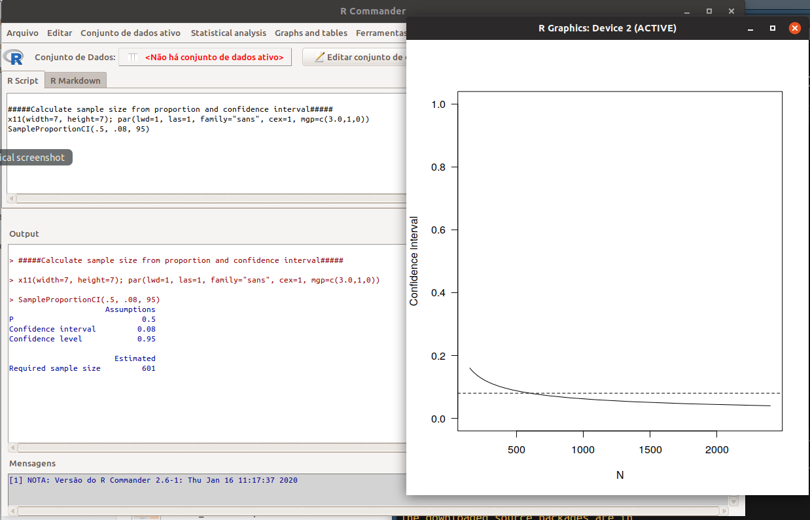
```

# Introdução à Inferencia Estatística

## Parâmetro, Estimador, Estimativa

- O processo de inferência (indução) realizado sobre uma população pode ser feito, a partir de uma amostra de duas formas:

  1. **Estimação:** É o processo que usa os resultados extraı́dos da amostra para produzir inferências de um certo parâmetro populacional. Tal processo pode ser feito de duas formas: Estimação Pontual e Intervalar;

  2. **Testes de Hipótese:** É o processo que usa os resultados extraı́dos da amostra para testar valores de certos parâmetros da população (Testes Paramétricos e Não-Paramétricos).
  
## Testes de Hipótese

- Testes de hipóteses permitem mensurar a evidência em favor ou contra valores especı́ficos de um parâmetro de interesse;

- Para além de uma estimativa pontual de um determinado parâmetro de interesse, em muitas situações, é importante dispôr de alguma forma de
do intervalo que indique a confiança $(1 − α)$ que se pode depositar na estimativa pontual.

## Elementos Básicos de um Teste de Hipótese

1. Hipótese Nula ($H_0$)

2. Hipótese Alternativa ($H_1$)

3. Nı́vel de significância ($\alpha$)

4. Estatística do teste

5. Valor-p ou p-valor 

6. Regra de decisão - Rejeita-se ou não $H_0$

## Valor de p ou p-valor

- Valor-p ou p-valor é a probabilidade estimada de se rejeitar $H_0$, quando $H_0$ é verdadeira.

$P(\mbox{rejeitar } H_0 | H_0 \mbox{verdadeira}) = P(\mbox{erro do tipo I})$        

## Testes Paramétricos e Não-Paramétricos

- Os testes estatı́sticos são fundamentalmente utilizados em pesquisas que tem como objetivo comparar condições experimentais;

- Eles fornecem um respaldo cientı́fico às pesquisas para que estas tenham validade e tenham aceitabilidade no meio cientı́fico.

- Os testes podem ser divididos em paramétricos e não-paramétricos.

## Testes Paramétricos e Não-Paramétricos

- Conforme Callegari-Jacques (2003), nos testes paramétricos os valores da variável estudada devem ter distribuição normal ou aproximação normal.

- Já os testes não-paramétricos, também chamados por testes de distribuição livre, não têm exigências quanto ao conhecimento da distribuição da variável na população.

# Testes de Normalidade

## Teste de Shapiro-Wilk

- O teste de *Shapiro-Wilk* tem sido o mais utilizado para testar a normalidade;

- Se o valor calculado de *W* é estatisticamente significativo (para $p− valor < \alpha$) rejeita-se a hipótese que a distribuição estudada é normal, ou seja, para a distribuição ser considerada Normal o valor de p deve ser maior que $\alpha$. 


## Teste de Shapiro-Wilk

```{r, out.width='70%', fig.align='center'}
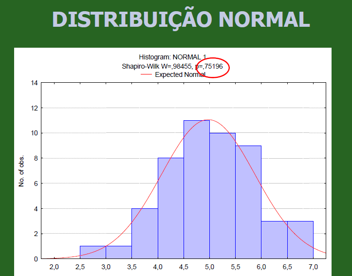

```

## Teste de Shapiro-Wilk

```{r, out.width='70%', fig.align='center'}
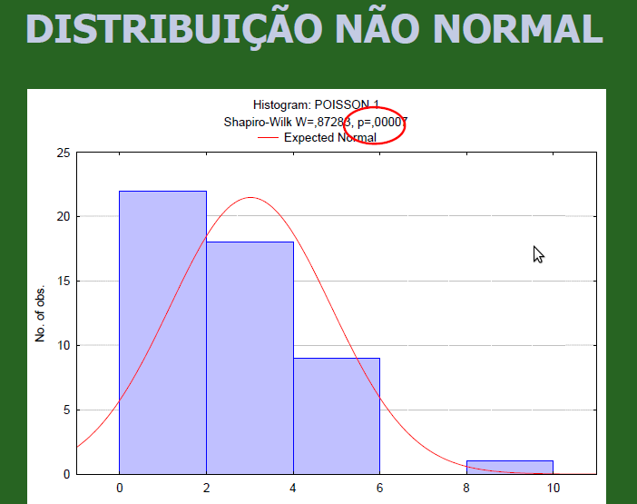

```

## Teste de Kolmogorov-Smirnov

- O teste de *Kolmogorov-Smirnov* baseia-se na máxima diferença entre a distribuição acumulada da amostra e distribuição acumulada esperada.

- Se o valor calculado de *D* é estatisticamente significativo (para $p < 0,05$) rejeita-se a hipótese que a distribuição estudada é normal, ou seja, para a distribuição ser considerada Normal o valor de *p* deve ser maior que $0,05$.

## Exemplo de aplicação

- A massa de 10 pássaros migratórios foi medida em duas
ocasiões, primeiro em agosto e os mesmos pássaros (marcados
individualmente e recapturados) foram remedidos em setembro.

- Os dados apresentam normalidade ?

## Exemplo de aplicação

\begin{center}
\begin{tabular}{cc}\hline
\textbf{Agosto} & \textbf{Setembro}\\\hline
10,3 & 12,2\\
11,4 & 12,1\\
10,9 & 13,1\\
12,0 & 11,9\\
10,0 & 12,0\\
11,9 & 12,9\\
12,2 & 11,4\\
12,3 & 12,1\\
11,7 & 13,5\\
12,0 & 12,3\\\hline
\end{tabular}
\end{center}

## Solução do exemplo utilizando o Rcommander 

  Importar o banco **massapassaros.xlsx** para o R
   
```{r, out.width='40%', fig.align='center'}
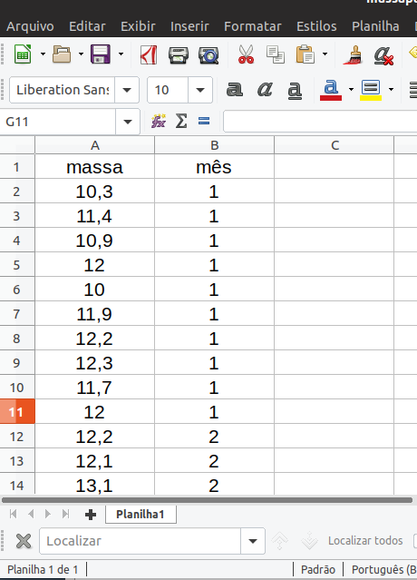
```

## Solução do exemplo utilizando o Rcommander 

  Rcommander $\rightarrow$ Dados $\rightarrow$ Importar arquivo de dados $\rightarrow$ do arquivo Excel $\rightarrow$ massapassaros.xlsx
   
```{r, out.width='80%', fig.align='center'}
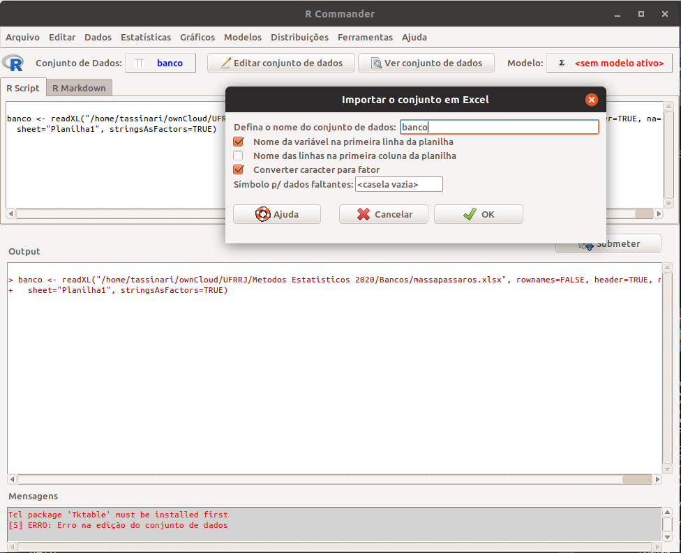
```

## Solução do exemplo utilizando o Rcommander 

```{r, out.width='80%', fig.align='center'}
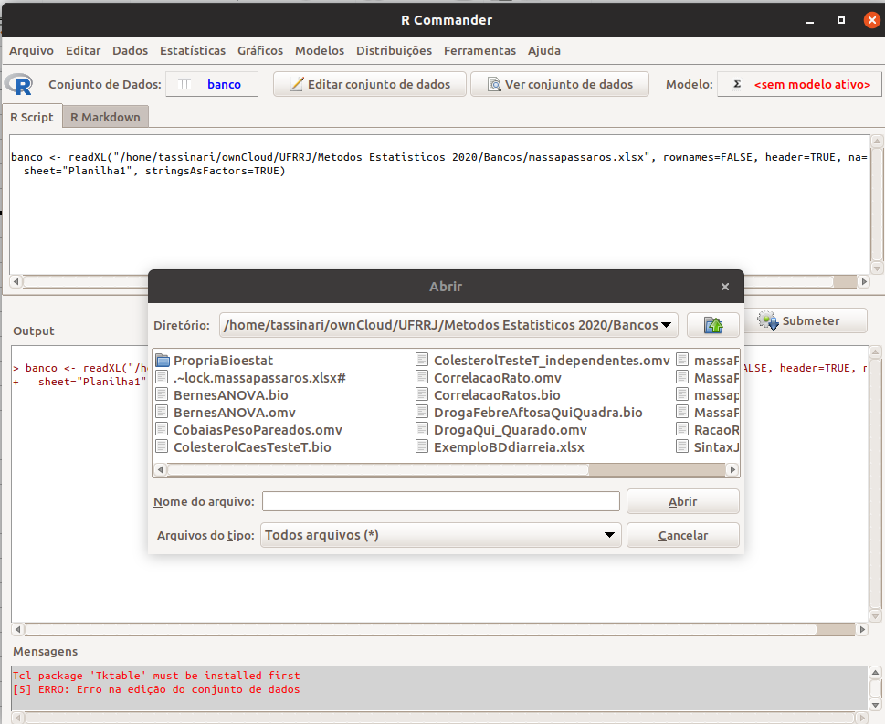
```

## Solução do exemplo utilizando o Rcommander

  Colocar os *labels* na variável categórica (qualitativa)
  
  Rcommander $\rightarrow$ Dados $\rightarrow$ Modificação de variáveis no conjunto de dados... $\rightarrow$ Converter variável numérica para fator...

```{r, out.width='60%', fig.align='center'}
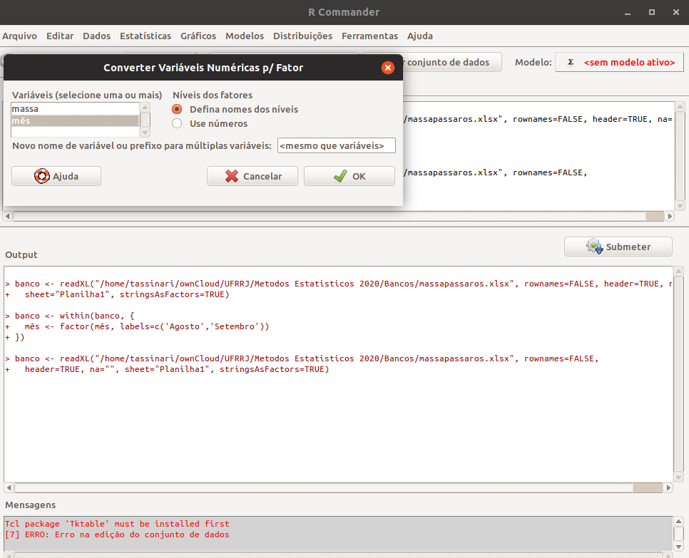
```

## Solução do exemplo utilizando o Rcommander

 
```{r, out.width='80%', fig.align='center'}
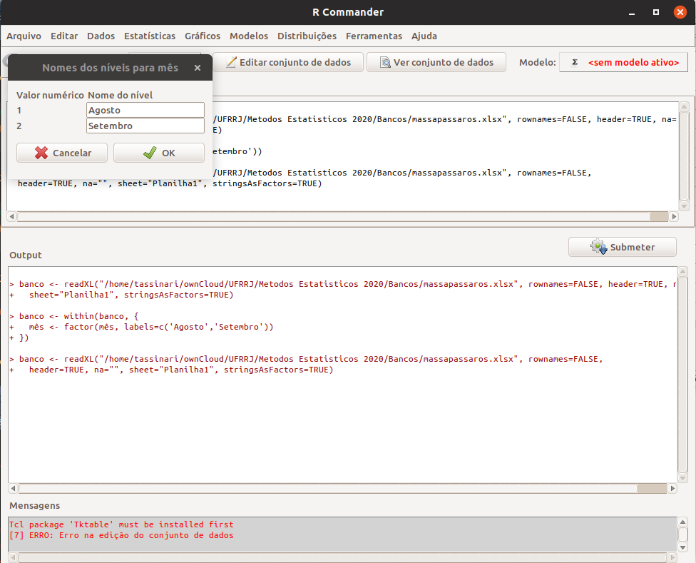
```

## Solução do exemplo utilizando o Rcommander

```{r, out.width='80%', fig.align='center'}
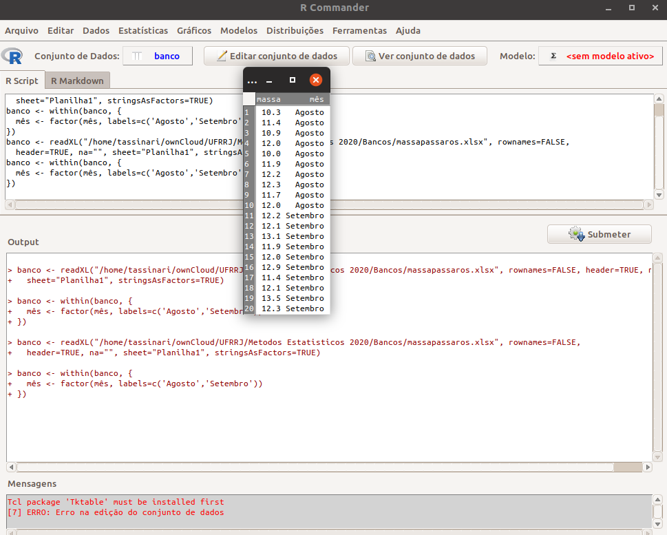
```

## Solução do exemplo utilizando o Rcommander

  Plotando os boxplots
  
  Rcommander $\rightarrow$ Gráficos $\rightarrow$ Boxplot

```{r, out.width='60%', fig.align='center'}
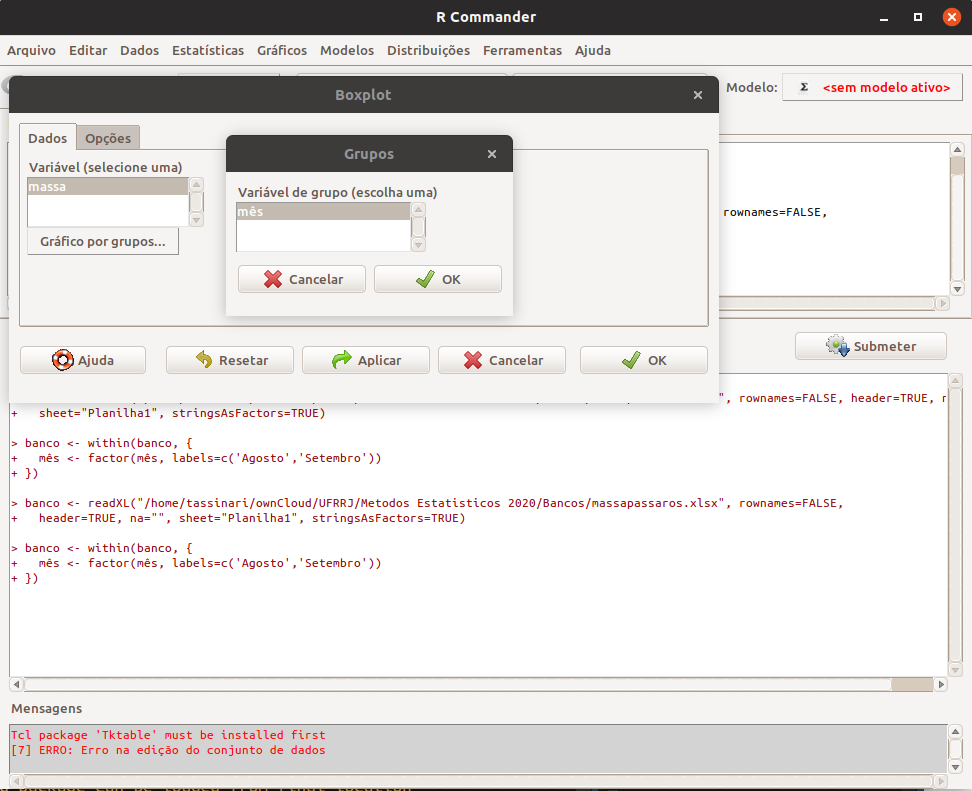
```

## Solução do exemplo utilizando o Rcommander

```{r, out.width='80%', fig.align='center'}
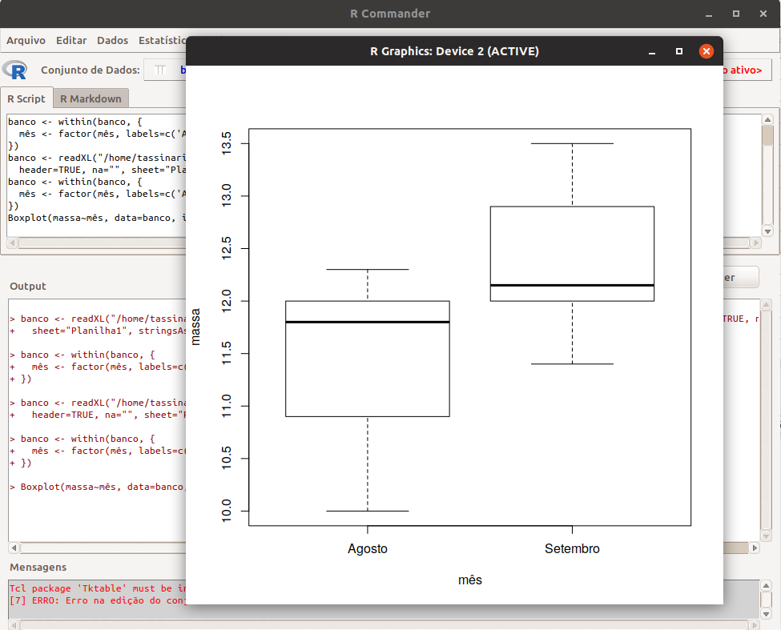
```

## Solução do exemplo utilizando o Rcommander

  Testando a normalidade
  
  Rcommander $\rightarrow$ Estatísticas $\rightarrow$ Resumos $\rightarrow$ Test of normality...

```{r, out.width='60%', fig.align='center'}
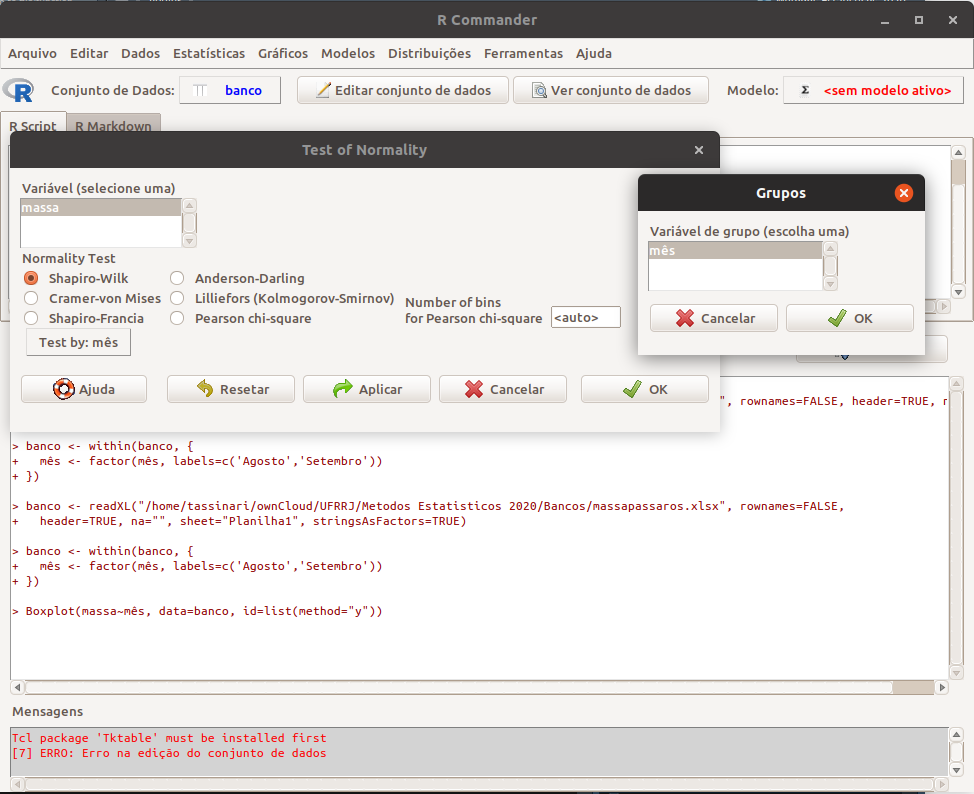
```

## Solução do exemplo utilizando o Rcommander

```{r, out.width='60%', fig.align='center'}
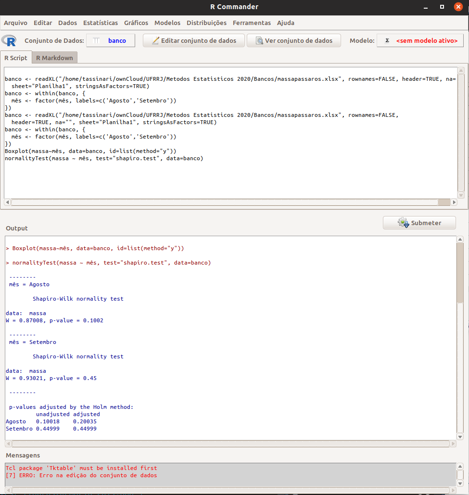
```

## Trasformação de Variáveis

A transformação dos dados é uma possı́vel forma de contornar os problemas da alta dispersão e o pressuposto da não normalidade dos dados.

Alguns exemplos de transformações na variável desfecho:

\begin{beamerboxesrounded}[shadow=true]{\color{yellow}{ }}
\begin{itemize}
       \item $\sqrt{y_i}$
        \item $log(y_i)$
        \item  $exp(y_i)$
	\item  $1/y_i$
        \item $y_i - \overline{y}$
         \item $\frac{y_i - \overline{y}}{\sigma_y}$
\end{itemize} 
\end{beamerboxesrounded}

## Exemplo de aplicação:

- Supondo o peso dos ratinhos abaixo, verifique se existe normalidade nos dados e caso essa condição não seja satisfeita faça algumas transformao̧ẽs na variável peso. 

- Os dados são: 79; 10; 11; 86; 12; 81; 90; 99; 29; 19; 11 e 98.

## Solução do exemplo utilizando o Rcommander

Para entrar com um conjunto de dados, é possível ser feito da seguinte forma:

   Rcommander $\rightarrow$ Dados $\rightarrow$ Novo conjunto de dados...

Ou importar o arquivo *transforme_normal.xlsx*

<!-- Ou escrever no *script*: -->

<!-- ```{r, echo = T, results='hide'} -->
<!-- dado2 <- c(79, 10, 11, 86, 12, 81, 90, 99, 29, 19, 11, 98) -->
<!-- dado2 <- data.frame(dado2) -->
<!-- ``` -->

## Solução do exemplo utilizando o Rcommander

  Recalcular a variável quantitativa com a função desejada desejada (ex: *exp()*, *log()*, etc)
  
  Rcommander $\rightarrow$ Dados $\rightarrow$ Modificação de variáveis no conjunto de dados... $\rightarrow$ Computar nova variável...

```{r, out.width='60%', fig.align='center'}
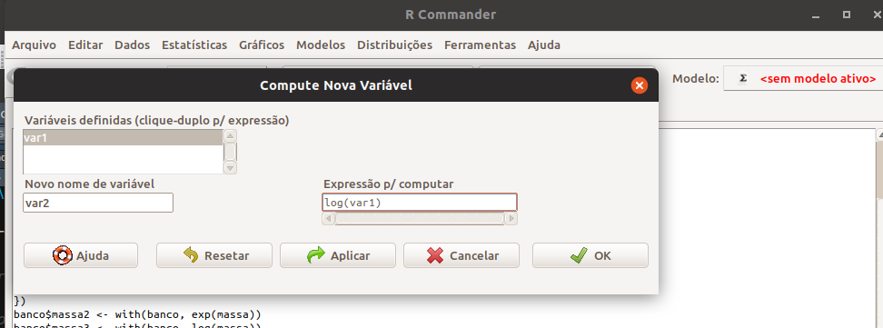
```

## Solução do exemplo utilizando o Rcommander

  
```{r, out.width='80%', fig.align='center'}
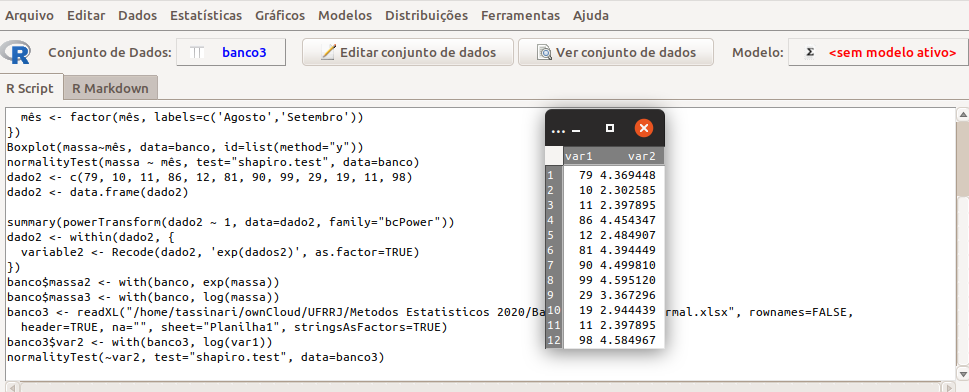
```

A cada variável transformada, basta ir testando a normalidade.