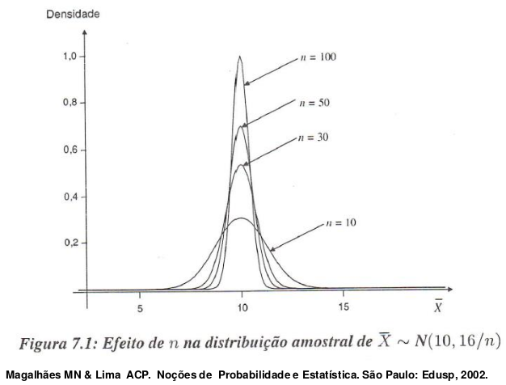
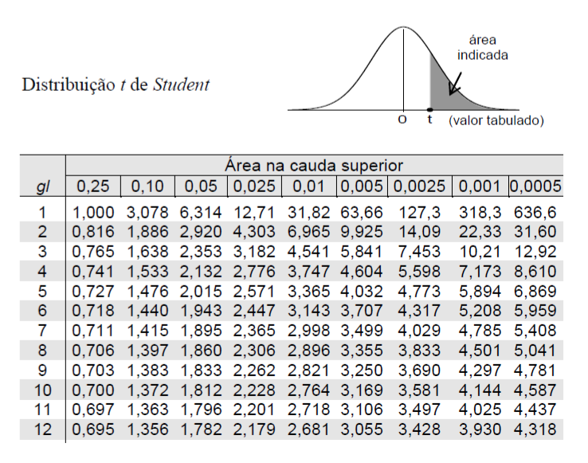

```{r setup, include=FALSE}
# https://ourcodingclub.github.io/2016/11/24/rmarkdown-1.html
knitr::opts_chunk$set(fig.width = 7, fig.height = 5, fig.align = 'center', dpi = 96, cache=TRUE, echo = F, comment = "", message = F, warning = F)

```

# Inferência Estatística

## Inferência Estatística

A Inferência Estatística é utilizada para que possamos fazer afirmações sobre características de uma população tomando como base os resultados observados na amostra.

```{r, out.width='70%', fig.align='center'}

```

## Alguns conceitos importantes

- População é o conjunto de indivíduos (ou objetos), tendo pelo menos uma variável ou característica em comum.

- Amostra é qualquer subconjunto da população em
estudo.

## Amostra representativa

Para que possamos inferir sobre as características de uma população é necessário que a amostra seja representativa da mesma. Através das técnicas de amostragem podemos obter amostras representativas da população.

Entre elas podemos citar:

- Amostragem casual simples (aleatória simples)
- Amostragem sistemática
- Amostragem estratificada
- Amostragem por conglomerados

## Alguns conceitos em estimação

- **Parâmetros** são valores desconhecidos da população
sob os quais temos interesse ($\mu, \Theta, \sigma$).

- **Estimador** é a "combinação de elementos da amostra,
construída com a finalidade de representar, ou estimar, um parâmetro de interesse na população". (Magalhães &
Lima)

**Exemplo:** Média populacional ($\hat{\mu}$)

- **Estimativa** é o valor numérico obtido pelo estimador (ou estatística) em uma certa amostra.

## Estimação Pontual

- **Estatística** é uma característica da amostra, ou seja, é uma função da amostra .

**Exemplo:** média amostral, variância amostral, maior e
menor valor em uma amostra, amplitude de uma amostra.

```{r, out.width='60%', fig.align='center'}
knitr::include_graphics('figuras/inferencia2019_2.png')
```

## Estimação Pontual

O processo de indução que se pretende realizar sobre uma
população pode ser feito, a partir de uma amostra, de duas maneiras:

1. **Estimação:** é o processo que usa os resultados extraídos da amostra para produzir inferências.
Existem dois tipos de estimação:

    a. **Por ponto:** Quando a partir da amostra, procura-se obter um único valor de um certo parâmetro populacional. Exemplo: média amostral ($\bar{x}$) na estimação da média populacional ($\mu$).
    
    b. **Por intervalo:** Quando, a partir da amostra, procura-se construir um intervalo de variação $[\hat{\theta_1}, \hat{\theta_2}]$ com uma certa probabilidade de conter o verdadeiro parâmetro populacional.
    
## Estimação Pontual

2. **Teste de hipóteses:** É o processo que usa os resultados extraídos da amostra para testar valores de
certos parâmetros da população (testes paramétricos) ou
para testar a natureza da distribuição da população (testes não-paramétricos ou de aderência).


## Estimação Intervalar ou Intervalo de Confiança

Todos os estimadores são pontuais, mas não permitem
calcular o erro associado. Assim, os intervalos de confiança são construídos baseados na distribuição amostral do estimador pontual (que é uma variável aleatória (v.a.)), associando um risco denominado “nível de significância”, representado por um valor probabilístico.

## Estimação Intervalar ou Intervalo de Confiança

- Ao se construir um intervalo de confiança é necessário associar um grau de risco, denominado “nível de significância”, representado por um valor probabilístico.

- O nível de significância ($\alpha$) é a probabilidade do parâmetro estimado não estar contido no intervalo de
confiança.

## Intervalo de Confiança

Então, a precisão esperada do intervalo de confiança é
obtida pelo complementar do nível de significância:

$[\hat{\theta_1} \leq \theta \leq \hat{\theta_2}] \rightarrow IC$ 

$P[\hat{\theta_1} \leq \theta \leq \hat{\theta_2}] = 1 - \alpha$

$\hat{\theta_1} \rightarrow$ limite inferior do intervalo de confiança

$\hat{\theta_2} \rightarrow$ limite superior do intervalo de confiança

$\theta \rightarrow$ parâmetro desconhecido

$\alpha \rightarrow$ nível de significância

$1 - \alpha \rightarrow$ nível de precisão ou nível de confiança

## Intervalo de confiança

- **Aumentando o nível de significância** $\rightarrow$ diminui a precisão e amplitude do intervalo diminui

- **Diminuindo o nível de significância** $\rightarrow$ aumenta a precisão e amplitude do intervalo aumenta.

## Intervalo de confiança p/ média populacional

**Teorema Central do Limite**

- Seja $X_1, X_2, ..., X_n$ uma sequência de variáveis aleatórias
independentes e identicamente distribuídas (i.i.d.), cada
uma com média $\mu$ e variância $\sigma^2$.

Então:

Quando $n → ∞$, a distribuição de probabilidades das médias amostrais é aproximadamente Normal com média $\mu$ e variância $\dfrac{\sigma^2}{n}$.

$$\bar{X} \sim N(\mu, \dfrac{\sigma^2}{n})$$

# Teorema Central do Limite (TCL)

## Teorema Central do Limite (TCL)

```{r, out.width='100%', fig.align='center'}

```

## Teorema Central do Limite (TCL)

```{r, out.width='100%', fig.align='center'}

```

# ## Intervalo de confiança para a média populacional com **variância populacional conhecida**

## Intervalo de confiança para a média populacional com **variância populacional conhecida**

$$\mbox{IC}_{1-\alpha}[\mu]= \left[ \bar{X} - z_{\alpha/2}\sqrt{\dfrac{\sigma^2}{n}} \leq \mu \leq \bar{X} + z_{\alpha/2}\sqrt{\dfrac{\sigma^2}{n}} \right]$$

  - $\mu \rightarrow$ parâmetro a ser estimado
  - $\bar{X} \rightarrow$ média amostral
  - $z \rightarrow$ valor da normal padrão $[0,1]$ (tabelada) para uma $p=\alpha/2$
  - $\sigma^2 \rightarrow$ variância populacional
  - $n \rightarrow$ tamanho amostral
  - $\alpha \rightarrow$ nível de significância

## Intervalo de confiança para a média populacional com **variância populacional conhecida**

Interpretação:

- Se um número suficientemente grande de amostras aleatórias é obtido, um I.C. de $(1-α)100\%$ de confiança para o parâmetro $μ$ é calculado para cada amostra, então $(1-α)100\%$ destes intervalos conterão o verdadeiro valor de $μ$.

## Exemplo:

Suponha que os comprimentos de jacarés adultos de uma certa raça siga o modelo Normal com média $μ$ desconhecida e variância igual a $0,01$ $m^2$ . Uma amostra de dez animais foi sorteada e forneceu média
$1,69$ $m$. Desejamos uma estimativa por intervalo para o parâmetro μ, com um nível de confiança de $95\%$.

## Solução:

  - $\bar{X} = 1,69$
  - $\sigma^{2}_{x}=0,01$
  - $\alpha = 0,05$
  - $\sigma_{\bar{x}} = \sqrt{\dfrac{\sigma^{2}_{x}}{n}} = \sqrt{\dfrac{0,01}{10}}= 0,0316$
  
$\mbox{IC}_{95\%} [\mu]= \left[ 1,69 - z_{0,05/2}\sqrt{\dfrac{0,01}{10}}; 1,69 + z_{0,05/2}\sqrt{\dfrac{0,01}{10}} \right]$

$\mbox{IC}_{95\%}[\mu]=[1,69 - 1,96 \times 0,0316; 1,69 + 1,96 \times 0,0316]$

$\mbox{IC}_{95\%}[\mu]=[1,63; 1,75]$

## Solução:

**Interpretação:** Se todas as amostras possíveis de tamanho igual a $10$ fossem retiradas, $95\%$ delas iriam conter a verdadeira média aritmética da população.

OU

Estamos $95\%$ confiantes de que os limites de $1,63$ e $1,75$
contenham a média verdadeira $μ$.

## Intervalo de confiança p/ média populacional com **variância populacional desconhecida**

- Distribuição *t* de Student

$$t = \dfrac{\bar{X}-\mu}{\dfrac{S}{\sqrt{n}}} \sim t_{n-1}$$

- Essa distribuição é utilizada quando se possuem poucos elementos amostrais ($n$ pequeno), sua distribuição tem aspecto gráfico também em forma de sino bem próxima da normal, embora com caudas mais pesadas.

## Distribuição *t* de Student

```{r, out.width='60%', fig.align='center'}

```

## Tabela da distribuição *t*

```{r, out.width='60%', fig.align='center'}

```

## Intervalo de confiança para a média populacional com **variância populacional desconhecida**

$$\mbox{IC}_{1-\alpha}[\mu]= \left[ \bar{X} - t_{(\alpha/2;n-1)}\sqrt{\dfrac{s^2}{n}} \leq \mu \leq \bar{X} + t_{(\alpha/2;n-1)}\sqrt{\dfrac{s^2}{n}} \right]$$

  - $\mu \rightarrow$ parâmetro a ser estimado
  - $\bar{X} \rightarrow$ média amostral
  - $t \rightarrow$ valor da *t*-student (tabelada) para uma $p=\alpha/2$
  - $s^2 \rightarrow$ variância populacional
  - $n \rightarrow$ tamanho amostral
  - $\alpha \rightarrow$ nível de significância

## Exemplo:

Considerando-se que uma amostra de 4 elementos forneceu média $8,20$ e desvio-padrão igual a $0,40$, construa um intervalo de confiança de $99\%$ para a média dessa população.

## Solução:

  - $n = 4$
  - $s=0,40$
  - $\bar{X} = 8,20$
  - $1-\alpha = 0,99 \rightarrow \alpha = 0,01$

$\mbox{IC}_{1-\alpha}[\mu]= \left[ 8,20 - t_{(\alpha/2;n-1)}\sqrt{\dfrac{0,40^2}{4}} ; 8,20 + t_{(\alpha/2;n-1)}\sqrt{\dfrac{0,40^2}{4}} \right]$

$\mbox{IC}_{99\%}[\mu]= \left[ 8,20 - t_{(0,005;3)}\sqrt{\dfrac{0,40^2}{4}} ; 8,20 + t_{(0,005;3)}\sqrt{\dfrac{0,40^2}{4}} \right]$

$\mbox{IC}_{99\%}[\mu]= \left[ 8,20 - 5,841\sqrt{\dfrac{0,40^2}{4}} ; 8,20 + 5,841\sqrt{\dfrac{0,40^2}{4}} \right]$

$\mbox{IC}_{99\%}[\mu]=[8,20 - 1,1682; 8,20 + 1,1682]$

$\mbox{IC}_{95\%}[\mu]=[7,0318; 9,3682]$

## Solução:

**Interpretação:** Se todas as amostras possíveis de tamanho igual a $4$ fossem retiradas, $99\%$ delas iriam conter a verdadeira média aritmética da população.

OU

Estamos $99\%$ confiantes de que os limites de $7,0318$ e $9,3682$ contenham a média verdadeira $μ$.

## Intervalo de confiança para a proporção

- Distribuição amostral da proporção

- Pelo Teorema Central do Limite, quando $n \rightarrow \infty$

$$z = \dfrac{\hat{p}-p}{\sqrt{\dfrac{p(1-p)}{n}}} \sim N(0,1)$$

## Intervalo de confiança para a proporção

$$\mbox{IC}_{1-\alpha}[p]= \left[ \hat{p} - z_{\alpha/2}\sqrt{\dfrac{\hat{p}(1-\hat{p})}{n}} \leq p \leq \hat{p} + z_{\alpha/2}\sqrt{\dfrac{\hat{p}(1-\hat{p})}{n}} \right]$$

  - $p \rightarrow$ parâmetro a ser estimado
  - $\hat{p} \rightarrow$ parâmetro calculado a partir dos dados amostrais
  - $z_{\alpha/2} \rightarrow$ valor correspondente a área da curva normal $(0,1)$ com $p=\alpha/2$
  - $n \rightarrow$ tamanho amostral
  - $(1 - \alpha) \rightarrow$ nível de confiança ou precisão


## Exemplo:

Pretende-se estimar a proporção $p$ de cura, através do uso de um certo medicamento em doentes contaminados com uma determinada doença. Um experimento consistiu em aplicar o medicamento em $200$ pacientes, escolhidos ao acaso, e observar que $160$ deles foram curados. Considere um nível de significância de
$5\%$.

## Solução:

  - $X:$ Número de pacientes curados
  - $\hat{p} = \dfrac{X}{n}  = \dfrac{160}{200} = 0,8$
  - $1 - \hat{p} = 1 - 0,8 = 0,2$
  - $\alpha = 0,05 \rightarrow z_{0,05/2} = z_{0,025}=1,96$
  
  $\mbox{IC}_{95\%}[p]= \left[ 0,8 - z_{0,05/2}\sqrt{\dfrac{0,8(0,2)}{200}} ; 0,8 + z_{0,05/2}\sqrt{\dfrac{0,8(0,2)}{200}} \right]$
  
  $\mbox{IC}_{95\%}[p]= \left[ 0,8 - 1,96\sqrt{\dfrac{0,8(0,2)}{200}} ; 0,8 + 1,96\sqrt{\dfrac{0,8(0,2)}{200}} \right]$
  
  $[0,745; 0,869]$
  
## Solução:

**Interpretação:** Se todas as amostras possíveis de tamanho igual a $200$
fossem retiradas, $95\%$ delas iriam conter a verdadeira proporção da população.

OU

Estamos $95\%$ confiantes de que os limites de $0,745$ e $0,869$ contenham a proporção verdadeira $p$.

## Exercício 1:

Quando as pessoas fumam, a nicotina que absorvem é convertida em cotinina, que pode ser medida. Uma amostra de $40$ fumantes tem um nível médio de $172,5$. Supondo que $\sigma$ é igual a $119,5$, ache a estimativa de intervalo de $95\%$ de confiança do nível médio de cotinina de todos os fumantes.


## Solução 1:


$$172,5 - 1,96 \times \dfrac{119,5}{\sqrt{40}} < \mu < 172,5 + 1,96 \times \dfrac{119,5}{\sqrt{40}}$$

$$172,5 - 37 < \mu < 172,5 + 37$$

$$135,5 < \mu < 209,5$$

**Interpretação:** Estamos 95% confiantes de que esse intervalo contenha a média verdadeira (média populacional)

## Exercício 2: 

O desvio padrão do nível de depressão de uma população é conhecido e igual a $2,0$. Considerando-se que uma
amostra de $100$ elementos extraída dessa população forneceu um nível de depressão médio de $35,6$, construir um intervalo de $90\%$ de confiança para a média do nível de depressão dessa população.


## Solução 2:

$$35,6 - 1,65 \times \dfrac{2,0}{\sqrt{100}} < \mu < 35,6 + 1,65 \times \dfrac{2,0}{\sqrt{100}}$$

$$35,6 - 0,33 < \mu < 35,6 + 0,33$$

$$35,27 < \mu < 35,93$$

## Exercício 3: 

Conduziu-se um estudo para estimar os custos hospitalares com vítimas de acidentes de carro que usavam cinto de segurança. Vinte casos selecionados aleatoriamente têm uma distribuição que parece ter uma forma de sino, com média de $\$9004$
e desvio padrão de $\$5629$. Construa um intervalo de $99\%$ de confiança para a média de todos esses custos.

## Solução 3:

$$9004 - 2,861 \times \dfrac{5629}{\sqrt{20}} < \mu < 9004 + 2,861 \times \dfrac{5629}{\sqrt{20}}$$

$$9004 - 3601,09 < \mu < 9004 + 3601,09 $$

$$5402,91 < \mu < 12605,09$$

## Exercício 4: 

Suponha que $829$ adultos de Minnesota foram
entrevistados e que $51\%$ deles se opunham ao uso de câmeras para
a aplicação de multas de trânsito. Encontre o intervalo de $95\%$ de
confiança para a proporção populacional.

## Solução 4:

$$0,51 - 1,96 \times \sqrt{\dfrac{(0,51)(0,49)}{829}} < p < 0,51 + 1,96 \times \sqrt{\dfrac{(0,51)(0,49)}{829}}$$

$$0,51 - 0,034 < p < 0,51 + 0,034$$

$$0,476 < p < 0,544$$

## Anexo (Não é cobrado em avaliação)

Distribuição Amostral da Média


## Anexo: Intervalo de confiança para média populacional

Distribuição amostral da média

- Seja $X$ uma v.a. com média $\mu$ e variância $\sigma^2$. Seja uma amostra casual simples $(x_1, x_2, ..., x_n)$. Então se $\bar{X} = \dfrac{x_1 + x_2 + ... + x_n}{n}$:

$E(\bar{X}) = \mu$ e $V(\bar{X}) = \dfrac{\sigma^2}{n}$

## Anexo: Intervalo de confiança para média populacional

Distribuição amostral da média

- Seja $X$ uma v.a. com média $\mu$ e variância $\sigma^2$. Seja uma amostra casual simples $(x_1, x_2, ..., x_n)$.

$E(\bar{X}) = E\left( \dfrac{x_1 + x_2 + ... + x_n}{n} \right) = \dfrac{1}{n}[E(X_1)+...+E(X_n)] = \dfrac{1}{n}[\mu + \mu + ... + \mu] = \dfrac{1}{n}[n\mu] = \mu$