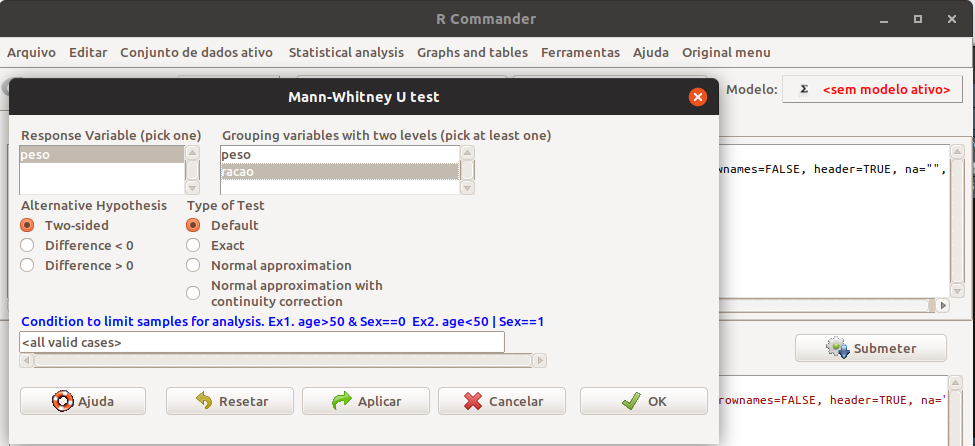
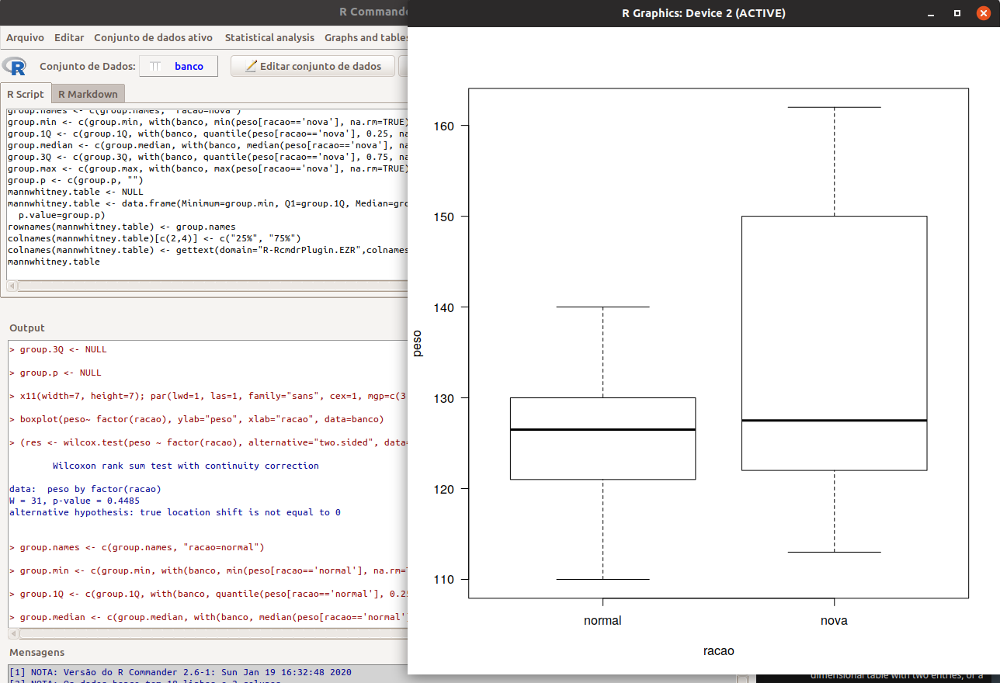
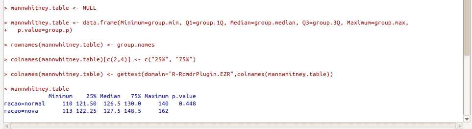
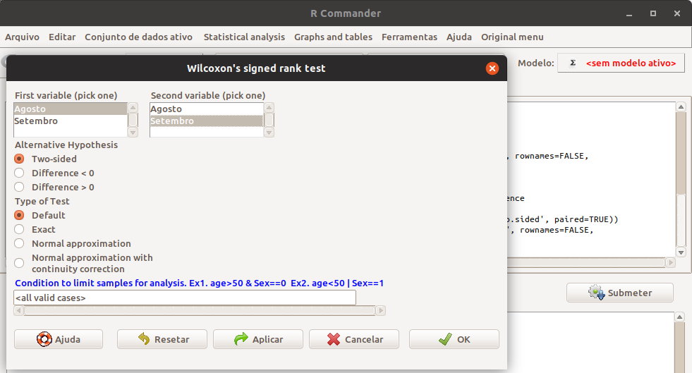
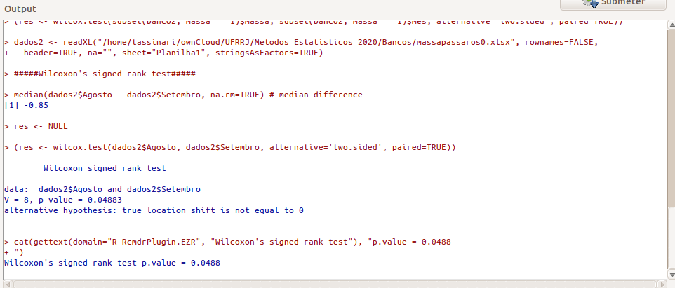
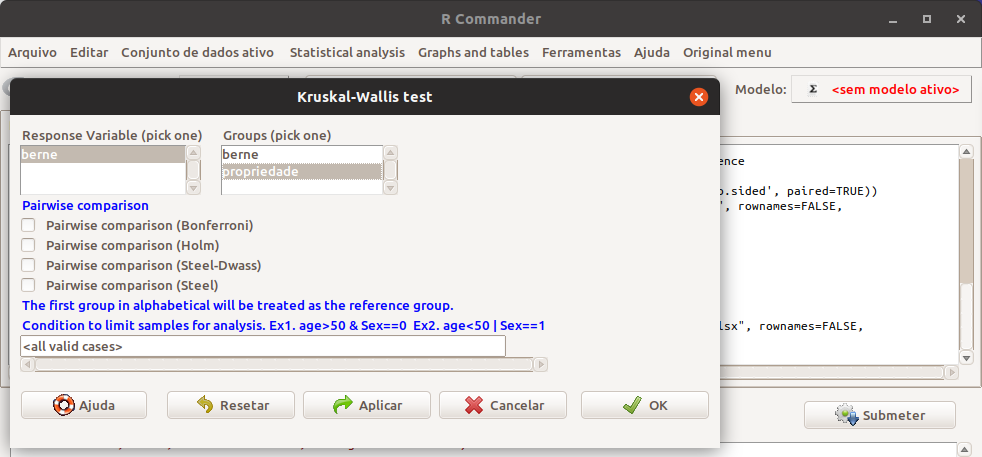
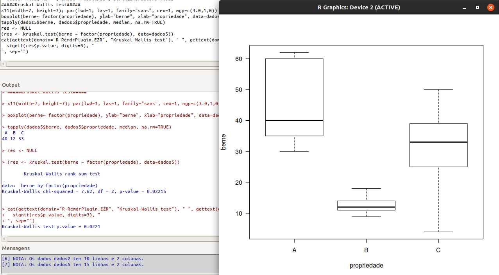

```{r setup, include=FALSE}
# https://ourcodingclub.github.io/2016/11/24/rmarkdown-1.html
knitr::opts_chunk$set(fig.width = 7, fig.height = 5, fig.align = 'center', dpi = 96, cache=TRUE, echo = F, comment = "", message = F, warning = F)

```

# Por que Utilizar Testes Não-Paramétricos ?

## Por que Utilizar Testes Não-Paramétricos ?

- Embora em grande parte das pesquisas quantitativas as variáveis em estudo se apresentem de maneira contı́nua e com distribuição normal, em muitas situações, na prática, muitas variáveis não satisfazem essas condições, e portanto não é possı́vel a utilização de métodos baseados na distribuição normal (métodos paramétricos);

- Ou seja, as variáveis não são contı́nuas, sua distribuição é desconhecida, ou ainda sua distribuição é conhecida mas não pode ser aproximada por uma distribuição normal.

## Por que Utilizar Testes Não-Paramétricos ?

- Tal como não é estatisticamente rigorosa a utilização de testes paramétricos quando não se cumprem os pressupostos necessários, também deverá ser evitada a utilização dos testes não-paramétricos em situaçães em que prevalecem as condições de utilização dos testes paramétricos, pois estes (paramétricos) são mais eficientes;

- Para verificar a forma de distribuição das populações, a fim de se decidir pela utilização de um teste paramétrico ou por um teste não-paramétrico, podem usar-se os testes de normalidade.

# Teste de Mann-Whitney

## Teste de Mann-Whitney

- É aplicado quando estão em comparação dois grupos independentes;

- Este teste é equivalente ao teste *t de Student* para a diferença de médias populacionais;

- Hipóteses

  - $H_0 : \mu_1 = \mu_2 \therefore \mu_1 − \mu_2 = 0$

  - $H_1 : \mu_2 \neq \mu_2 \therefore \mu_1 − \mu_2 \neq 0$
  
## Exemplo:

Com o objetivo de testar a eficiência de uma nova ração para engorda, dezoito ratos foram separados aleatoriamente em dois grupos. O primeiro grupo, formado por oito ratos, recebeu ração normal. O segundo grupo, de dez ratos, foi tratado com uma nova
ração de engorda. Verifique através do teste de Mann-Whitney se houve um aumento de peso significativo a 5% de significância.

  - $H_0 : \mu_{normal} = \mu_{nova}$

  - $H_1 : \mu_{normal} \neq \mu_{nova}$


## Solução utilizando o plugin Rcommander.EZT 

- Importar o arquivo "racaoratos.xlsx"

  - Rcommander $\rightarrow$ Arquivo $\rightarrow$ Importar arquivos de dados $\rightarrow$ from Excel data set

- Testar os dois grupos

  - Rcommander $\rightarrow$ Statistical analysis $\rightarrow$ Testes Não-Paramétricos $\rightarrow$ Mann Whitney U test
  
```{r, out.width='70%', fig.align='center'}


```

## Solução utilizando o plugin Rcommander.EZT 

```{r, out.width='100%', fig.align='center'}


```

## Solução utilizando o plugin Rcommander.EZT 

```{r, out.width='90%', fig.align='center'}


```

- Como $p-valor = 0,4239$, não rejeita-se $H_0$

# Teste de Wilcoxon

## Teste de Wilcoxon

- O teste de Wilcoxon é aplicado quando estão em comparação de duas amostras pareadas;

- Também chamado de teste de Mann-Whitney-Wilcoxon para dados pareados;
Este teste é equivalente ao teste t pareado.

  - $H 0 : \mu_1 = \mu_2 \therefore \mu_1 − \mu_2 = 0 \therefore \mu_d = 0$

  - $\mu_1 : \mu_2 \neq \mu_2 \therefore \mu_1 − \mu_2 \neq 0 \therefore \mu_d \neq 0$
  
## Exemplo:

A massa de 10 pássaros migratórios foi medida em duas ocasiões, primeiro em agosto e os mesmos pássaros (marcados individualmente e recapturados) foram medidos novamente em setembro.

  - $H_0 : μ_{agosto} = μ_{setembro}$

  - $H_1 : μ_{agosto} \neq μ_{setembro}$
  


## Solução utilizando o plugin Rcommander.EZT 

- Importar o arquivo "massapassaros.xlsx"

  - Rcommander $\rightarrow$ Arquivo $\rightarrow$ Importar arquivos de dados $\rightarrow$ from Excel data set

- Testar os dois grupos

  - Rcommander $\rightarrow$ Statistical analysis $\rightarrow$ Testes Não-Paramétricos $\rightarrow$ Mann Whitney U test
  
```{r, out.width='70%', fig.align='center'}


```

## Solução utilizando o plugin Rcommander.EZT 

```{r, out.width='90%', fig.align='center'}


```

- Como $p-valor = 0, 0469$, rejeita-se $H_0$ ao nı́vel de $5\%$ de significância, portanto houve um aumento significativo na massa dos pássaros ao longo do tempo.

# Teste de Kruskal-Wallis

## Teste de Kruskal-Wallis

- Este teste é equivalente a uma ANOVA não-paramétrica de um fator (experimento inteiramente ao acaso);

- O teste de Kruskal-Wallis ou análise de variância pelos números de ordem (*ranks*) pode ser utilizado nos casos em que se utiliza o teste paramétrico da ANOVA, sendo apenas ligeiramente menos potente. Além disso, deve ser utilizado nas situações em que a ANOVA paramétrica não pode ser utilizada, nomeadamente quando as *k* amostras ou grupos não provêm de populações normais, ou quando as variâncias são muito heterogêneas.

## Teste de Kruskal-Wallis

- Quando $k = 2$, o teste de Kruskal-Wallis é idêntico ao teste de Mann-Whitney;

- Hipóteses:

  - $H_0$: Não existe diferença entre os tratamentos

  - $H_1$: Existe diferença entre os tratamentos
  
## Exemplo:

Foi realizado um estudo para verificar se a média do número de bernes por animal é a mesma em três propriedades selecionadas para o estudo. Foram alocados 5 animais em cada propriedade.

## Solução utilizando o plugin Rcommander.EZT 

- Importar o arquivo "bernepropriedades.xlsx"

  - Rcommander $\rightarrow$ Arquivo $\rightarrow$ Importar arquivos de dados $\rightarrow$ from Excel data set

- Testar os grupos

  - Rcommander $\rightarrow$ Statistical analysis $\rightarrow$ Testes Não-Paramétricos $\rightarrow$ Kruskal-Wallis test
  
```{r, out.width='70%', fig.align='center'}


```

## Solução utilizando o plugin Rcommander.EZT 

```{r, out.width='90%', fig.align='center'}


```


- Como $p-valor = 0.02215$, rejeita-se $H_0$ ao nı́vel de $5\%$ de
significância, portanto existe diferença significativa no número
de bernes em pelo menos uma das propriedades.