```{r setup, include=FALSE}
# https://ourcodingclub.github.io/2016/11/24/rmarkdown-1.html
knitr::opts_chunk$set(fig.width = 7, fig.height = 5, fig.align = 'center', dpi = 96, cache=TRUE, echo = F, comment = "", message = F, warning = F)

```

# Medidas de Associação

## Introdução

- Um problema no qual nos deparamos frequentemente é verificar se determinada caracterı́stica de uma população está ou não relacionada com a outra(s) e em que grau;

- Até a década de 1970, boa parte da teoria estatı́stica usada partia do princı́pio de que as variáveis eram contı́nuas e, se possı́vel, tinham distribuição normal. O motivo para isto é que podia-se lançar mão de uma série de métodos referêntes a
dist. normal;

- Metodologias para lidar com variáveis não-normais ou não existiam ou se referiam a problemas bastante especı́ficos.

# Medidas de Associação - Variáveis Qualitativas

## Medidas de Associação - Variáveis Qualitativas

- Se as duas variáveis em estudo são independentes, espera-se que a distribuição marginal de uma delas (sem discriminar por valores da outra) seja igual às distribuições condicionadas por valores da outra;

- A partir dessa idéia, podemos construir uma medida de associação entre duas variáveis qualitativas, conhecida como Qui-quadrado.


## Teste Qui-Quadrado

- É um teste de associação entre variáveis independentes e cujas variáveis são qualitativas (nominal e/ou ordinal);

- Seu objetivo é verificar se a distribuição das frequências observadas se desvia significativamente das frequências esperadas;

- O qui-quadrado testa a associação entre variáveis, mas não permite obter qualquer evidência quanto a força ou sentido dessa inter-relação;

- Alguns autores trabalham como sendo o Coeficiente de Contingência (*C*), sendo $0 \leq C \leq 1$.


## Teste Qui-Quadrado

- A estatística de qui-quadrado é dado por:

$$\chi^{2} =  \dfrac {\sum_{i = 1}^{k}(f_{observado} - f_{esperado})^{2}}{f_{esperado}}$$

  - $H_{0}:$ As duas variáveis não são associadas ($C = 0$)
  
  - $H_{1}:$ As duas variáveis são associadas ($C \neq 0$)
  
## Exemplo

O efeito de uma nova droga contra a febre aftosa está sendo testada em um rebanho através de um estudo prospectivo, ou seja, os animais são selecionados aleatoriamente para participar do estudo, e registra-se sua evolução. Para saber se a droga tem efeito ou não, alguns dos animais selecionados recebem a droga, outros recebem um placebo de maneira randomizada. Veja a tabela a seguir.

  - $H_{0}:$ O tratamento não funciona, ou seja, o tratamento não está associado com a condição do animal.  ($C = 0$)
  
  - $H_{1}:$ O tratamento é eficaz, ou seja, o tratamento está associado com a condição do animal. ($C \neq 0$)

## Observações:

- A correção de continuidade de *yates* é utilizada quando a frequencia observada de uma das 'caselas' for $< 5$;

- O teste exato de *fisher* é utilizado quando o nosso $n$ é muito pequeno.

## Exemplo:

```{r, out.width='80%', fig.align='center'}
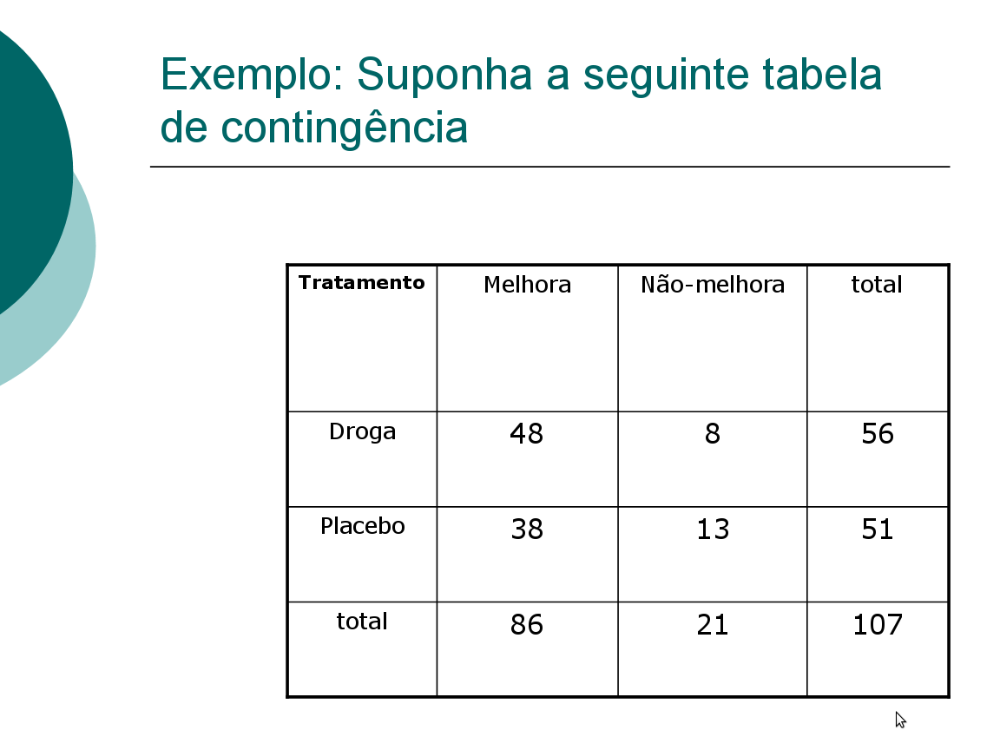

```

## Solução utilizando o Rcommander 

- Não precisa importar banco algum

  - Rcommander $\rightarrow$ Estatísticas $\rightarrow$ Tabelas de Contingência $\rightarrow$ Digite e analise tabela de dupla entrada
  
```{r, out.width='70%', fig.align='center'}
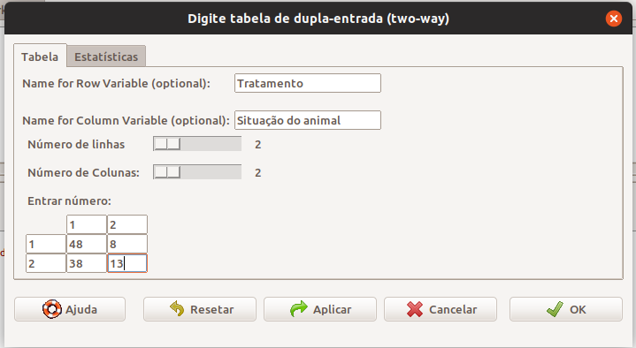

```

## Solução utilizando o Rcommander 

```{r, out.width='60%', fig.align='center'}
knitr::include_graphics(c('figuras/Rcmdr78_2019.png', 'figuras/Rcmdr79_2019.png'))

```

## Solução utilizando o Rcommander e no plugin EZT 

```{r, out.width='60%', fig.align='center'}
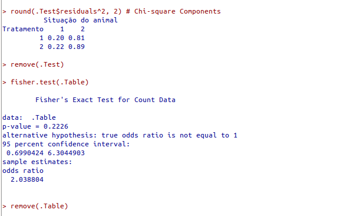

```

- Como o $p-valor = 0,145$, nao rejeita-se $H_0$, verificamos que as variáveis não apresentam associação.

- Solução utilizando o plugin Rcommander.EZT 

  - Rcommander $\rightarrow$ Statistical analysis $\rightarrow$ Discrete variables $\rightarrow$ Enter and analyze two-way table
  
## Exemplo com um banco de dados

```{r, out.width='95%', fig.align='center'}
knitr::include_graphics('figuras/bancosalex.png')

```

## Solução utilizando o plugin Rcommander.EZT 

- Importar o arquivo "salex.xls"

  - Rcommander $\rightarrow$ Arquivo $\rightarrow$ Importar arquivos de dados $\rightarrow$ from Excel data set
  
```{r, out.width='55%', fig.align='center'}


```
  
- Colocar os *labels* em todas as variáveis categóricas 

- Rcommander $\rightarrow$ Conjunto de dados ativo $\rightarrow$ Variables $\rightarrow$ Convert numeric variables to factors

## Solução utilizando o plugin Rcommander.EZT 

```{r, out.width='55%', fig.align='center'}
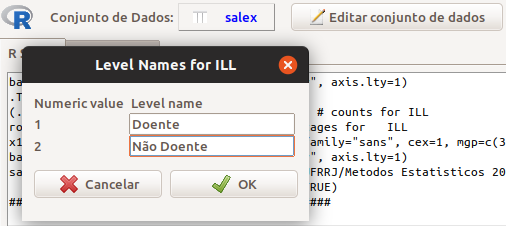
```

- Verificando a possível associação via teste de Qui-quadrado

  - Rcommander $\rightarrow$ Statistical analysis $\rightarrow$ Discrete variables $\rightarrow$ Create two-way and compare two proportions

```{r, out.width='55%', fig.align='center'}
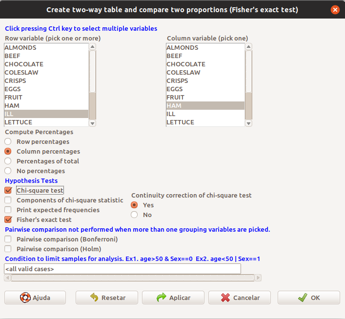
```

  
## Solução utilizando o plugin Rcommander.EZT 

```{r, out.width='60%', fig.align='center'}
knitr::include_graphics(c('figuras/Rcmdr84_2019.png', 'figuras/Rcmdr85_2019.png'))

```

## Solução utilizando o plugin Rcommander.EZT

- Como o $p-valor = 0,01842$, rejeita-se $H_0$, verificamos que as variáveis apresentam associação, ou seja, o presunto pode ter levado a intoxicação alimentar.

- Verifique se os outros alimentos apresentam alguma associação também.


# Medidas de Associação - Variáveis Quantitativas

## Medidas de Associação - Variáveis Quantitativas

- A associação entre duas variáveis pode também ser expressa como um único valor, chamado de coeficiente de correlação linear;

- Coeficientes de correlação podem ou não ser baseados na distribuição das variáveis em estudo, dando origem a coeficientes paramétricos e não-paramétricos.

## Coeficiente de Correlação de Pearson

- O Coeficiente de Correlação de Pearson é dada por:

$\rho = \dfrac{\sum(x_i - \overline{x})(y_i - \overline{y})}{\sqrt{\frac{\sum(x_i - \overline{x})^2}{n-1}} \sqrt{\frac{\sum(y_i - \overline{y})^2}{n-1}}} = \dfrac{cov(x_i, y_i)}{\sigma_x \sigma_y}$


- A estatística do teste *t* em função do Coeficiente de Correlação de Pearson e dada por:

$t_{p} =  \rho_{p} \sqrt{\dfrac{n - 2}{1 - \rho_{p}^{2}}}$


- Hipóteses:

- $H_{0}:$ $\rho_{p} = 0$ (não existe correlação entre as variáveis)

- $H_{1}:$ $\rho_{p} \neq 0$ (existe correlação entre as variáveis)

## Exemplo: 

- Suponha que um pesquisador deseje saber se existe associação entre o peso e o comprimento de ratinhos. Foram coletados 12 ratinhos com pesos(g) iguais a: 50; 62; 70; 86; 60; 64; 66; 77; 58; 55; 82 e 74. E os comprimentos(cm) iguais a: 4,0; 5,2;
6,0; 6,6; 5,0; 4,4; 5,6; 5,7; 4,8; 4,5; 6,2 e 6,4. 

## Solução utilizando o plugin Rcommander.EZT 

- Importar o arquivo "pesocompratos.xlsx"

  - Rcommander $\rightarrow$ Arquivo $\rightarrow$ Importar arquivos de dados $\rightarrow$ from Excel data set

- Testando a correlação

  - Rcommander $\rightarrow$ Statistical analysis $\rightarrow$ Continuous variables $\rightarrow$ Test for Pearson's correlation

```{r, out.width='65%', fig.align='center'}
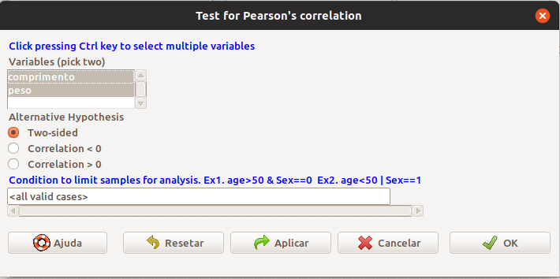
```

## Solução utilizando o plugin Rcommander.EZT 

```{r, out.width='80%', fig.align='center'}
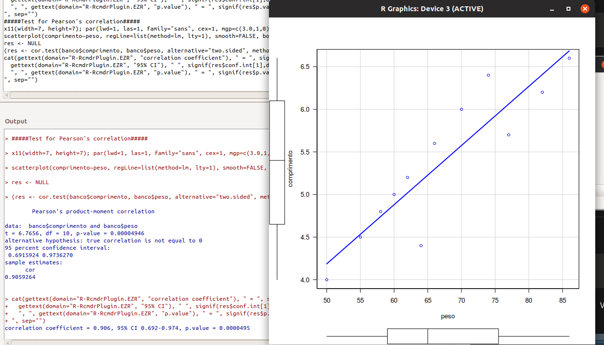
```

- Como $r = 0,9059$ e o $p-valor \leq 0,001$, rejeita-se $H_0$. Verificamos que as variáveis apresentam correlação muito alta.

## Coeficiente de Correlação de Spearman

- O Coeficiente de Correlação de Spearman, que não supõe que que as variáveis envolvidas tenham uma distribuição em particular, sendo portanto um coeficiente de correlação não-paramétrico;

- Este coeficiente é particularmente útil quando uma (ou ambas) variável(eis) é(são) qualitativas de contagem ou ordinais;

- Este coeficiente é calculado sobre a ordenação (rank ou postos) dos dados obtidos, dentro de cada variável, daı́ calcula-se o Coeficiente de Correlação de Pearson entre posto-x e posto-y.

## Coeficiente de Correlação de Spearman

- O Coeficiente de Correlação de Spearman ou “Rank Correlation” é dada por:

$\rho_s = 1 - \dfrac{6 \sum d_i^2}{n^3 - n}$

  - Sendo $d_i = n$ de ordem de $x_i − n$ de $y_i$
  
- A estatı́stica do teste *z* em função do Coeficiente de Correlação de Spearman é dada por:

$z_{s} =  \dfrac{\sqrt{n - 3}}{2} ln(\frac{1 + \rho_s}{1 - \rho_s}) \sim N(0,1)$

- Hipóteses:

  - $H_0 : \rho_s = 0$ (não existe correlação entre as variáveis)

  - $H_1 : \rho_s \neq 0$ (existe correlação entre as variáveis)
  

## Exemplo:
  
- Voltando ao exemplo dos ratinhos, e supondo a não normalidade em pelo menos uma das variáveis, o pesquisador deseja saber se existe associação entre o peso e o comprimento de ratinhos utilizando o coeficiente de correlação de Spearman.


## Solução utilizando o plugin Rcommander.EZT 

- Importar o arquivo "pesocompratos.xlsx"

  - Rcommander $\rightarrow$ Arquivo $\rightarrow$ Importar arquivos de dados $\rightarrow$ from Excel data set

- Testando a correlação

  - Rcommander $\rightarrow$ Statistical analysis $\rightarrow$ Testes Não-Paramétricos $\rightarrow$ Sperman's rank correlation test

```{r, out.width='65%', fig.align='center'}
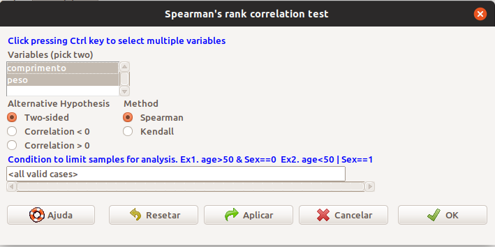
```

## Solução utilizando o plugin Rcommander.EZT 

```{r, out.width='80%', fig.align='center'}
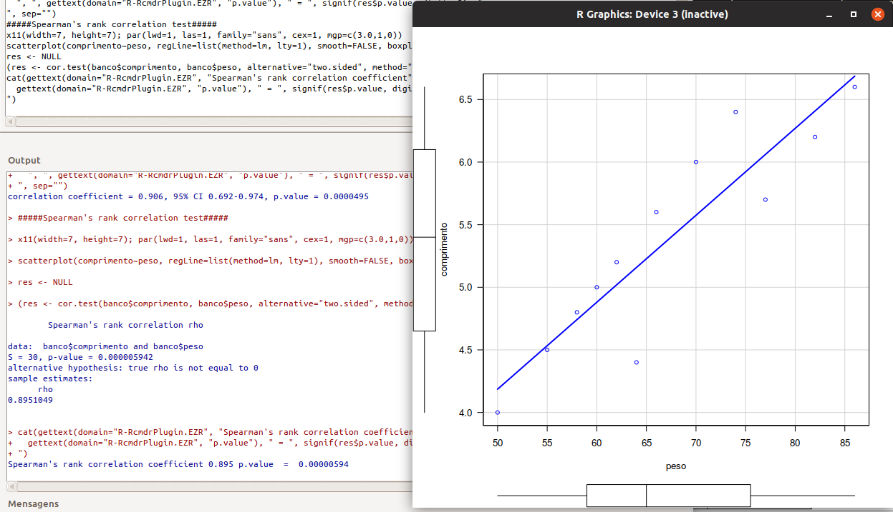
```

- Como $r_s = 0,8951$ e o $p-valor \leq 0,001$, rejeita-se $H_0$. Verificamos que as variáveis apresentam correlação muito alta.

## O coeficiente de concordância de Kappa 

- É utilizado para descrever a concordância entre dois ou mais avaliadores ou juizes quando realizam uma avaliação nominal ou ordinal de uma mesma amostra.

- Existem diversas doenças cujos diagnósticos dependem da avaliação do médico dos resultados de exames de imagem. Como exemplo ilustrativo da utilização do coeficiente de Kappa, apresentaremos uma situação onde dois médicos avaliam de forma independente o resultado de 180 exames de diagnóstico por imagem e o classificam como “normal”, “alterado” e “inconclusivo”.

## O coeficiente de concordância de Kappa

$$\hat{K} = \dfrac{\hat{p}_{observada} - \hat{p}_{esperada}}{1 - \hat{p}_{esperada}}$$

- Interpretando o Coeficiente de Concordância de Kappa

|  Valor de Kappa  |          Interpretação          |
| :--------------: | :-----------------------------: |
|  Menor que zero  |      insignificante (poor)      |
|  Entre 0 e 0,2   |         fraca (slight)          |
| Entre 0,21 e 0,4 |         razoável (fair)         |
| Entre 0,41 e 0,6 |       moderada (moderate)       |
| Entre 0,61 e 0,8 |       forte (substantial)       |
|  Entre 0,81 e 1  | quase perfeita (almost perfect) |


## Exemplo de aplicação do Coeficiente de Concordância de Kappa

Em nosso exemplo, poderíamos formar uma base de dados com a seguinte estrutura:

| Paciente |   Médico X   |   Médico Y   |
| :------: | :----------: | :----------: |
|    1     |    Positivo    |   Positivo    |
|    2     |   Positivo   | Negativo |
|    3     | Negativo |    Positivo    |
|    4     |   Positivo   |   Positivo   |
|    …     |      …       |      …       |


## Solução utilizando o plugin Rcommander.EZT 

- Importar o arquivo "concordancia.xlsx"

  - Rcommander $\rightarrow$ Arquivo $\rightarrow$ Importar arquivos de dados $\rightarrow$ from Excel data set
  
- Primeiro vamos fazer a tabela de contingência

  - Rcommander $\rightarrow$ Statistical analysis $\rightarrow$ Discrete variables $\rightarrow$ Create two-way and compare two proportions

```{r, out.width='55%', fig.align='center'}
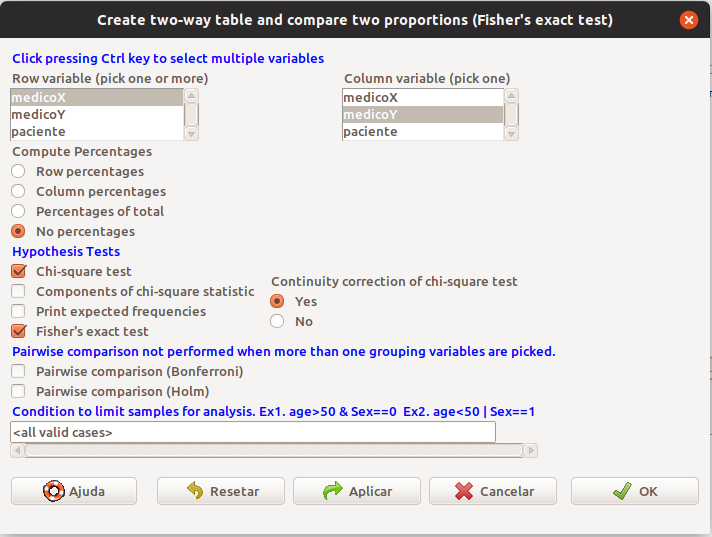
```

## Solução utilizando o plugin Rcommander.EZT   

```{r, out.width='65%', fig.align='center'}

```

- Testando a concordância

  - Rcommander $\rightarrow$ Statistical analysis $\rightarrow$ Accuracy of diagnostic test $\rightarrow$ Kappa statistics for agreement of two tests

```{r, out.width='60%', fig.align='center'}
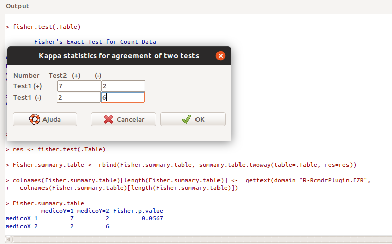
```

## Solução utilizando o plugin Rcommander.EZT 

```{r, out.width='90%', fig.align='center'}
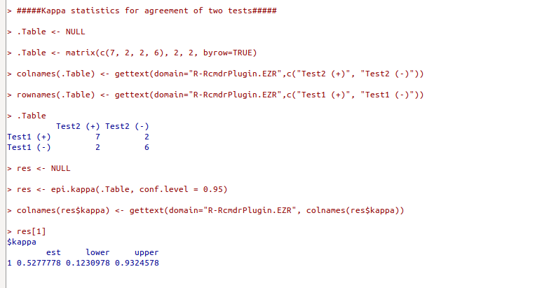
```

- Como $kappa = 0,5277$, podemos dizer que a concordância entre os dois médicos foi moderada.
