```{r setup, include=FALSE}
# https://ourcodingclub.github.io/2016/11/24/rmarkdown-1.html
knitr::opts_chunk$set(fig.width = 7, fig.height = 5, fig.align = 'center', dpi = 96, cache=TRUE, echo = F, comment = "", message = F, warning = F)

```

#  Teste para a média populacional

## Teste para a média populacional

- Nosso objetivo agora é apresentar procedimentos estatı́sticos simples para verificar se um conjunto de dados amostrais dá ou não suporte à uma conjectura sobre o valor médio $μ$ (desconhecido) de uma caracterı́stica de interesse, observável em "indivı́duo” de uma população.

- Mais precisamente, procedimentos para testar hipóteses sobre μ, tomando como base o valor médio dessa caracterı́stica, observado em uma amostra casual simples de tamanho *n* desses "indivı́duos".

## Teste para a média populacional (μ) - One *Sample t-test*

- Intervalo de Confiança
$$P[\mu \in (\overline{x} \pm t_{(n-1; \alpha)} \times s/\sqrt{n}] = 1 - \alpha$$
- Hipóteses 
  - $H_{0}: \mu = \mu_{0}$
  - $H_{1}: \mu \neq \mu_{0}$
  - $H_{1}: \mu < \mu_{0}$
  - $H_{1}: \mu > \mu_{0}$

- Estatística Teste

$$t_{calc} = \dfrac{\overline{x} - \mu_{0}}{s/\sqrt{n}}$$

## Exemplo: 

Voltando ao exemplo dos pássaros migratórios, bibliografias recentes sobre estes passaros mostram que a massa média destes pássaros no mês de agosto é de $μ = 14.1$. Verifique se a média dessa amostra coletada corresponde com a massa média verificada na maioria das literaturas sobre o assunto ($μ$, média populacional).

  - $H_0: μ = 14.1$
  
  - $H_1: μ = 14.1$
  

## Solução utilizando o plugin Rcommander.EZT 

- Importar o arquivo "massapassaros0.xlsx"

  - Rcommander $\rightarrow$ Arquivo $\rightarrow$ Importar arquivos de dados $\rightarrow$ from Excel data set
  
- Testar a média

  - Rcommander $\rightarrow$ Estatísticas $\rightarrow$ Médias $\rightarrow$ Teste t para uma amostra
  
```{r, out.width='70%', fig.align='center'}
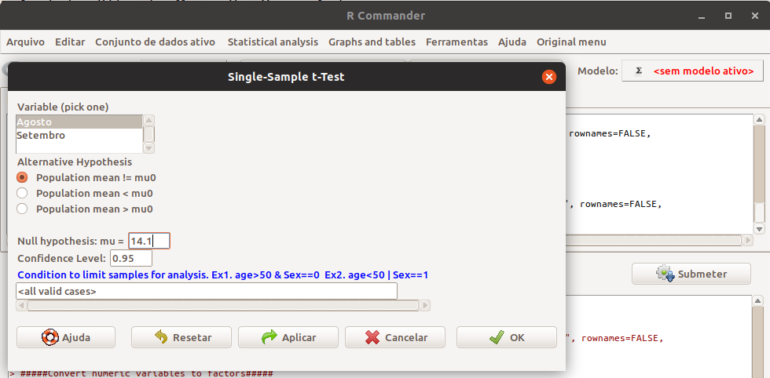

```

## Solução: 


```{r, out.width='80%', fig.align='center'}
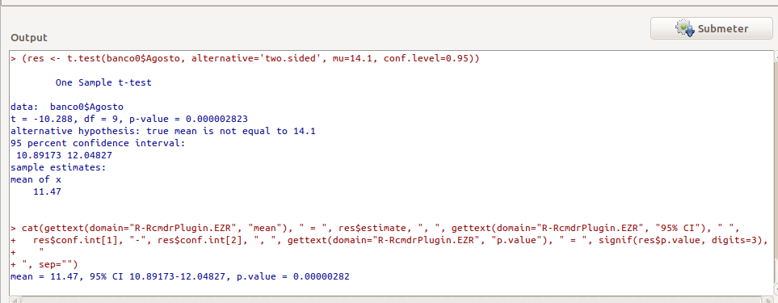
```

como o $p-valor < 0.001$, rejeita-se $H_0$, ou seja, a massa média dos pássaros desta amostra não corresponde com o a média encontrada na literatura.

## Teste para a comparação de duas médias populacionais ($μ_1 e μ_2$) - Grupos Independentes

- Intervalo de confiança
  
$P[\mu_{1} - \mu_{2} \in (\overline{x}_{1} - \overline{x}_{2} \pm t_{(n_{1} + n_{2} - 2; \alpha)} \cdot s_{p} \sqrt{1/n_{1} + 1/n_{2}})] = 1 - \alpha$

  - Sendo $s_{p}$ o desvio-padrão conjugado
    
$s_{p} =  \sqrt{\dfrac{(n_{1} - 1)s_{1}^{2} + (n_{2} - 1)s_{2}^{2}}{n_{1} + n{2} - 2}}$

- Hipóteses:
  
  - $H_{0}: \mu_{1} = \mu_{2} \therefore \mu_{1} - \mu_{2} = 0$
  
  - $H_{1}: \mu_{1} \neq \mu_{2} \therefore \mu_{1} - \mu_{2} \neq 0$

- Estatística de teste
  
$t_{calc} = \dfrac{\overline{x}_{1} - \overline{x}_{2}}{s_{p}/\sqrt{1/n_{1} + 1/n_{2}}}$

## Exemplo:

Comparando as distribuições do teor de colesterol sérico em cães machos e femêas normais, medidos em mg/100ml, pergunta-se: É possı́vel responder se existe diferença significativa no teor de de colesterol entre cães machos e femêas ?

- $H_{0}: \mu_{macho} = \mu_{femea} \therefore \mu_{macho} - \mu_{femea} = 0$

- $H_{1}: \mu_{macho} \neq \mu_{femea} \therefore \mu_{macho} - \mu_{femea} \neq 0$

## Solução utilizando o plugin Rcommander.EZT 

- Importar o arquivo "colesterolcaes.xlsx"

  - Rcommander $\rightarrow$ Arquivo $\rightarrow$ Importar arquivos de dados $\rightarrow$ from Excel data set
  
- Colocar os *labels* na variável categórica (qualitariva), sexo

- Rcommander $\rightarrow$ Conjunto de dados ativo $\rightarrow$ Variables $\rightarrow$ Convert numeric variables to factors

```{r, out.width='55%', fig.align='center'}
knitr::include_graphics(c('figuras/Rcmdr19_2019.png', 'figuras/Rcmdr20_2019.png'))

```

## Solução utilizando o plugin Rcommander.EZT 

- Testar os dois grupos

  - Rcommander $\rightarrow$ Statistical analysis $\rightarrow$ Continuous variables $\rightarrow$ Two-sample t-test
  
```{r, out.width='70%', fig.align='center'}
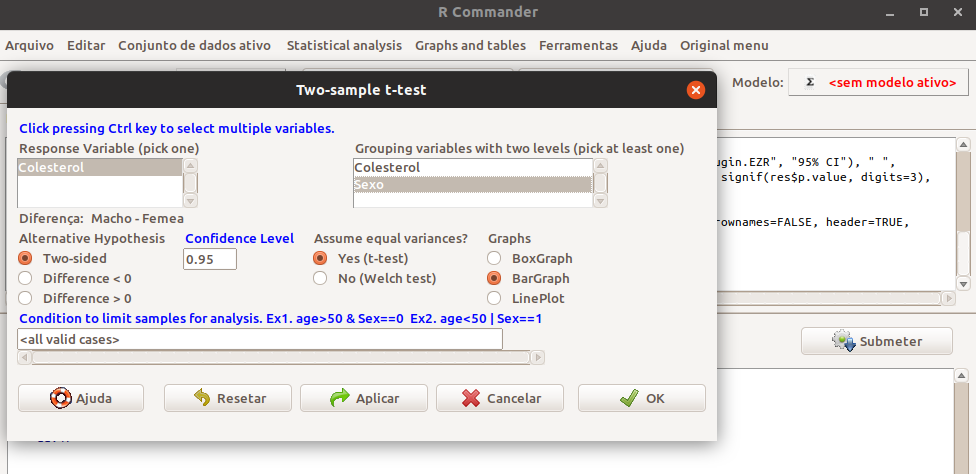

```

## Solução utilizando o plugin Rcommander.EZT 


```{r, out.width='85%', fig.align='center'}
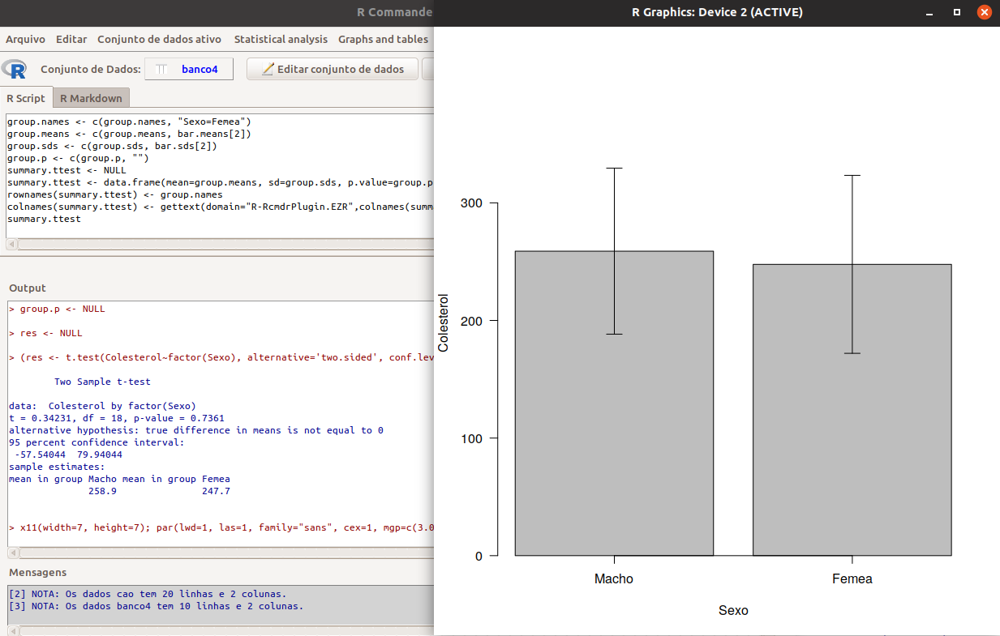

```

como o $p-valor= 0,7361$, não rejeita-se $H_0$, ou seja, não existe diferença significativa entre o nível dos coleterois entre cães fêmeas e cães machos.


## Solução utilizando o plugin Rcommander.EZT 


```{r, out.width='90%', fig.align='center'}
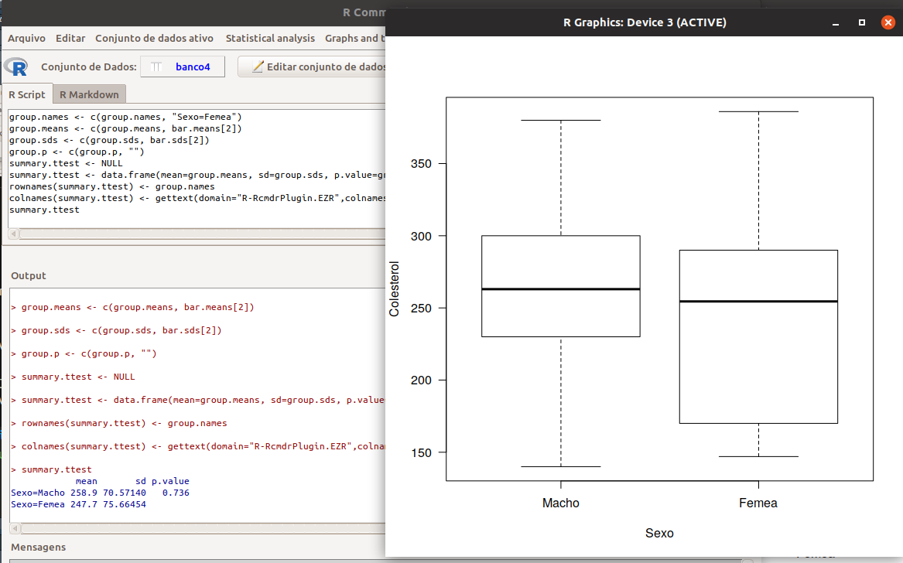

```

## Teste para a comparação de duas médias populacionais ($\mu_1$ e $\mu_2$) - Dados Pareados

- Intervalo de Confiança

$P[\mu \in (\overline{d} \pm t_{(n-1; \alpha)} \cdot s_{d}/\sqrt{n}] = 1 - \alpha$

- Hipóteses 

  - $H_{0}: \mu_{antes} = \mu_{depois} \therefore \mu_{antes} - \mu_{depois} = 0$

  - $H_{1}: \mu_{antes} \neq \mu_{depois} \therefore \mu_{antes} - \mu_{depois} \neq 0$

- Estatística Teste

$t_{calc} = t_{d} = \dfrac{\overline{d}}{s_{d}/\sqrt{n}}$

## Exemplo:

Dez cobaias foram submetidas ao tratamento de engorda com certa ração. Os pesos em gramas, antes e após o teste são dados a seguir (supõe-se que provenham de distribuições normais). A $1\%$ de significância, podemos concluir que o uso da ração contribuiu para o aumento do peso médio dos animais ?

 - $H_{0}: \mu_{antes} = \mu_{depois} \therefore \mu_{antes} - \mu_{depois} = 0$

- $H_{1}: \mu_{antes} \neq \mu_{depois} \therefore \mu_{antes} - \mu_{depois} \neq 0$

## Solução utilizando o plugin Rcommander.EZT 

- Importar o arquivo "pesocobaias0.xlsx"

  - Rcommander $\rightarrow$ Arquivo $\rightarrow$ Importar arquivos de dados $\rightarrow$ from Excel data set
  

- Testar os dois grupos

  - Rcommander $\rightarrow$ Statistical analysis $\rightarrow$ Continuous variables $\rightarrow$ Paried t-test
  
```{r, out.width='70%', fig.align='center'}
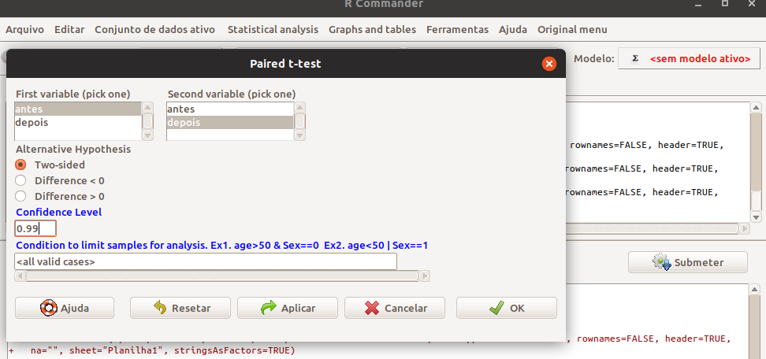

```

## Solução utilizando o plugin Rcommander.EZT


```{r, out.width='60%', fig.align='center'}
knitr::include_graphics(c('figuras/Rcmdr28_2019.png', 'figuras/Rcmdr29_2019.png'))

```

Como $p-valor = 0,0158$, rejeita-se $H_0$, ou seja, existe diferença significativa entre as médias do antes e do depois.

## Teste para a comparação para mais de duas médias populacionais - ANOVA

- Hipóteses:

  - $H_{0}: \mu_{1} = \mu_{2} = \ldots = \mu_{k}$

  - $H_{1}: \mu_{i} \neq \mu_{j}$, sendo $i \neq j$
  

- Estatística Teste: Teste *F*

## Exemplo:

Gostarı́amos de verificar se o número de bernes por animal é a mesma nas três propriedades distintas. Para cada propriedade foram selecionados 5 animais.

  - $H_{0}: \mu_{a} = \mu_{b} = \mu_{c}$

  - $H_{1}: \mu_{i} \neq \mu_{j}$, sendo $i \neq j$
  

## Solução utilizando o plugin Rcommander.EZT 

- Importar o arquivo "bernepropriedades.xlsx"

  - Rcommander $\rightarrow$ Arquivo $\rightarrow$ Importar arquivos de dados $\rightarrow$ from Excel data set
  
  - Testar os grupos

  - Rcommander $\rightarrow$ Statistical analysis $\rightarrow$ Continuous variables $\rightarrow$ one-Way ANOVA

```{r, out.width='60%', fig.align='center'}

```

## Solução utilizando o plugin Rcommander.EZT


```{r, out.width='90%', fig.align='center'}
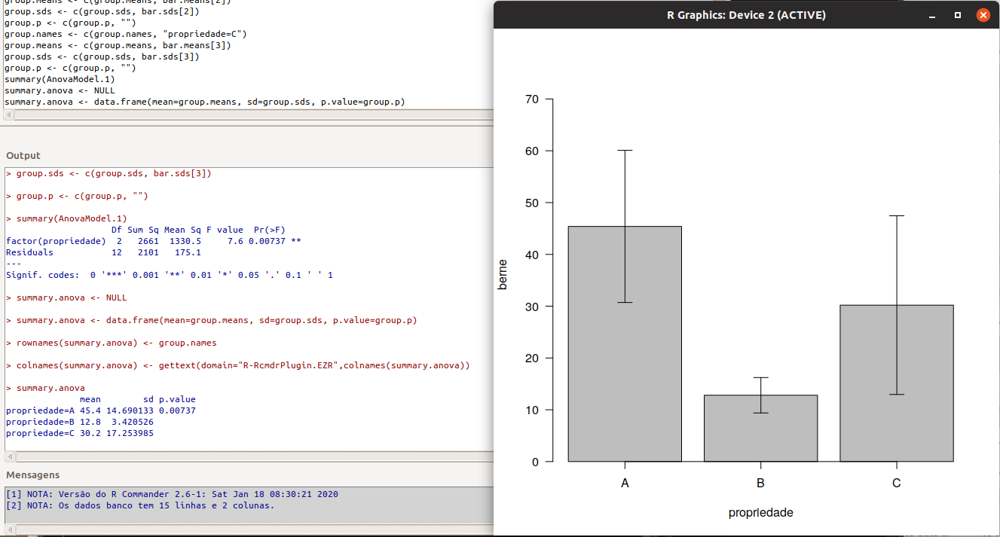
```

  - Como $p-valor = 0,00104$, rejeita-se $H_0$
  
  - Verificamos que existe diferença significativa entre as médias.

# Testes para a variância

## Teste para a comparação de duas variâncias populacionais 

- Hipóteses

   - $H_0: \sigma_1^2 = \sigma_2^2 (=\sigma)$ ou $\dfrac{\sigma_1^2}{\sigma_2^2} = 1$
   
      - $H_1: \sigma_1^2 \neq \sigma_2^2$ ou $\dfrac{\sigma_1^2}{\sigma_2^2} \neq 1$
   
- Estatística do teste

  - $F_{calc} = \dfrac{s^{2}_{1}}{s^{2}_{2}}$


- A utilização deste teste é necessária quando precisamos comparar diferenças entre médias. Alguns softwares já fazem isso, como é o caso do Bioestat.

## Solução utilizando o plugin Rcommander.EZT 

- Importar o arquivo "pesocobaias.xlsx"

  - Rcommander $\rightarrow$ Arquivo $\rightarrow$ Importar arquivos de dados $\rightarrow$ from Excel data set
  

- Testar a variância dos dois períodos

  - Rcommander $\rightarrow$ Statistical analysis $\rightarrow$ Continuous variables $\rightarrow$ Two-variences F-test
  
```{r, out.width='70%', fig.align='center'}
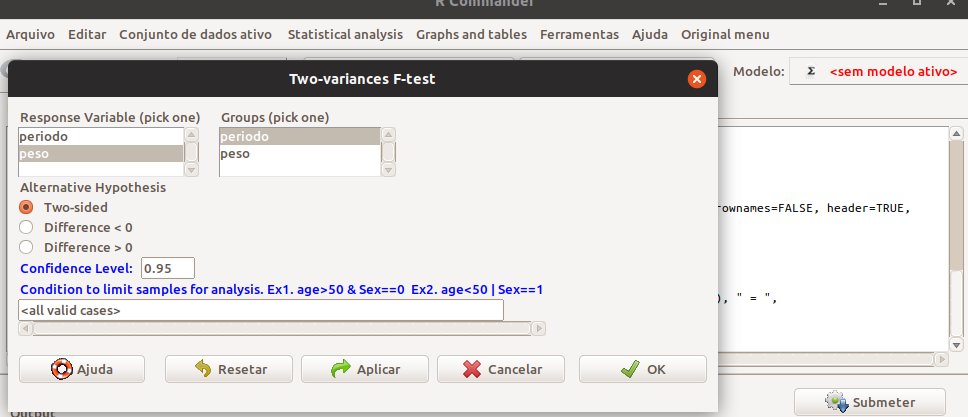

```

## Solução utilizando o plugin Rcommander.EZT


```{r, out.width='90%', fig.align='center'}
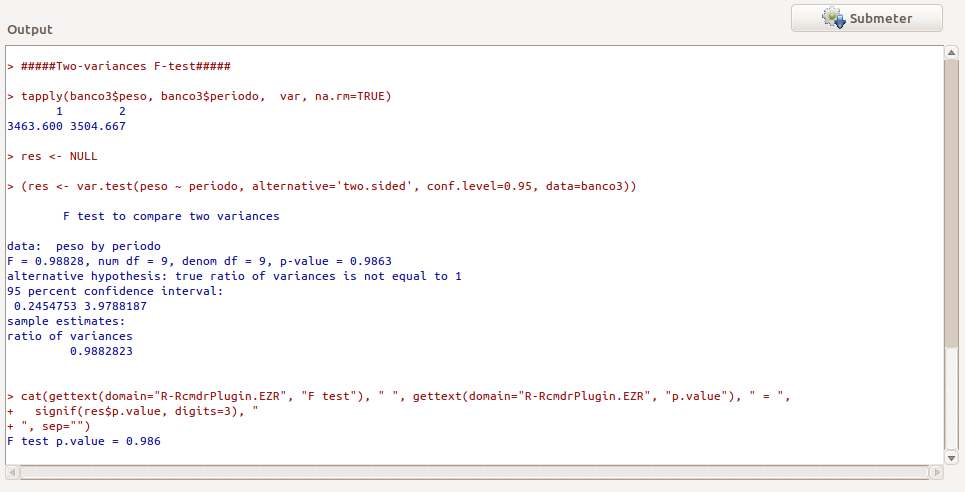
```

  - Como $p-valor = 0.986$, não rejeita-se $H_0$
  
  - Verificamos que as variâncias entre os períodos são homogêneas (iguais).
  
## Teste para a comparação de duas ou mais variâncias populacionais - Bartlett's Test

- Hipóteses

  - $H_{0}: \sigma^{2}_{1} = \sigma^{2}_{2} = \ldots = \sigma^{2}_{k} = \sigma^{2}$
  
  - $H_{1}: \sigma^{2}_{i} \neq \sigma^{2}_{j}$, sendo $i \neq j$

- Estatística de teste

$T = \dfrac{(n - k) ln (s_{p}^{2}) - \sum_{i=1}^{k}(n_{i} - 1) ln (s_{p}^{2})}{1 + (1/(3(k - 1))) ((\sum_{i=1}^{k} 1/(n_{i} - 1)) - 1/(n - k))}$

  - sendo $n = n_{1} + n_{2} + \ldots + n_{k}$, $k$ o número de grupos ou amostras e a variância conjunta sendo:

$s_{p}^{2} = \dfrac{\sum_{i=1}^{k}(n_{i} - 1) (s_{i}^{2})}{n - k}$

## Solução utilizando o plugin Rcommander.EZT 

- Importar o arquivo "bernepropriedades.xlsx"

  - Rcommander $\rightarrow$ Arquivo $\rightarrow$ Importar arquivos de dados $\rightarrow$ from Excel data set
  
  - Comparar as variâncias do número de berne entre as propriedades

  - Rcommander $\rightarrow$ Statistical analysis $\rightarrow$ Continuous variables $\rightarrow$ Bartlett's test

```{r, out.width='65%', fig.align='center'}
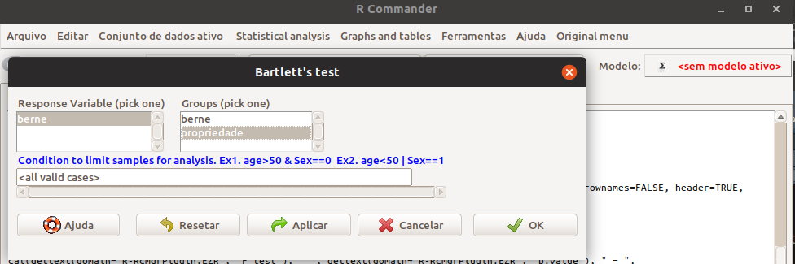
```

## Solução utilizando o plugin Rcommander.EZT

```{r, out.width='95%', fig.align='center'}

```

  - Como $p-valor = 0,02908$, rejeita-se $H_0$
  
  - Verificamos que a variabilidade do número de bernes entre entre as propriedades é heterogênea.

# Teste para proporções

## Teste para Proporção Populacional ($\pi$)

- Intervalo de Confiança

$P[\pi \in (p \pm z_{\alpha/2} \cdot \sqrt{\dfrac{p (1-p)}{n}})] = 1 - \alpha$

- Hipóteses 

  - $H_{0}: \pi = \pi_{0}$
  - $H_{1}: \pi \neq \pi_{0}$
  - $H_{1}: \pi < \pi_{0}$
  - $H_{1}: \pi > \pi_{0}$
  
- Estatística Teste

$z_{calc} = \dfrac{p - \pi_{0}}{\sqrt{\dfrac{p (1-p)}{n}}}$

## Exemplo:

Amostras de sangue de 115 cabeças de gado foram analisadas através de um teste sorológico para *Leptospira sp.* e, de acordo com o título, cada amostra foi classificada como positiva ou negativa. Na amostra, 36 animais apresentaram título positivo. Deseja-se saber se a prevalência de animais infectados foi de $40\%$ em todo estabelecimento.
 
  - $H_{0}: \pi = 40\%$ 

  - $H_{1}: \pi \neq 40\%$

## Solução utilizando o plugin Rcommander.EZT 
  
  - Não existe a necessidade de abrir um banco de dados (tabela)

- Estimando o intervalo de confiança para a proporção

  - Rcommander $\rightarrow$ Statistical analysis $\rightarrow$ Discrete variables $\rightarrow$ Confidence interval for a proportion
  
```{r, out.width='65%', fig.align='center'}
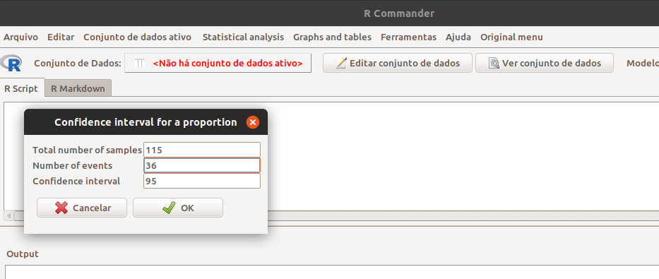
```

## Solução utilizando o plugin Rcommander.EZT 

```{r, out.width='85%', fig.align='center'}
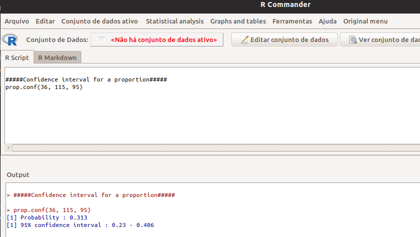
```

- Como o valor $40\%$ está incluido dentro do intervalo de confiança, podemos dizer que não rejeitamos $H_0$, ou seja, a prevalência de animais infectados pode ser considerada de $40\%$ em todo estabelecimento.

## Solução utilizando a linha de comando do R

```{r, echo=T}
 prop.test(36, 115, 0.4)
```


- Como o $p-valor = 0,071$, não rejeitamos $H_0$.

## Teste para a Comparação de duas Proporções Populacionais ($\pi_1$ e $\pi_2$)

- Intervalo de Confiaça

$P[\pi_{1} - \pi_{2} \in (p_{1} - p_{2} \pm z_{\alpha/2} \cdot \sqrt{\dfrac{p_1 (1 - p_1)}{n_1} + \dfrac{p_2 (1 - p_2)}{n_2}}] = 1 - \alpha$

- Hipóteses 

  - $H_{0}: \pi_{1} = \pi_{2}$
  
  - $H_{1}: \pi_{1} \neq \pi_{2}$

- Estatística Teste

$z_{calc} = \dfrac{p_{1} - p_{2}}{\sqrt{\dfrac{p_1 (1 - p_1)}{n_1} + \dfrac{p_2 (1 - p_2)}{n_2}}}$


## Exemplo:

Pesquisadores decidiram avaliar se a proporção de cães machos é idêntica em cães domiciliados e não-domiciliados. Fizeram um levantamento em uma determinada cidade, e observaram que, dos 510 cães domiciliados amostrados, 301 eram machos e, dentre os 230 não-domiciliados, 97 eram machos. Pergunta-se, existe diferença significativa entre as duas proporções ?
 
  - $H_{0}: \pi_{1} = \pi_{2}$ 
  
  - $H_{1}: \pi_{1} \neq \pi_{2}$

## Solução utilizando o plugin Rcommander.EZT 
  
  - Não existe a necessidade de abrir um banco de dados (tabela)

- Estimando o intervalo de confiança para a proporção

  - Rcommander $\rightarrow$ Statistical analysis $\rightarrow$ Discrete variables $\rightarrow$ Confidence interval for a difference between two proportions
  
```{r, out.width='65%', fig.align='center'}
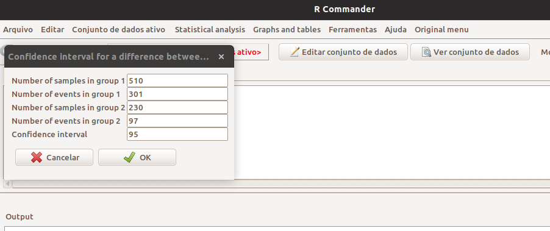
```

## Solução utilizando o plugin Rcommander.EZT 

```{r, out.width='85%', fig.align='center'}
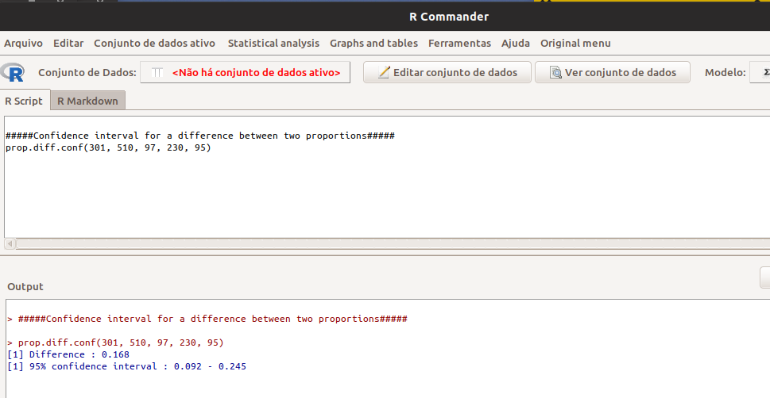
```

- Como o 0 (zero) não está incluido dentro do intervalo de confiança, podemos dizer que que existe diferença significativa entre as proporções.

## Solução utilizando a linha de comando do R

```{r, echo=T}
 prop.test(c(301,97), c(510,230))
```

- Como o $p-valor < 0,05$, rejeitamos $H_0$.